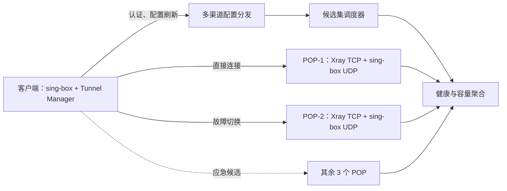
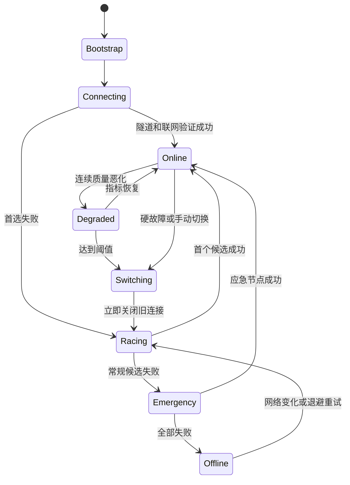

# 强网络限制环境 VPN 产品架构设计规格

- 状态：已完成方案评审，待用户审阅书面规格
- 日期：2026-08-04
- 产品品牌：`Talenro`（泰联诺）
- 目标版本：MVP 至 10 万并发设备生产架构
- 客户端平台：Android、iOS、Windows、macOS
- 核心选择：sing-box 客户端；Xray/sing-box 混合服务端
- 品牌规格：[Talenro 品牌命名体系设计](./2026-08-04-talenro-brand-naming-design.md)
- 本地化规格：[VPN 五语本地化与 RTL 设计](./2026-08-04-vpn-localization-design.md)

## 1. 执行摘要

本产品采用“控制面调度 + 客户端本地故障转移 + POP 内容量管理”的分布式架构。

客户端以 sing-box 为隧道核心，在其上构建自研 `Tunnel Manager`，统一管理节点候选集、连接状态、质量评分、手动切换、故障切换以及平台 VPN 生命周期。控制面为每台设备生成少量、签名且按设备加密的候选节点配置；客户端不依赖控制面即可使用最后已知可用配置启动和完成故障切换。

首发协议组合：

- 主线路：Xray 服务端上的 VLESS + REALITY + Vision，TCP 443。
- 辅线路：sing-box 服务端上的 Hysteria2，UDP 443。
- 后续备用：AnyTLS 或 Trojan。
- WireGuard：不进入 MVP，只保留协议适配接口，待第二阶段按实际网络覆盖需求引入。
- V2Ray：不作为产品核心依赖；当前需求中 Xray 和 sing-box 的能力更匹配。

客户端切换采用“立即断开旧连接、并行竞速新候选”的语义。活跃连接故障恢复目标为 p95 小于 8 秒、p99 小于 10 秒。深度空闲移动端不维持高频心跳；收到新流量或系统网络变化时立即恢复。

容量基准：

- 10 万并发在线设备。
- 单设备产品带宽上限 100 Mbps。
- 正常容量模型按每台设备平均 5 Mbps，即有效流量约 500 Gbps。
- 正常 40% 余量为 700 Gbps。
- 为承受最大 POP 整体失效，首发建议部署约 800 Gbps 的可用容量。
- 10 Mbps 平均压力模型如果升级为持续 SLA，则建议部署约 1.6 Tbps 的 N+1 容量。

100 Mbps 是单设备最大速率，不是每台设备的独享或保证带宽。若要求 10 万设备同时获得 100 Mbps，原始需求就达到 10 Tbps，已超出本设计的容量和商业模型。

## 2. 目标和非目标

### 2.1 产品目标

1. 在强网络限制、UDP 受限、DNS 污染和部分入口被阻断的环境中提供可恢复连接。
2. 支持自动节点选择、用户手动选择、连接失败切换和质量恶化切换。
3. 切换时立即终止旧连接并重建隧道。
4. 活跃连接从确认节点失效到恢复联网不超过 10 秒。
5. 支持 10 万并发在线设备和 5 个 POP。
6. 控制面不可达时，已有设备仍能使用缓存配置启动和切换。
7. 支持 Android、iOS、Windows、macOS 同期产品化。
8. 接受 sing-box GPL 许可证带来的源代码和分发义务，但发布前仍需专门的许可证与应用商店法律审查。
9. 自动切换支持严格“保持当前国家”，禁止在用户未授权时静默跨国。
10. 支持账号共享流量套餐、设备用量明细和服务端硬停。
11. 支持月、季、半年、年付订阅及 90 天加油包；消费者套餐长期周期目标折扣为 5%、10%、20%。
12. 支持 App Store、Google Play、Web 和官网加密货币支付，统一归入账号权益。
13. 首发支持简体中文、英文、俄语、波斯语和日语；语言切换、RTL 或内容服务故障不能影响隧道状态和 10 秒恢复路径。

### 2.2 非目标

1. 不在 MVP 中实现跨节点保持原 TCP socket；节点切换会使应用连接重新建立。
2. 不依赖单一全球 VIP 或单一域名提供高可用。
3. 不把 sing-box URLTest 当作完整调度系统。
4. 不把 Xray 内置 outbound balancer 当作客户端入口负载均衡器。
5. 不在 MVP 中引入 WireGuard 作为主要抗限制协议。
6. 不允许控制面下发任意原始 sing-box JSON 并直接执行。
7. 不收集用户访问域名、目标 IP、DNS 内容或应用流量内容；套餐计费所需的账号/设备累计字节除外。
8. 不按普通付费套餐划分低质量和高质量节点池。
9. 不提供永久免费或无限流量消费者套餐。

## 3. 总体架构



关键原则：

- 控制面负责全局容量和稳定分配，客户端负责 10 秒内的本地恢复。
- 流量不经过控制面。
- 每台设备只获得 3 至 5 个候选入口，不暴露整个节点库存。
- 候选集跨 POP、协议、运营商、ASN、云厂商和故障域。
- 客户端缓存最后已知可用配置和应急候选。
- 服务端负载变化优先影响新分配，不强制迁移健康的已有连接。

## 4. 技术选型边界

### 4.1 sing-box 客户端

sing-box 负责 TUN、路由、DNS 以及协议连接，自研层负责产品状态与策略。

客户端不得直接暴露 sing-box 或 Clash API 作为产品控制面。定义稳定的 `TunnelEngine` 边界，至少包含：

- `start(bundle)`
- `stop(reason)`
- `switch(endpoint, reason)`
- `validate(bundle)`
- `observeHealth()`
- `snapshot()`

四个平台的 UI、账号和生命周期代码只依赖该接口，避免与某个 sing-box 配置版本紧耦合。

### 4.2 Xray 服务端

Xray 主要承载 VLESS + REALITY + Vision/TCP。仅使用 sing-box 客户端明确兼容的协议参数，不追逐 Xray 独有且客户端尚不支持的 XHTTP、mKCP 或最新实验性 VLESS Encryption 组合。

Xray HandlerService 仅监听 loopback，由节点代理调用，用于动态添加和删除 VLESS 用户。Metrics/Stats 用于聚合容量和诊断，不把设备 ID 直接作为高基数 Prometheus 标签。

### 4.3 sing-box 服务端

sing-box 主要承载 Hysteria2/UDP。MVP 不依赖 1.14 alpha API 服务完成用户管理。Hysteria2 用户凭证先通过不可变快照和节点滚动替换部署；规模化阶段可在经过审计的 GPL 分支中增加本地外部认证接口。

### 4.4 WireGuard

WireGuard 具有良好性能和低协议复杂度，但固定使用 UDP，容易在强限制网络中被整体阻断。因此：

- MVP 不启用 WireGuard。
- 在自有协议模型中预留 `wireguard` 类型和密钥字段，但客户端不下发未支持配置。
- 第二阶段可将 WireGuard 用于企业网络、低限制地区或设备间专线，不作为唯一回退协议。

## 5. 客户端状态机



### 5.1 硬故障

以下事件不等待质量评分：

- 核心进程或系统隧道退出。
- TCP reset/refused 或协议握手失败。
- Wi-Fi、蜂窝网络或默认路由发生变化。
- 活跃连接连续两次快速真实隧道探测失败。
- 只有上行、无任何下行，判定疑似黑洞。
- 当前节点被控制面紧急标记为 `offline` 或 `quarantined`。

### 5.2 质量恶化

质量恶化必须连续确认，避免抖动：

- 当前节点分数低于 45。
- 候选节点至少高 15 分。
- 条件持续三个 2 秒短窗口。
- 当前节点分数低于 20 或完全无下行时，升级为硬故障并立即切换。

普通质量切换后进入 30 秒冷却期；硬故障和手动切换不受冷却限制。

### 5.3 手动切换

- 用户选择后立即中断旧连接。
- 目标节点 2.5 秒内失败则自动尝试其他健康节点。
- 手选节点是“首选”，不是“禁止故障转移”。
- 故障转移后不自动回切手选节点，避免反复断网；用户重新选择或下次启动时再尝试。

### 5.4 会话原子性

每次启动或切换递增 `session_epoch`。旧 epoch 的异步回调、DNS 结果和健康事件一律丢弃，防止旧隧道在新隧道建立后重新成为当前连接。

### 5.5 10 秒预算

| 阶段 | 预算 |
|---|---:|
| 发现硬故障或黑洞 | 0–3 秒 |
| 关闭旧连接并递增 epoch | 小于 100 毫秒 |
| 第一批两个候选竞速 | 最多 2.5 秒 |
| 第二批或应急候选 | 最多 2.5 秒 |
| 恢复路由、DNS 并验证 | 1–2 秒 |

第一候选立即连接，第二候选延迟约 200–300 毫秒。大规模故障时使用设备 ID 生成的 0–500 毫秒确定性抖动。第一轮最多竞速两个节点。

移动端 SLO 边界：

- 活跃连接严格执行 10 秒目标。
- 前台空闲降低探测频率。
- 后台深度空闲不维持 2–3 秒心跳；新流量或系统网络变化时立即恢复。

## 6. 节点评分和选择

### 6.1 两级决策

1. 控制面通过加权 Rendezvous Hash 将设备稳定分散到节点。
2. 客户端只在本机候选集中按本地质量选择。

这避免所有用户同时追逐同一个最低延迟节点。

### 6.2 硬过滤

以下节点不得进入评分：

- 不属于账号权益允许的节点组。
- 不符合用户启用的 `egress_country` 国家锁定。
- `offline` 或 `quarantined`。
- 客户端版本不支持其协议或 schema。
- 凭证无效或尚未部署。
- 地区政策不允许。
- 达到带宽或连接硬上限。
- 当前网络已确认阻断该协议。
- 与刚失败节点属于同一强相关故障域，且故障疑似来自该故障域。

`degraded` 节点降低权重；`draining` 节点不接收新分配。

### 6.3 综合评分

```text
总分 =
  35% 本机可用性
+ 20% 本机链路质量
+ 15% 服务端容量
+ 15% 控制面设备分配适配度
+ 10% 同网络群体可达性
+  5% 当前节点稳定性
- 失败与封锁惩罚
```

可用性优先于延迟。一个 RTT 250ms 且稳定的节点，应优先于 RTT 80ms 但握手成功率只有 70% 的节点。

### 6.4 测量窗口

- 短窗口：约 10 秒，用于突发故障。
- 中窗口：约 5 分钟，用于网络内稳定性。
- 长窗口：约 1 小时，用于冷启动和候选排序。
- 网络变化后清除短期状态，长期历史按地区、ASN、Wi-Fi/蜂窝、IPv4/IPv6、协议类型分桶。

### 6.5 本地熔断

| 事件 | 处理 |
|---|---|
| 单次握手失败 | 扣 40 分，30 秒内不作第一候选 |
| 5 分钟内连续两次失败 | 本地熔断 2 分钟 |
| 30 分钟内连续三次失败 | 本地熔断 10 分钟 |
| 控制面判定疑似被封 | `quarantined` |
| 系统网络变化 | 清除短期熔断并重新验证 |
| 所有候选失败 | 允许应急节点绕过一次熔断 |

熔断按“节点 + 网络环境”保存，不能把一个运营商中的失败扩大到所有网络。

### 6.6 候选多样性

竞速第二节点必须与第一节点具有故障域差异。优先顺序为：不同 POP、不同上游运营商、不同协议、不同地址族。即使第二节点分数略低，也不应选择同一供应商中的高度相关入口。

## 7. 控制面

### 7.1 服务划分

| 服务 | 职责 |
|---|---|
| 账号与设备服务 | 邮箱认证、Passkey/TOTP、设备会话和设备密钥 |
| 商品与支付适配 | StoreKit、Play Billing、Web 和加密支付事件 |
| 统一权益服务 | 把支付渠道转换为套餐、设备数和节点组权益 |
| 流量账本与配额 | 账号/设备用量、周期 grant、加油包和配额租约 |
| 节点库存 | POP、地址、协议、故障域和状态 |
| 健康聚合器 | 服务端指标和匿名化客户端成功率 |
| 候选集调度器 | 加权哈希和容量约束 |
| 凭证服务 | 生成、部署和撤销设备级凭证 |
| 配置签名服务 | 生成版本化、自有 schema 配置 |
| 多渠道分发 | 主 API、备用镜像和应急入口 |
| 遥测接收 | 批量质量事件和 SLO 统计 |

控制面运行至少跨两个独立区域。强一致数据库保存设备、节点、凭证版本和最高配置版本；短期健康与容量可以使用缓存和时序存储。

### 7.2 设备注册

客户端首次启动：

1. 生成随机 `device_id`。
2. 生成签名密钥和配置解密密钥，存入平台安全存储；支持时使用硬件保护。
3. 注册公钥、平台、应用版本和协议能力。
4. 服务端返回短期访问令牌和签名设备授权。
5. 不采集 IMEI、广告 ID 或硬件序列号。

### 7.3 控制面接口

MVP 最少需要：

- `POST /v1/devices/register`
- `POST /v1/config/resolve`
- `POST /v1/config/ack`
- `POST /v1/telemetry/batch`
- `GET /v1/trust/{version}`

`config/resolve` 请求包含设备授权、当前 bundle 版本、客户端能力和粗粒度网络提示；服务端返回加密配置、服务器时间、刷新建议和镜像列表。接口必须支持 ETag/版本条件请求、幂等重试和响应大小上限。

### 7.4 自有配置 schema

配置包包含：

- `schema_version`
- 单调递增的 `bundle_version`
- `device_id`
- `issued_at`、`refresh_after`、`valid_until`
- `connectivity_grace_until`
- 最低应用和引擎版本
- 切换策略
- 常规候选和应急候选
- DNS 与路由策略
- 签名密钥 ID

候选节点包含 endpoint、POP、不透明故障域、协议参数、地址、设备凭证、容量提示和有效期。

客户端只接受白名单字段。服务端 schema 经客户端适配器编译为 sing-box JSON，然后完成解析和 dry-run 验证，验证成功后才原子替换运行配置。

## 8. 配置安全

### 8.1 算法

- Ed25519：配置签名。
- RFC 8785 JCS：JSON 规范化。
- RFC 9180 HPKE：按设备公钥加密配置。
- SHA-256：内容摘要。
- TLS：API 传输保护，但不作为唯一真实性保证。

处理顺序：

```text
生成配置 → JCS 规范化 → Ed25519 签名
→ 组合签名信封 → HPKE 加密给设备 → 分发
```

### 8.2 密钥角色

| 密钥 | 用途 |
|---|---|
| 离线根密钥，建议 2-of-3 | 授权与撤销在线配置签名密钥 |
| 在线配置签名密钥 | 高频配置签名，存入 KMS/HSM |
| 软件发布密钥 | 客户端和内核更新，独立于配置密钥 |
| API TLS 密钥 | HTTPS 身份和传输保护 |

根轮换采用 TUF 风格的信任连续性：新根版本同时满足旧根和新根阈值签名，版本只增不减。完整软件更新流程应直接采用成熟 TUF 实现或平台签名机制，不自行实现更新密码学。

### 8.3 防回滚

客户端验证：

- 签名密钥链。
- 设备 audience。
- bundle 版本不低于本机最高可信版本。
- 有效期与宽限期。
- 最低应用/引擎版本。
- 字段、地址、候选数量和内容大小限制。
- 凭证有效期覆盖配置使用期。

客户端可回滚到上一份本地可运行配置，但不能降低持久化的“最高已见签名版本”。

### 8.4 缓存与宽限

- 每 30 分钟尝试刷新。
- 正常 bundle 有效期约 72 小时。
- 签名的连接宽限最长 7 天。
- 宽限模式只允许使用缓存节点恢复，不接受旧配置改变策略。
- 账号停用和凭证撤销仍由服务器强制执行。

## 9. 控制面不可达和引导

启动时并行执行：

1. 读取最后已知可用配置。
2. 尝试主配置入口和两个独立备用入口。
3. 有有效缓存时立即连接，不等待控制面超时。
4. 常规候选失败后使用应急候选。
5. VPN 建立后通过隧道再次刷新配置。

分发入口跨云厂商、ASN 和 DNS 域，并保留按设备加密的静态镜像。由于配置有应用层签名和加密，镜像可以不被完全信任：镜像能拒绝服务，但无法伪造配置或读取协议凭证。

新安装且所有内置引导入口均被封锁是明确的不可消除边界，需要通过应用更新、签名引导包或独立分发渠道恢复。

## 10. 服务端 POP 设计

### 10.1 正常容量

| POP | 调度权重 | 有效流量 | 含 40% 正常余量 |
|---|---:|---:|---:|
| POP-1 | 30% | 150 Gbps | 210 Gbps |
| POP-2 | 25% | 125 Gbps | 175 Gbps |
| POP-3 | 20% | 100 Gbps | 140 Gbps |
| POP-4 | 15% | 75 Gbps | 105 Gbps |
| POP-5 | 10% | 50 Gbps | 70 Gbps |
| 合计 | 100% | 500 Gbps | 700 Gbps |

### 10.2 N+1 容量

700 Gbps 下最大 POP 失效后只剩 490 Gbps。首发按约 800 Gbps 部署：

| POP | 20G 实测容量单元 | 可用容量 |
|---|---:|---:|
| POP-1 | 12 | 240 Gbps |
| POP-2 | 10 | 200 Gbps |
| POP-3 | 8 | 160 Gbps |
| POP-4 | 6 | 120 Gbps |
| POP-5 | 4 | 80 Gbps |
| 合计 | 40 | 800 Gbps |

20G 是基于真实 p95 压测的可调度吞吐，不是网卡标称值。若单机实测只有 12G，则应按 12G 重新计算实例数。

最大 POP 失效后剩约 560 Gbps，可承载 500 Gbps 并保留约 12% 余量。

如果 10 Mbps 平均压力场景成为持续 SLA，则有效流量为 1 Tbps、正常 40% 余量为 1.4 Tbps，加入最大 POP 灾备并向容量单元取整后建议约 1.6 Tbps。

### 10.3 故障域

每个 POP 至少：

- 两个独立上游运营商/ASN。
- 两组独立计算或机架故障域。
- 大型 POP 尽量跨两个设施。
- Xray 与 sing-box 使用不同进程和发布批次。
- 每个边缘入口使用独立 REALITY 私钥。
- Hysteria2 TLS 凭据与 REALITY 密钥分离。

客户端直接连接边缘入口。默认不使用单一 POP VIP；Hysteria2 经过 L4 LB 时必须保证 UDP/QUIC 会话保持，因此仅作为例外架构。

### 10.4 协议池

- 正常起始配比：约 70% TCP/REALITY，30% UDP/Hysteria2。
- TCP 工作池的计算能力必须可独立承载全部 500 Gbps 有效流量。
- UDP 工作池按预期流量加至少 50% 计算余量。
- 两个协议池可以共享 POP 总出口合同，但不共享进程和单一故障单元。

### 10.5 故障容量边界

约 800 Gbps 的首发设计在 5 Mbps 平均负载下保证一个主要故障维度：

- 最大 POP 整体失效；或
- UDP 在所有网络中失效，流量全部转入 TCP 池；或
- 多个普通边缘节点同时失效。

“最大 POP 失效并且 UDP 同时全局不可用”属于双重灾难场景，不应默认假设 800 Gbps 和基础 TCP 工作池仍具有完整余量。若要把该组合故障纳入 SLA，需要让最大 POP 之外的 TCP 工作池独立承载至少 500 Gbps，并相应增加计算、握手和出口预留。

## 11. 节点代理与凭证

节点代理只监听 loopback 或私有管理网络，通过 mTLS 拉取签名期望状态：

- 验证版本和签名。
- 管理核心进程、配置和凭证。
- 执行本地真实协议握手。
- 上报构建版本、配置版本、带宽、连接、CPU、内存、文件描述符和队列。
- 保留最后可用服务端配置。
- 实现排空和滚动升级。

凭证原则：

- 每台设备使用独立协议凭证，不共享全局密码。
- Xray VLESS 用户通过 loopback HandlerService 动态更新。
- Hysteria2 MVP 使用不可变凭证快照和滚动节点替换。
- 凭证部署成功 ACK 必须先于客户端配置下发。
- 凭证撤销由节点执行，缓存客户端配置不能绕过停用。

## 12. 服务端负载调度

节点负载取以下指标的最差值：

```text
出口带宽 / 带宽上限
活跃连接 / 连接上限
新握手速率 / 安全握手速率
CPU 与内存压力
文件描述符使用率
出口丢包和队列长度
```

状态规则：

| 条件 | 状态 |
|---|---|
| 低于 70% | `healthy` |
| 持续超过 75% | `degraded`，降低权重 |
| 达到约 90% | 停止新分配，保留已有连接 |
| 运维排空 | `draining`，权重归零 |
| 进程退出或真实握手失败 | `offline` |
| 多网络群体均失败 | `quarantined` |
| 仅特定网络群体失败 | 仅对该群体隐藏 |

负载经约 30 秒 EWMA 平滑，节点代理约每 5 秒上报，控制面不必把每次细微变化发布给客户端。过期的 `capacity_hint` 按中性处理，不直接判定离线。

## 13. 大规模故障与恢复

当 POP-1 失效、约 3 万设备同时重连时：

- 候选备用顺序已经按设备哈希分散到其他 POP。
- 客户端不先访问控制面，直接使用缓存候选。
- 第一轮最多竞速两个节点。
- 使用 0–500 毫秒确定性抖动。
- 前 10 秒积极恢复，之后指数退避且设置上限。
- 节点按设备凭证限制新握手，避免对运营商 NAT IP 粗暴限速。
- 剩余 POP 预留 N+1 带宽和计算容量。

恢复 POP 时不让已有连接集体回切：

```text
健康观察 → 1% 新分配 → 5% → 20% → 50% → 100%
```

已有健康连接保持不动，仅新连接和自然重连逐步回流。

## 14. 单设备 100 Mbps 限制

100 Mbps 必须被视为服务端可执行的产品策略，而不仅是客户端 UI 配置。当前 Xray/sing-box 的通用配置和统计能力不能直接等同于可靠的跨协议、按设备硬带宽整形。

实施要求：

- MVP 可先做客户端软限制、服务端按设备流量采样和滥用断路保护。
- 正式宣称“硬 100 Mbps 上限”前，需要在两种服务端协议中建立统一、服务端强制的 token-bucket 整形层。
- 可选实现是经过审计的核心扩展，或能识别认证设备身份的代理内限速层。
- 不能仅依赖源 IP，因为 CGNAT 会让多个用户共享地址。
- 不能仅依赖客户端配置，因为修改后的客户端可以绕过。

这是进入实施计划前必须验证的技术风险之一。

## 15. 可观测性和隐私

### 15.1 允许采集

- 匿名设备随机 ID 或旋转后的分析 ID。
- 客户端版本、平台和协议能力。
- 粗粒度国家/地区、ASN、Wi-Fi/蜂窝、IPv4/IPv6。
- 节点 ID、协议、握手结果、延迟、丢包、切换原因和恢复时间。
- 节点资源、带宽、连接数和错误率。
- 账号和设备维度的上行、下行有效载荷累计字节，用于用户展示和套餐计费。

### 15.2 禁止采集

- 用户访问域名和 URL。
- 目标 IP 和完整 DNS 查询内容。
- 应用流量明文、数据内容或协议载荷样本。
- IMEI、广告 ID、硬件序列号。
- 不为故障诊断所需的长期源 IP 日志。

原始源 IP 只在入口完成即时安全判断；分析前转换为粗粒度网络分桶并按最短必要期限保存。

## 16. 发布和变更管理

发布顺序：

1. 内部节点。
2. 约 1% 生产金丝雀。
3. 一个次要故障域。
4. 单个 POP。
5. 其他 POP 分批发布。

同一时间禁止同时升级：

- 两种协议池。
- 同一设备候选集中的全部节点。
- 所有 POP 的节点代理。
- 配置 schema 和所有客户端适配器。
- 配置签名服务与根信任元数据。

节点排空：

```text
draining → 停止新分配 → 等待已有连接
→ 达到最长排空时间 → 关闭升级 → 验证 → 小比例重新加入
```

## 17. 平台和许可证约束

### 17.1 平台

- Android 使用 Kotlin、Jetpack Compose 和系统 `VpnService` 生命周期。
- iOS 使用 Swift、SwiftUI/UIKit 和 `NEPacketTunnelProvider`。
- macOS 使用 Swift、SwiftUI/AppKit 和 Network Extension。
- Windows 使用 C#、WinUI 3 和独立高权限隧道服务。
- 四端完全原生；只共享 API/schema、状态机规范、测试向量和视觉设计令牌，不共享跨平台 UI。
- 四端使用平台原生本地化资源，首发语言为 `zh-Hans`、`en`、`ru`、`fa`、`ja`；波斯语使用完整 RTL。
- UI 与隧道只交换稳定状态码和类型化参数，不能用自然语言控制连接、切换或计量行为。
- 语言切换只能重载主应用界面，不能重启隧道扩展、后台服务或 sing-box。
- UI 与隧道进程隔离，UI 崩溃不能遗留错误路由或 DNS 状态。
- 四个平台都必须实现 kill-switch 异常恢复、休眠/唤醒、网络切换和系统 DNS 恢复测试。

### 17.2 许可证

- sing-box 为 GPLv3+；分发修改或链接后的客户端/服务端二进制前，必须确认完整对应源码、许可证文本和构建脚本等义务。
- Xray-core 为 MPL-2.0；修改文件的分发义务与专有控制面代码应保持清晰边界。
- V2Ray-core 为 MIT，但本设计不把它作为核心依赖。
- GPL 与 Apple App Store 条款的组合存在长期合规争议，必须由熟悉开源许可证和应用商店条款的律师在 iOS 发布前审查；“接受 GPL”本身不能替代该审查。

### 17.3 商业客户端专项规格

账号、设备、原生 UI、国家锁定、流量账本、配额租约、套餐、节点组和支付渠道的详细设计见 [VPN 商业客户端、账号、计量与支付设计规格](./2026-08-04-vpn-commercial-client-design.md)。邀请码、普通双边流量奖励、认证推广佣金、归因、反作弊和付款的详细设计见 [VPN 邀请码与推广返利设计规格](./2026-08-04-vpn-referral-affiliate-design.md)。Android 激励广告、SSV、有限流量奖励、SDK 隔离和跨端 grant 的详细设计见 [VPN 激励广告送流量设计规格](./2026-08-04-vpn-rewarded-ads-design.md)。季、半年和年付折扣、渠道价格点、展示、退款与佣金口径见 [VPN 长期订阅周期折扣设计规格](./2026-08-04-vpn-subscription-discount-design.md)。五语资源、回退、RTL、结构化错误和翻译发布门见 [VPN 五语本地化与 RTL 设计规格](./2026-08-04-vpn-localization-design.md)。

## 18. SLO 和验收标准

### 18.1 生产 SLO

- 活跃连接故障恢复：p95 < 8 秒，p99 < 10 秒。
- 真实协议握手成功率：目标不低于 99.5%。
- 非必要自动切换：低于每设备每天 0.1 次。
- 正常节点负载：尽量低于 70%。
- 单节点故障：无需控制面参与即可恢复。
- 单 POP 故障：剩余容量可承载 5 Mbps 平均模型。
- 控制面不可达：已有设备可使用签名缓存启动。

### 18.2 必测故障

1. 当前 TCP/REALITY 节点直接宕机。
2. 当前 Hysteria2 节点静默丢包。
3. UDP 在特定网络被整体阻断。
4. DNS 被污染但缓存 IP 可用。
5. 控制面所有主入口不可达。
6. 单节点过载、单运营商故障、最大 POP 失效。
7. 3 万设备在 500 毫秒窗口内触发重连。
8. 新配置签名错误、schema 不兼容、版本回滚和过期。
9. Wi-Fi/蜂窝、IPv4/IPv6 切换和系统休眠唤醒。
10. 手动选择失效节点后的自动回退。
11. 国家锁定开启时所有同国节点失效，且不得静默跨国。
12. 账号共享额度在多设备、多 POP 同时消耗时的配额一致性。
13. 套餐耗尽硬停及购买后自动恢复。
14. Apple、Google、Web 与加密支付的重复通知、退款和撤销。
15. 邀请归因覆盖、重复返利、退款冲正、自邀和推广佣金付款失败。
16. 广告 SSV 伪造、重复和延迟，50 MB grant 的设备并发锁定、24 小时到期与小额租约硬停。
17. 长期周期价格点、货币舍入、价格版本、折扣展示、升级、退款和折后推广佣金。
18. 活跃连接中切换五种语言、波斯语双向混排攻击、远程内容签名失败与本地化离线回退。

### 18.3 容量验收

- 单容量单元的 20G 假设必须通过持续吞吐和握手混合压测确认。
- 压测包含小包、长连接、突发建连和 TCP/UDP 混合，而非只测试大文件吞吐。
- 最大 POP 故障压测中，剩余 POP 不得超过硬容量阈值。
- 100 Mbps 硬上限在对外承诺前必须证明无法被修改客户端绕过。

## 19. 分阶段交付

### 阶段 0：技术验证

- 四平台 sing-box 嵌入和 TUN 生命周期。
- REALITY 与 Hysteria2 在目标网络中的真实可达性。
- Tunnel Manager 状态机和 10 秒恢复原型。
- 单机混合流量性能基准。
- Hysteria2 设备认证和 100 Mbps 服务端整形可行性。
- Xray/Hysteria2 统一有效载荷计量和配额租约原型。

### 阶段 1：MVP

- 2 个 POP、两种协议、少量候选集。
- 签名和按设备加密配置。
- 自动/手动切换、缓存启动和基本健康调度。
- 严格国家锁定、账号与已激活设备管理。
- Basic/Plus/Pro、周期 grant、加油包和硬停。
- StoreKit、Play Billing、Web 与加密支付的统一权益中心。
- 普通双边流量邀请奖励，以及通过审核后开放的认证推广佣金。
- Play 与官网 Android 的自愿激励广告；每次 50 MB、滚动 24 小时 3 次、终身 1 GB，并与隧道进程隔离。
- Basic/Plus/Pro 的季付 5%、半年付 10%、年付 20% 目标折扣及跨渠道实际价格展示。
- 简体中文、英文、俄语、波斯语和日语原生资源；完整 RTL、通信语言和签名内容目录。
- 小规模金丝雀和应用商店合规验证。

### 阶段 2：生产扩展

- 扩展至 5 个 POP、10 万并发和约 800 Gbps N+1。
- 完整容量调度、节点代理、跨网络群体健康判断。
- 最大 POP 故障演练和大规模重连保护。

### 阶段 3：扩展能力

- 视实际数据引入 AnyTLS、Trojan 或 WireGuard。
- 审计后的 Hysteria2 外部认证。
- 如商业 SLA 要求，扩展至约 1.6 Tbps。

## 20. 已知风险和待实施验证项

1. iOS/macOS 的 GPL 与应用商店分发合规结论。
2. Hysteria2 在 sing-box 服务端的高频设备凭证变更机制。
3. 跨 Xray/Hysteria2 统一执行 100 Mbps 硬限速的方法。
4. 20 Gbps 单节点可用吞吐假设。
5. 新安装设备在所有内置引导入口被阻断时的恢复渠道。
6. 5 个 POP 的具体城市、供应商、ASN 和数据合规边界。
7. Web 支付和加密支付处理商的采购、安全与隐私评估。
8. 首发国家/地区的 VPN、税务、自动续订和虚拟资产合规边界。
9. 多协议统一有效载荷计量的 0.1% 精度目标。
10. 推广佣金、广告披露、KYC、税务、制裁和稳定币付款的目标国家合规边界。
11. Play 与官网 APK 广告提供商的 SSV、隐私、SDK 供应链、真实填充率和奖励单位经济。
12. Apple/Google 长周期价格点、Web/crypto 舍入和季/半年/年付折扣后的地区毛利。
13. Windows 运行时资源刷新、Apple 隧道扩展隔离、Android OEM 语言变更和波斯语第三方支付页的真实行为。

这些事项不改变已批准的总体架构，但第 1、2、3、4、7、8、9、10、11、12、13 项必须在大规模实施前完成技术、采购或法律验证。

## 21. 参考资料

- [sing-box 配置结构](https://sing-box.sagernet.org/configuration/)
- [sing-box Selector](https://sing-box.sagernet.org/configuration/outbound/selector/)
- [sing-box URLTest](https://sing-box.sagernet.org/configuration/outbound/urltest/)
- [sing-box Hysteria2 入站](https://sing-box.sagernet.org/configuration/inbound/hysteria2/)
- [sing-box 更新日志](https://sing-box.sagernet.org/changelog/)
- [Xray 路由与 balancer](https://xtls.github.io/en/config/routing.html)
- [Xray API](https://xtls.github.io/en/config/api.html)
- [Xray Metrics](https://xtls.github.io/en/config/metrics.html)
- [Xray REALITY/传输](https://xtls.github.io/en/config/transport.html)
- [RFC 8032：Ed25519/EdDSA](https://www.rfc-editor.org/info/rfc8032/)
- [RFC 8785：JSON Canonicalization Scheme](https://www.rfc-editor.org/rfc/rfc8785.html)
- [RFC 9180：HPKE](https://www.rfc-editor.org/rfc/rfc9180.html)
- [The Update Framework Specification](https://theupdateframework.github.io/specification/)
- [Apple App Review Guidelines](https://developer.apple.com/app-store/review/guidelines/)
- [FTC Endorsement Guides 问答](https://www.ftc.gov/business-guidance/resources/ftcs-endorsement-guides-what-people-are-asking)
- [Google Play VpnService 政策说明](https://support.google.com/googleplay/android-developer/answer/12564964?hl=en-GB)
- [Google AdMob 激励广告奖励政策](https://support.google.com/admob/answer/7313578?hl=en-GB)
- [Apple In-App Purchase 与订阅定价](https://developer.apple.com/help/app-store-connect/reference/pricing-and-availability/in-app-purchase-and-subscriptions-pricing-and-availability)
- [Google Play 订阅政策](https://support.google.com/googleplay/android-developer/answer/9900533?hl=en)
- [Google Play VpnService 政策](https://support.google.com/googleplay/android-developer/answer/12564964?hl=zh-Hans)
- [Android VpnService](https://developer.android.com/reference/android/net/VpnService)
- [sing-box GPLv3+ 仓库](https://github.com/SagerNet/sing-box)
- [Xray-core MPL-2.0](https://raw.githubusercontent.com/XTLS/Xray-core/main/LICENSE)
