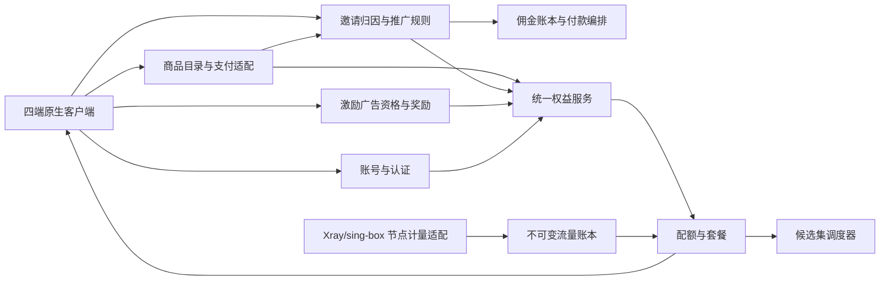
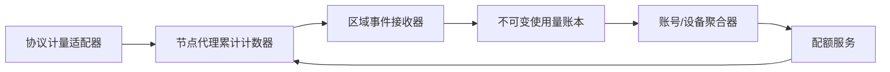

# VPN 商业客户端、账号、计量与支付设计规格

- 状态：已完成方案评审，待用户审阅书面规格
- 日期：2026-08-04
- 产品品牌：`Talenro`（泰联诺）
- 品牌规格：[Talenro 品牌命名体系设计](./2026-08-04-talenro-brand-naming-design.md)
- 关联规格：[强网络限制环境 VPN 产品架构设计](./2026-08-04-resilient-vpn-architecture-design.md)
- 增长规格：[VPN 邀请码与推广返利设计](./2026-08-04-vpn-referral-affiliate-design.md)
- 广告奖励规格：[VPN 激励广告送流量设计](./2026-08-04-vpn-rewarded-ads-design.md)
- 定价规格：[VPN 长期订阅周期折扣设计](./2026-08-04-vpn-subscription-discount-design.md)
- 本地化规格：[VPN 五语本地化与 RTL 设计](./2026-08-04-vpn-localization-design.md)
- 客户端：Android、iOS、Windows、macOS 四端完全原生

## 1. 已确认的产品决策

1. 自动切换支持“保持当前国家”，默认关闭；开启后禁止静默跨国。
2. 套餐流量按账号汇总，同时保留每台设备明细。
3. 计费字节为认证成功后实际转发的上行与下行有效载荷之和，不计算协议开销、失败握手和网络重传。
4. 计量采用不可变流量账本和分布式配额租约。
5. 套餐耗尽采用硬停策略。
6. 支持周期套餐和加油包，无永久免费套餐。
7. 普通付费套餐不按节点质量分级；节点组只用于试用、高成本地区和企业专用服务。
8. 四端采用完全原生 UI 和系统集成，不使用 Flutter、React Native 或共享跨平台 UI。
9. 邮箱为账号主标识，手机号不必填。
10. 主认证为邮箱密码，Passkey、TOTP 和恢复码可选；不使用短信，首发不接入社交登录。
11. 移动应用商店与官网直销并存，权益统一归入账号。
12. 自建统一权益中心，直接接入 StoreKit、Google Play Billing 和 Web 支付。
13. 官网支持加密货币支付；首发使用合规支付处理商，保留后期自托管适配能力。
14. 首发无无限流量套餐。
15. 周期额度不结转；加油包有效 90 天，要求基础订阅有效。
16. 支持月付、季付、半年付和年付；长期套餐一次收费，但流量按月发放。
17. 套餐设备上限按已激活设备数量执行，而不是只限制同时在线数量。
18. 邀请与推广采用一套推荐系统、两个奖励等级：普通邀请发放双边流量奖励，认证推广者可以获得可提现佣金。
19. 普通邀请奖励不可提现；推广佣金默认首单按净实收收入 20%、后续续费 10%、最长 12 个月，不提供终身返佣。
20. 推广佣金冻结 30 天、每月结算、最低提现门槛等值 100 美元；付款通过合规服务商完成。
21. 激励广告只面向试用耗尽或订阅已过期用户；有效付费期内完全无广告。
22. 广告观看入口首发位于 Google Play Android 与官网 Android APK；其他三端只显示和使用账号奖励。
23. 广告奖励基线为每次 50 MB、滚动 24 小时最多 3 次、账号终身最多 1 GB，每笔有效 24 小时。
24. 广告奖励只允许 `trial` 节点组、1 台设备和 20 Mbps；第一台使用设备锁定该笔 grant。
25. 广告奖励只接受提供商签名 SSV，广告 SDK 与 VPN 隧道和目标流量完全隔离。
26. 消费者套餐长期周期折扣统一为季付 5%、半年付 10%、年付 20%，月付不打折。
27. 折扣按同套餐、同国家和同渠道月价计算；商店显示实际可售价格与实际折扣，不夸大目标比例。
28. 长期折扣不与其他现金优惠叠加；邀请和广告流量可以并存，推广佣金按折后净实收收入计算。
29. 首发完整支持简体中文、英文、俄语、波斯语和日语；采用四端原生资源系统、共享语义目录和完整波斯语 RTL，语言切换不得中断 VPN。
30. 主品牌为 `Talenro`，官方中文名为 `泰联诺`；消费者应用商店名统一为 `Talenro VPN`，Basic、Plus、Pro、Enterprise 只作为套餐名。

## 2. 子系统边界



边界原则：

- 支付成功不直接操作 VPN 节点，只写入交易账本并生成权益。
- 流量监控与可计费流量账本分离。
- 账号服务不负责节点健康和协议配置。
- 调度器只消费签名权益和节点资格，不理解支付渠道。
- 客户端不能自行声明购买成功、剩余额度或节点组权限。
- 推荐系统只消费服务端验证后的支付事件；流量奖励进入权益服务，可提现佣金进入独立金额账本。
- 推荐风控和付款服务不得读取 VPN 访问目标或内容。
- 激励广告只消费签名 SSV；广告 SDK 只存在于 Android 主应用，不进入隧道进程。
- 广告提供商不可达不会影响账号、支付、邀请、节点切换或 VPN 连接。

## 3. 四端原生客户端

### 3.1 技术栈

| 平台 | UI 与应用层 | 隧道与系统层 |
|---|---|---|
| Android | Kotlin、Jetpack Compose | `VpnService`、原生后台服务、sing-box 适配 |
| iOS | Swift、SwiftUI/UIKit | `NEPacketTunnelProvider`、Keychain、StoreKit 2 |
| macOS | Swift、SwiftUI/AppKit | Network Extension、菜单栏、Keychain、StoreKit 2/官网支付 |
| Windows | C#、WinUI 3 | 独立高权限 Windows Service、TUN、路由、sing-box 生命周期 |

iOS 与 macOS 可以共享纯 Swift 的 API 模型、认证、账本展示和测试向量，但 UI、Network Extension 生命周期和系统集成分别实现。Android 和 Windows 不共享 UI 代码。

四端共享的不是运行时代码，而是：

- OpenAPI/Protobuf schema。
- 签名配置和权益格式。
- 节点评分与状态机规范。
- 错误码、遥测事件和测试向量。
- 视觉设计令牌和文案资源规范。

### 3.2 原生本地化

- Android 使用系统资源与 App Language API；iOS/macOS 使用 String Catalogs；Windows 使用 WinUI `.resw` 与资源限定符。
- 共享 `message_id`、类型化参数、术语表、审核状态和测试向量，不共享运行时 UI 或翻译引擎。
- UI 语言默认跟随系统并允许按设备覆盖；邮件、账单和安全通知使用账号级通信语言。
- 首发语言为 `zh-Hans`、`en`、`ru`、`fa`、`ja`，英文是源语言和最终安全回退。
- 波斯语启用完整 RTL；IP、域名、端口、订单号、验证码和加密货币地址保持 LTR 并使用双向隔离。
- 语言变化只重载主应用 UI，不重启 `VpnService`、Network Extension、Windows 隧道服务或 sing-box。

详细规则见 [VPN 五语本地化与 RTL 设计](./2026-08-04-vpn-localization-design.md)。

### 3.3 进程隔离

- UI 进程不直接拥有 TUN 或系统路由。
- 隧道运行于 Android 前台服务、Apple Packet Tunnel Extension 或 Windows Service。
- UI 与隧道通过强类型 IPC 通信。
- UI 崩溃不能破坏当前隧道、DNS 或系统路由。
- 隧道进程崩溃后由系统宿主和 Tunnel Manager 完成清理与恢复。
- 购买、账号和流量页不可阻塞隧道事件循环。

## 4. 信息架构

### 4.1 移动端

底部导航固定为：

1. 连接
2. 节点
3. 流量
4. 账户

“连接优先”首页包含：

- 大型连接/断开控件。
- 当前出口国家、节点、协议和延迟。
- 自动/手动节点模式。
- “保持当前国家”快速入口。
- 本周期账号总用量。
- 当前设备用量和实时速度摘要。
- 连接详情二级入口。

### 4.2 桌面端

侧边导航包含：

1. 连接
2. 节点
3. 流量
4. 设备
5. 账户与套餐
6. 设置

桌面端显示更完整的连接摘要，但协议阈值、丢包、候选评分和故障原因仍放入连接详情，不把首页变成运维控制台。

### 4.3 节点页

节点页提供“自动选择”和“手动选择”两个模式：

- 自动模式显示当前策略、锁定国家、当前节点和少量备用候选。
- 手动模式按出口国家分组，显示节点协议、健康状态和简化质量指标。
- 手选节点表示首选节点；节点失败后仍自动恢复。
- 手动选择其他国家节点时，若国家锁定开启，则同步更新锁定国家。
- 普通用户不显示控制面权重、精确服务器负载或敏感基础设施信息。

## 5. 保持当前国家

### 5.1 语义

- 默认关闭。
- 国家由实际出口 IP 的 `egress_country` 决定，不使用机房标签或服务器物理位置。
- 开启后，自动切换、质量切换和应急候选都只能来自锁定国家。
- IPv4 和 IPv6 出口都必须符合锁定国家。
- 国家锁定是账号本地偏好，可按设备独立设置，不作为套餐权益。

### 5.2 本国节点全部失败

客户端不得静默跨国。显示三个操作：

1. 一次性允许跨国恢复。
2. 继续重试当前国家。
3. 保持断开。

一次性跨国恢复只影响当前故障事件，不永久关闭国家锁定。严格 10 秒恢复 SLO 只在锁定国家仍有健康、合格候选时成立。

### 5.3 调度过滤顺序

```text
套餐允许的节点组
→ 用户锁定的国家
→ 客户端协议能力
→ 节点健康与容量
→ 控制面稳定分配
→ 客户端本地评分
```

## 6. 账号与认证

### 6.1 账号模型

账号主标识是规范化邮箱地址。手机号不是必填字段，也不作为恢复账号的唯一手段。

主要实体：

- `account`
- `email_identity`
- `password_credential`
- `passkey_credential`
- `totp_credential`
- `recovery_code_set`
- `device`
- `device_session`
- `security_event`

账号支持邮箱变更，但必须同时验证旧凭证和新邮箱。邮箱地址不能直接用作节点凭证、公开日志标签或遥测 ID。

### 6.2 密码与 Passkey

- 密码使用 Argon2id 哈希并设置可升级的参数版本。
- 邮箱验证、密码重置和异常登录通知使用短期、一次性令牌。
- 每次普通登录不依赖邮件验证码。
- Passkey 可作为后续无密码登录方式。
- Passkey 私钥始终留在系统认证器中，服务端保存公钥凭证。
- TOTP 和恢复码由用户主动启用。
- 恢复码只显示一次，在服务端按不可逆摘要保存。
- 首发不接入 Google、Apple 或其他社交登录。

### 6.3 会话

- 每台设备拥有独立刷新令牌族。
- 刷新令牌轮换并检测重复使用。
- 访问令牌短期有效。
- 设备移除时撤销其令牌、配置解密身份和节点凭证。
- 用户可以退出当前设备、其他所有设备或全部设备。
- 修改密码触发高风险会话复核，但不必无条件中断当前可信设备的 VPN。

### 6.4 账户删除

四端均提供账户删除入口。删除流程：

1. 重新认证。
2. 展示订阅和加油包后果。
3. 取消可由本方取消的订阅；商店订阅引导用户在系统订阅管理中取消。
4. 撤销设备、配置和节点凭证。
5. 依据税务、反欺诈和争议处理要求保留最小必要交易记录，其余个人数据按政策删除或匿名化。

## 7. 设备管理

### 7.1 设备上限

设备数量按已激活设备计算，不按同时在线连接计算。每个设备记录：

- 随机设备 ID。
- 用户可编辑名称。
- 平台、应用版本和最后活动时间。
- 本周期上行、下行和合计用量。
- 在线状态和粗粒度当前出口国家。
- 凭证版本与撤销状态。

达到设备上限时，新设备登录成功但不获得 VPN 凭证。用户必须移除旧设备或升级套餐，并通过密码或 Passkey 重新认证该操作。

### 7.2 远程撤销

远程移除设备后：

- 立即撤销账号刷新令牌。
- 撤销设备配置公钥或标记不可再获取新配置。
- 将节点凭证加入撤销传播流程。
- 在线隧道在控制面事件到达或下一次配额/凭证验证时终止。
- 历史用量仍保留在账号账本中，但设备显示名称可匿名化。

## 8. 可计费流量定义

```text
billable_bytes = forwarded_uplink_payload + forwarded_downlink_payload
```

只计算认证成功后，代理实际转发的逻辑有效载荷：

- 计算上行和下行。
- 不计算 TLS、REALITY、QUIC 或 Hysteria2 协议开销。
- 不计算失败握手。
- 不计算操作系统或网络层重传。
- 不计算客户端与控制面的配置、账号和支付请求。
- Xray 与 sing-box 必须通过统一计量适配层输出相同语义。

账号总量是所有设备用量之和；设备维度用于明细、风险识别和用户自查，不形成彼此独立的套餐余额。

## 9. 流量账本

### 9.1 架构



节点上报累计快照而不是无法恢复的裸增量。事件至少包含：

- `event_id`
- `node_id`
- `boot_id`
- `sequence`
- `account_id`
- `device_id`
- `credential_id`
- `uplink_total`
- `downlink_total`
- `observed_at`

区域接收器在 durable append 后才确认。消费端通过节点启动 ID 和单调序号去重，重复事件不得重复扣减。

### 9.2 不可变账本

账本记录以下类型：

- 使用量扣减。
- 周期额度发放。
- 加油包额度发放。
- 补偿额度。
- 退款冲正。
- 人工调整。
- 过期结转为零的关闭记录。

不得直接修改“当前已用流量”字段。当前余额和报表由账本投影生成，所有人工操作必须有操作者、原因和审计记录。

### 9.3 数据时效

- 客户端用量显示目标延迟小于 60 秒。
- 计量事件可批量发送，不能逐包写入中央服务。
- 节点重启前尽力落盘最后计数；中央账本使用累计快照弥补重复和重试。
- 正常计量差异目标小于 0.1%。

## 10. 配额租约与硬停

### 10.1 配额租约

中央服务为账号下的活跃设备原子分配有限字节和时间的配额租约。节点在本地高速扣减，不为每个包或连接同步调用中央服务。

- 租约按设备签发，但从账号共享余额中预留。
- 多设备未结算租约总和不能超过账号可分配余额。
- 租约大小根据速率动态调整。
- 账本短时不可达时，节点可消耗现有租约。
- 租约用尽或过期且无法续租时，节点失败关闭代理流量。
- 最大超额受所有未结算租约上限约束。

### 10.2 通知和耗尽

- 80%：普通提醒。
- 95%：高优先级提醒和加油包入口。
- 100%：停止签发新租约。
- 节点耗尽现有租约后拒绝新连接并终止现有代理流量。
- 账号、支付、套餐和帮助接口通过受控直连通道保持可访问。
- 购买完成并获得新 grant 后自动恢复隧道，无需重新登录。

## 11. 商品目录

### 11.1 普通套餐

首发目录采用三档消费者套餐和一档企业套餐：

| 套餐 | 初始月度额度 | 已激活设备 | 单设备上限 | 节点资格 |
|---|---:|---:|---:|---|
| Basic | 100 GB | 3 | 100 Mbps | `general` |
| Plus | 500 GB | 5 | 100 Mbps | `general` |
| Pro | 1 TB | 10 | 100 Mbps | `general` |
| Enterprise | 合同定义 | 合同定义 | 合同定义 | `general`/`dedicated` |

上述消费者额度是初始商品目录，服务端 catalog 可以在不发布客户端新版本的情况下为新购买者调整额度和价格；已购买订单始终按交易时的产品快照履约。

首发不提供无限流量。所有普通付费套餐共享相同节点质量、协议、故障恢复和普通国家覆盖，不销售“VIP 节点”或“高级协议”。

### 11.2 订阅周期

支持以下周期与目标折扣：

| 周期 | 预付月数 | 目标折扣 | 目标月价系数 |
|---|---:|---:|---:|
| 月付 | 1 | 0% | 100% |
| 季付 | 3 | 5% | 95% |
| 半年付 | 6 | 10% | 90% |
| 年付 | 12 | 20% | 80% |

长期套餐一次收费，但每月按套餐档位生成一次周期流量 grant。未使用的周期额度在每个发放月结束时清零，不结转到下一月。

商店和银行卡渠道可以自动续费；加密货币为固定期限，默认手动续费。

折扣基准是同一套餐、同一国家/storefront、同一支付渠道和同一税务口径的月付价格。Apple/Google 因价格点无法精确命中时，客户端展示实际总价和实际折扣率；Web 与加密支付按目标公式计算后按货币最小单位舍入。

长期周期折扣是常规 SKU 价格，不与其他现金优惠叠加。邀请、广告或故障补偿流量属于非现金 grant，可以并存，但不改变订单金额。完整计算、渠道映射、展示、调价和退款规则见 [VPN 长期订阅周期折扣设计规格](./2026-08-04-vpn-subscription-discount-design.md)。

### 11.3 加油包

- 加油包是一次性额度 grant。
- 购买后有效 90 天。
- 可以跨周期使用。
- 使用时必须存在有效基础订阅。
- 基础订阅暂停或过期时，加油包有效期继续流逝，不暂停计时。
- 额度扣减优先使用最早到期的 grant。
- 商品页面在购买前显示明确到期日期。

加油包容量和价格由 catalog 配置；客户端根据渠道返回的可售商品展示，不把商品 ID 写死在 UI。

### 11.4 试用

- 不提供永久免费套餐。
- 每个新账号一次试用。
- 1 台已激活设备。
- 1 GB 或 24 小时，任一先到结束。
- 使用 `trial` 节点组。
- 最高 20 Mbps。
- 支持真实自动切换和国家锁定，以便用户验证连接质量。
- 不强制手机号；通过设备密钥、账号历史和风险信号减少重复试用。

## 12. 节点组权益

| 组 | 用途 |
|---|---|
| `general` | 所有普通付费套餐 |
| `trial` | 一次性试用与滥用隔离 |
| `high_cost` | 高成本或资源稀缺地区附加权益 |
| `dedicated` | 企业固定出口、专用容量或独立 SLA |
| `quarantine` | 运维隔离，永不下发给用户 |

套餐包含 `allowed_node_groups`，但普通消费者套餐全部允许 `general`。控制面不创建“Basic 节点”和“Pro 节点”这类质量分区。

## 13. 统一权益中心

### 13.1 权益状态

至少支持：

- `trialing`
- `active`
- `grace_period`
- `past_due`
- `canceled_active_until_period_end`
- `expired`
- `refunded`
- `chargeback`
- `suspended`

权益服务把支付渠道状态转换为内部统一状态，并生成签名的短期 entitlement snapshot，供客户端、配额服务和调度器消费。

### 13.2 商品映射

内部 SKU 与渠道产品分离：

```text
internal_sku
├─ apple_product_id
├─ google_product_id / base_plan_id
├─ web_price_id
└─ crypto_invoice_price_rule
```

商品 catalog 保存交易时的额度、设备数、周期、价格、币种、税务类别和节点组快照，避免后续改价改变历史订单含义。

长期周期 SKU 还保存 `target_discount_bps`、同渠道月付参考 SKU、渠道实际总价、实际折扣、折算月价、价格版本和有效时间。客户端不能提交任意扣款金额；Web/crypto 下单由服务端按 SKU 与价格版本重新复核，Apple/Google 使用商店实际产品价格。

## 14. 支付渠道

### 14.1 Apple

- iOS 和 Mac App Store 使用 StoreKit 2。
- 客户端将已验证 JWS 交易发送到后端。
- 后端使用 App Store Server API 和 Server Notifications 同步购买、续订、退款和撤销。
- 服务端验证完成后才授予权益。
- App Store 版本不得使用加密货币、许可证密钥或不合规外部支付直接解锁服务。
- 跨平台已购权益可以登录后使用，但商品展示和外部链接必须按 storefront 政策配置。

### 14.2 Google Play

- Google Play 分发版使用 Play Billing。
- 客户端把 purchase token 和混淆账号 ID 发送到后端。
- 后端通过 Google Play Developer API 验证并处理 RTDN。
- 只有 `PURCHASED` 状态授予权益。
- 订阅和一次性商品在后端完成 acknowledge/consume 流程。
- 替代支付和外部链接按国家/地区及已加入的 Google 计划启用，不能全局假设可用。

### 14.3 Web 支付

- 官网 Android、Windows 和官网 macOS 使用 Web 支付处理商。
- Webhook 先写入幂等事件收件箱，再查询或验证支付处理商状态。
- 信用卡等敏感支付信息由合规支付页面收集，产品服务不保存完整卡号。
- Web 订阅、退款、失败重试和拒付转换为统一权益事件。

### 14.4 加密货币

加密支付只出现在官网结账流程：

1. 创建唯一发票。
2. 锁定法币报价约 15 分钟。
3. 用户选择处理商支持的币种和链。
4. 处理商完成链上确认和风险检查。
5. 签名 webhook 进入交易账本。
6. 最终确认后发放固定期限套餐或加油包。

首发原则：

- 使用合规加密支付处理商。
- 优先支持稳定币；其他币种由处理商决定是否接受和换汇。
- 不在客户端或普通控制面保存钱包私钥。
- 加密支付默认不自动续费。
- 链上交易哈希和发票 ID 全局去重。
- 支持 `pending`、`confirmed`、`underpaid`、`expired`、`refunding`、`refunded`。
- 退款需要用户提供并确认退款地址，不能盲目退回原发送地址。
- 加密支付不宣称匿名；按经营地区执行制裁、反洗钱、税务和财务记录要求。

后期自托管通过相同 `CryptoPaymentAdapter` 接口实现，不改变交易账本和权益服务。

## 15. 支付事件与幂等

所有渠道先进入支付事件收件箱：

- 保存原始签名事件、渠道、环境和接收时间。
- 以渠道交易 ID、purchase token、JWS transaction ID 或链上发票/交易哈希建立唯一约束。
- 重复事件返回成功但不重复发放权益。
- 异步 worker 验证渠道真实状态。
- 验证成功后写入不可变交易账本。
- 权益投影失败可以重放，不重新扣款。

客户端购买成功页面只能显示“正在确认”，直到统一权益服务返回新 entitlement。

## 16. 退款、拒付与套餐变更

- 退款不删除原始交易，写入反向交易。
- 未消耗加油包额度可以撤销对应 grant。
- 已消耗额度不能从历史账本删除；账号可形成负余额、暂停或进入人工审核。
- 拒付进入 `chargeback`，停止签发新配额并保留争议证据。
- 升级可以立即生效并按渠道规则补差价。
- 降级在当前已付周期结束后生效。
- 长期套餐中途退款必须根据已发放月份和已消耗加油包计算，不由客户端自行计算。
- 长期套餐退款以实际折后支付额和已履约月份为基础，不能按未折扣月价追溯扣除；商店渠道以实际退款/撤销事件为财务真相。

## 17. 邀请码与推广返利

产品采用一套推荐领域系统，并按账号资格选择奖励策略：

- 所有合格账号自动获得不可预测的邀请码、签名邀请链接和二维码。
- 普通邀请在被邀请人首次有效付费后发放双边流量奖励；奖励需要有效基础订阅，有效期 90 天且不可提现。
- 认证推广者默认获得首单净实收收入 20%、续费 10%、最长 12 个月的佣金；比例和期限以不可变活动版本为准。
- 每个账号只能绑定一个邀请人；允许在注册后 7 天且首次付费前显式输入邀请码，首次有效付费后归属锁定。
- 推广佣金冻结 30 天、每月结算，达到等值 100 美元后通过合规服务商支付。
- 重复支付通知不会重复发奖；退款、拒付和人工调整通过反向账本记录冲正。
- 反作弊使用账号、设备、安全、归因和支付信号，不使用 VPN 浏览目标或内容。

详细的归因优先级、账本、付款、反作弊、后台和验收规则见 [VPN 邀请码与推广返利设计规格](./2026-08-04-vpn-referral-affiliate-design.md)。

## 18. 客户端商业 UI

### 18.1 流量页

- 账号总用量是第一层信息。
- 显示上行、下行、总量、剩余天数和更新时间。
- 设备明细显示每台设备的本周期用量。
- 80% 和 95% 状态提供明确提醒。
- 计量注明“服务端统计，可能延迟约 60 秒”。

### 18.2 套餐页

- 显示当前 SKU、周期、额度、设备数和续订渠道。
- 显示可升级套餐和加油包。
- 周期选择同时显示本次总付款、折算月价、实际节省金额、实际折扣率和续订周期。
- 年付可以标注“最划算”，但不默认预选；默认保持月付或用户当前周期。
- App Store/Google Play 版本只展示渠道允许的购买方式。
- 官网购买和加密支付得到的权益会同步到账号，但受限商店版本不显示违规入口。
- 提供恢复购买和系统订阅管理入口。

### 18.3 额度耗尽

- 连接页显示“额度用尽”，不伪装为节点故障。
- 提供加油包和升级套餐入口。
- 账号和支付控制面通过直连保持可达。
- 新 grant 确认后自动请求配额租约并恢复隧道。

### 18.4 设备页

- 显示已激活数量和套餐上限。
- 显示设备用量、最后活动和在线状态。
- 远程移除要求重新认证。
- 新设备达到上限时，必须先移除旧设备或升级套餐。

### 18.5 邀请奖励与推广中心

- 移动端从“账户 → 邀请奖励”进入，桌面端从“账户与套餐 → 邀请奖励”进入。
- 普通用户看到邀请码、分享链接、二维码、邀请人数、待确认奖励和已获得流量。
- 认证推广者在同一入口看到点击、注册、有效付费、待结算佣金、可提现佣金、付款记录与披露要求。
- 被邀请用户只以脱敏状态显示，不暴露邮箱、设备、付款方式或订单金额。
- 分享使用系统分享面板，不请求或上传通讯录。

### 18.6 获取免费流量

- Android 从“流量 → 获取免费流量”进入；有效付费用户不显示入口，也不初始化广告 SDK。
- 播放前显示本次奖励、滚动 24 小时剩余次数、终身剩余额度、24 小时有效期、`trial` 节点和 20 Mbps 限制。
- VPN 连接中只能由用户明确选择“断开并观看”，不能自动打断连接。
- 完成广告后先显示“奖励确认中”，收到服务端 SSV 验证结果后才显示到账。
- iOS、Windows 和 macOS 可以显示账号奖励及锁定设备，但不提供观看入口。

## 19. 激励广告送流量

- 该能力是有限的试用延长与召回机制，不是按月重置的永久免费套餐。
- Play 版优先 AdMob；官网 APK 使用支持侧载应用和签名 SSV 的可替换提供商。
- 每个发行包首发只内置一个广告 SDK，不使用多 SDK 自动竞价。
- 服务端签发 10 分钟有效的一次性 `ad_session`，绑定账号、设备、发行渠道、提供商、广告单元、活动版本和奖励字节数。
- 只有签名 SSV 经过交易 ID、会话、时间、广告单元、资格和风险复核后，才写入不可变奖励账本。
- `ad_reward` 不要求基础订阅；首发为 50 MB、24 小时、`trial` 节点、1 台设备和 20 Mbps。
- 广告奖励归账号，第一台消耗该 grant 的设备原子锁定；24 小时内不能转移。
- 购买套餐后付费权益立即优先，剩余广告奖励不转换、不延期，仍按原时间过期。
- 每日与终身上限按已发放奖励计算；客户端改时间、重装或换账号不能重置强设备限制。
- 广告无库存、加载失败、提前关闭或 SDK 崩溃不扣次数；SSV 延迟时保持待确认。

完整的平台、SSV、SDK 隔离、反作弊、配额和验收规则见 [VPN 激励广告送流量设计规格](./2026-08-04-vpn-rewarded-ads-design.md)。

## 20. 隐私和合规隔离

- 支付 SDK、崩溃分析和广告 SDK 不得访问 VPN 目标流量。
- 不向支付处理商传递节点、协议、访问目标或详细 VPN 遥测。
- 支付事件使用内部账号引用，不发送邮箱作为不必要的第三方元数据。
- 交易、税务和争议记录与 VPN 使用遥测分库或至少分权限域。
- 客服默认只能看到套餐、支付和汇总用量，不能看到用户访问目标。
- 推荐风控只使用账号、设备、安全、归因和支付信号；IP/ASN 不能单独作为拒绝奖励的依据。
- 推广佣金关系需要按目标市场规则清晰披露；稳定币付款不被描述为匿名付款。
- 广告 SDK 只在资格、断开、地区开关和用户同意均通过后初始化；应用不主动申请广告 ID。
- 非个性化广告仍可能处理 IP 和设备技术信息，隐私政策及 Android Data safety 必须如实披露。
- 广告 SDK 不得接收节点、协议、国家锁定、DNS、访问目标或 VPN 流量明细。
- Apple VPN 数据规则、Google VpnService 政策、消费者自动续订披露、退款和账户删除要求在发布地区逐项审查。

## 21. API 边界

建议最小接口：

```text
POST /v1/auth/register
POST /v1/auth/login
POST /v1/auth/refresh
POST /v1/auth/passkeys/*
GET  /v1/devices
DELETE /v1/devices/{device_id}
GET  /v1/catalog
POST /v1/purchases/apple/verify
POST /v1/purchases/google/verify
POST /v1/crypto/invoices
GET  /v1/entitlement
GET  /v1/usage/summary
GET  /v1/usage/devices
GET  /v1/usage/ledger
GET  /v1/referrals/me
POST /v1/referrals/attributions
GET  /v1/referrals/rewards
POST /v1/affiliates/applications
GET  /v1/affiliates/dashboard
GET  /v1/affiliates/commissions
GET  /v1/affiliates/payouts
GET  /v1/ad-rewards/eligibility
POST /v1/ad-rewards/sessions
GET  /v1/ad-rewards/sessions/{ad_session_id}
GET  /v1/ad-rewards/grants
```

Apple、Google、Web、加密支付和广告 SSV 使用独立入口、独立验证密钥和严格请求大小限制。

本地化 API 契约：

- 客户端发送 `Accept-Language` 与规范化 `X-App-Locale`，账号通信语言通过独立字段管理。
- 语言、国家、storefront、币种和法律辖区分别建模，不根据界面语言推断商业资格。
- 错误响应使用稳定 `code`、类型化 `params`、`action` 与 `trace_id`；客户端依据代码本地化，不能解析服务端自然语言决定行为。
- 连接和配额关键文案内置；远程运营内容必须签名、版本化、缓存且可回滚。

## 22. 验收标准

### 22.1 账号与设备

- 邮箱登录不依赖每次邮件验证码。
- Passkey、TOTP 和恢复码能够独立撤销。
- 设备达到上限后无法获得新 VPN 凭证。
- 远程移除后旧刷新令牌不能再次获取配置。
- 账户删除可以从四端发起。

### 22.2 计量

- Xray 与 Hysteria2 对相同测试流量的计费差异小于 0.1%。
- 重复事件不重复扣费。
- 节点重启不丢失已确认用量。
- 账号总量严格等于设备投影之和。
- UI 用量正常延迟小于 60 秒。
- 最大超额不超过所有未结算配额租约。

### 22.3 套餐

- 月、季、半年、年付均按月生成额度。
- 季、半年、年付目标折扣分别为 5%、10%、20%，并按渠道实际价格显示有效折扣。
- 折扣只影响订单价格，不改变流量、设备、速率或节点组。
- 长期折扣不叠加其他现金优惠；邀请与广告流量可以并存。
- 周期额度不结转。
- 加油包 90 天到期且最早到期优先。
- 基础订阅失效时加油包不能单独连接。
- 80%、95% 和 100% 状态均有确定行为。
- 100% 后节点最终硬停，购买后自动恢复。

### 22.4 支付

- 客户端伪造购买结果不能获得权益。
- Apple/Google/Web/加密重复通知不重复发放。
- `pending` 交易不授予可用权益。
- 退款、拒付、取消和续订状态可以重放并得到相同结果。
- 加密发票过期、少付、重复交易和退款地址错误都有人工可恢复路径。
- 商店版不展示不符合当前 storefront 规则的外部或加密支付入口。
- Web/crypto 不能通过篡改客户端金额或复用过期价格版本获得错价。
- 长期套餐退款和推广佣金都使用实际折后付款，不使用未折扣月价。

### 22.5 UI

- 移动端四栏导航和桌面侧边导航保持语义一致。
- 首页连接操作不被账号、用量或支付网络请求阻塞。
- 国家锁定失败不会静默跨国。
- 套餐耗尽不会被错误显示为普通节点故障。
- 辅助功能、键盘导航、动态字体、高对比度和本地化在四平台分别验收。
- 五种语言覆盖关键流程；俄语复数、波斯语 RTL/双向混排、日语换行和中文紧凑布局通过专项测试。
- 活跃 VPN 连接期间切换语言不会触发隧道 stop、restart 或重新计量。
- 界面不出现原始资源键、未替换参数、错误语言或未经标注的法律文本回退。

### 22.6 邀请与推广

- 手动码、签名链接和 Cookie 按已确认优先级归因，首付后不能覆盖。
- Apple、Google Play、Web 和加密支付重复通知不会重复发放奖励或佣金。
- 普通奖励不可提现，90 天到期且只能与有效基础订阅一起使用。
- 推广佣金按净实收收入和活动快照计算，退款与拒付会产生反向记录。
- 未认证推广者不能提现；30 天冻结、月度付款和 100 美元门槛行为确定。
- 共享 IP 或运营商 NAT 不会单独触发拒绝，且推荐系统不能读取 VPN 目标流量。

### 22.7 激励广告

- 有效付费用户不显示入口且广告 SDK 初始化次数为 0。
- 客户端伪造完成不能发奖；重复、乱序和延迟 SSV 不会重复产生 grant。
- 滚动 24 小时第 4 次和终身 1 GB 之后的请求被服务端拒绝。
- 50 MB grant 只允许 `trial`、1 台锁定设备和 20 Mbps，并在 24 小时后到期。
- 四端能显示 grant，并发首连不能把同一笔奖励锁定到两台设备。
- VPN 连接期间不能加载广告；广告系统故障不影响连接、支付和邀请。
- 广告 SDK 不存在于隧道模块依赖图，网络数据中不包含 VPN 访问目标。
- 共享 IP 或运营商 NAT 不会单独触发拒绝奖励。

## 23. 发布前决策门

以下项目在实现计划中作为有明确负责人的发布门，不阻塞当前架构定稿：

1. 确定首发国家/地区及相应 VPN、税务、自动续订和虚拟资产合规范围。
2. 完成 Web 支付处理商和加密支付处理商的采购、安全与隐私评估。
3. 根据真实带宽成本和商店费率最终确认价格；初始额度和设备数已作为 catalog 基线。
4. 完成 Xray 与 sing-box 统一有效载荷计量原型。
5. 验证 100 Mbps 服务端硬限速和配额租约的组合行为。
6. 完成 Apple、Google 购买沙盒与退款/撤销全生命周期测试。
7. 完成推广佣金、广告披露、税务、KYC、制裁和付款服务商的目标国家评估。
8. 用真实渠道费率、带宽边际成本、退款率和欺诈率确认奖励额度与佣金活动。
9. 完成 Play 与官网 APK 广告提供商的采购、SSV、安全、隐私、SDK 供应链和真实填充率评估。
10. 验证 50 MB 小额 grant 的配额租约超额、控制面负载和 `trial` 节点单位经济。
11. 完成 Apple/Google 长周期产品价格点、Web/crypto 舍入、折扣毛利与退款全生命周期验证。
12. 完成五语术语、母语审校、法律/支付文案批准、商店材料和客服模板。
13. 完成四端语言切换不影响隧道、波斯语 RTL 安全和签名远程内容回滚验证。

## 24. 参考资料

- [Apple App Review Guidelines](https://developer.apple.com/app-store/review/guidelines/)
- [Apple StoreKit 2](https://developer.apple.com/storekit/)
- [App Store Server API](https://developer.apple.com/documentation/appstoreserverapi)
- [Google Play Payments Policy](https://support.google.com/googleplay/android-developer/answer/9858738?hl=en)
- [Google Play Billing 后端集成](https://developer.android.com/google/play/billing/backend)
- [Google Play Billing 安全建议](https://developer.android.com/google/play/billing/security)
- [Apple appAccountToken](https://developer.apple.com/documentation/storekit/transaction/appaccounttoken)
- [Google Play Billing 购买归因](https://developer.android.com/google/play/billing/developer-payload)
- [FTC Endorsement Guides 问答](https://www.ftc.gov/business-guidance/resources/ftcs-endorsement-guides-what-people-are-asking)
- [Google Play VpnService 政策说明](https://support.google.com/googleplay/android-developer/answer/12564964?hl=en-GB)
- [Google AdMob 激励广告奖励政策](https://support.google.com/admob/answer/7313578?hl=en-GB)
- [AdMob SSV 验证](https://developers.google.com/admob/android/ssv)
- [AdMob 应用设置与支持商店](https://support.google.com/admob/answer/9989980?hl=en-GB)
- [Play Integrity standard request](https://developer.android.com/google/play/integrity/standard)
- [Apple In-App Purchase 与订阅定价](https://developer.apple.com/help/app-store-connect/reference/pricing-and-availability/in-app-purchase-and-subscriptions-pricing-and-availability)
- [Google Play 订阅模型](https://support.google.com/googleplay/android-developer/answer/12154973?hl=en-EN)
- [Google Play 订阅政策](https://support.google.com/googleplay/android-developer/answer/9900533?hl=en)
- [Android VpnService](https://developer.android.com/reference/android/net/VpnService)
- [Apple NEPacketTunnelProvider](https://developer.apple.com/documentation/networkextension/nepackettunnelprovider)
- [WinUI 3](https://learn.microsoft.com/en-us/windows/apps/winui/winui3/)
- [WebAuthn Level 3](https://www.w3.org/TR/webauthn-3/)
- [RFC 9106：Argon2](https://www.rfc-editor.org/rfc/rfc9106.html)
- [FATF 虚拟资产风险指南](https://www.fatf-gafi.org/en/publications/Fatfrecommendations/Guidance-rba-virtual-assets.html)
- [OFAC 虚拟货币行业制裁合规指南](https://ofac.treasury.gov/system/files/126/virtual_currency_guidance_brochure.pdf)
