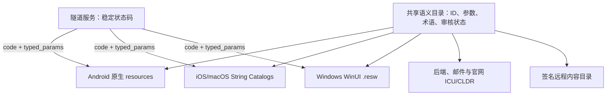

# VPN 五语本地化与 RTL 设计规格

- 状态：已完成方案评审，待用户审阅书面规格
- 日期：2026-08-04
- 产品品牌：`Talenro`（泰联诺）
- 首发语言：简体中文、英文、俄语、波斯语、日语
- 客户端：Android、iOS、Windows、macOS 四端完全原生
- 品牌规格：[Talenro 品牌命名体系设计](./2026-08-04-talenro-brand-naming-design.md)
- 关联规格：[强网络限制环境 VPN 产品架构设计](./2026-08-04-resilient-vpn-architecture-design.md)
- 商业规格：[VPN 商业客户端、账号、计量与支付设计](./2026-08-04-vpn-commercial-client-design.md)

## 1. 执行摘要

首发完整支持 `zh-Hans`、`en`、`ru`、`fa` 和 `ja`。产品采用“平台原生资源系统 + 共享语义目录”，不引入跨平台 UI 或自研运行时翻译引擎：Android 使用系统资源和 App Language API；iOS/macOS 使用 Xcode String Catalogs；Windows 使用 WinUI `.resw` 与资源限定符。后端、官网、邮件和运营内容共享稳定 `message_id`、参数 schema、术语表与审核状态，但各运行环境使用成熟的 Unicode/CLDR 实现完成格式化。

界面语言默认跟随系统，允许每台设备单独覆盖且不跨设备同步。邮件、账单与安全通知使用账号级“通信语言”。英文是源语言和最终安全回退；首发发布门仍要求五种语言关键内容全部由人工审核。

波斯语启用完整 RTL。界面使用 `leading/trailing` 语义，导航元素按平台规则镜像；IP、域名、端口、协议、邮箱、订单号和加密货币地址等结构化 LTR 内容必须执行双向隔离。语言切换只能刷新 UI，不能重启、断开或重建 VPN 隧道。

连接与配额等关键文案随 App 内置，保证离线可用。服务端返回稳定错误码和类型化参数，由客户端本地化；远程运营内容必须版本化、签名、缓存并可回滚，不得覆盖连接、授权或支付确认等安全关键控件。

## 2. 已确认的产品决策

1. 首发完整支持 `zh-Hans`、`en`、`ru`、`fa`、`ja`。
2. 采用方案 A：四端原生资源系统，另设共享语义目录和术语表。
3. 英文是源语言和最终回退语言。
4. UI 语言默认跟随系统，允许按设备覆盖，不跨设备同步。
5. 账号级通信语言在注册时继承 UI 语言，之后可单独修改并跨设备同步。
6. 语言切换不影响 VPN 隧道、节点选择、实时计量和连接恢复状态。
7. 波斯语使用完整 RTL，而不是仅翻译字符串。
8. 服务端错误采用稳定错误码、类型化参数和操作建议，不以预翻译文本驱动客户端逻辑。
9. 连接、权限、配额与安全关键文本内置；运营内容可以远程下发，但必须签名和版本化。
10. 金额使用真实交易币种；Apple、Google 或支付处理商返回的本地化价格是渠道展示真相。
11. 支付、法律、隐私、安全与加密货币文案不得仅凭机器翻译发布。
12. 新增语言不修改连接、计量、支付或权益业务逻辑。
13. `Talenro` 是五种语言中不变的主品牌；`泰联诺` 是官方中文名，`Таленро`、`تالنرو`、`タレンロ` 只作发音和搜索辅助，不替代主 Logo。

## 3. 目标与非目标

### 3.1 目标

- 五种首发语言在四个平台具有一致的产品语义和完整关键流程。
- 波斯语 RTL、俄语复数、日语换行及中英文混排达到原生应用质量。
- 控制面不可达、内容服务故障或离线时仍能连接、切换节点并理解关键错误。
- 后端、官网、邮件和客户端使用相同语义键、术语与参数契约。
- 用户语言偏好不泄漏到 VPN 目标流量，也不改变节点资格、定价区域或法律辖区。
- 翻译可审计、可回滚，并能证明法律文本的语言和版本。
- 后续增加语言时，只扩展资源、内容和 QA 矩阵。

### 3.2 非目标

- 不使用 Flutter、React Native 或共享跨平台 UI。
- 不让四端在运行时依赖同一个远程翻译引擎。
- 不使用语言推断国家、币种、节点组或法律辖区。
- 不翻译协议名、日志代码、节点技术标识、订单 ID 或机器字段。
- 不允许远程内容修改连接、支付确认、权限授权等安全关键按钮的语义。
- 不承诺所有非首发语言使用机器翻译自动覆盖。

## 4. 语言、偏好与回退

### 4.1 规范语言标签

| 语言 | BCP 47 标签 | 资源显示名 | 方向 |
|---|---|---|---|
| 简体中文 | `zh-Hans` | 简体中文 | LTR |
| 英文 | `en` | English | LTR |
| 俄语 | `ru` | Русский | LTR |
| 波斯语 | `fa` | فارسی | RTL |
| 日语 | `ja` | 日本語 | LTR |

API、内容目录、遥测和审核记录统一存储规范 BCP 47 标签。入口可以接收平台提供的区域变体，但不得把区域变体无限扩展成未经审核的新语言资源。

### 4.2 解析和别名

- `zh-CN`、`zh-SG` 及明确的简体中文脚本请求解析到 `zh-Hans`。
- `fa-IR` 等波斯语区域变体解析到已审核 `fa` 内容。
- `en-*`、`ru-*` 和 `ja-*` 在没有独立审核资源时解析到基础语言。
- 标签先做语法校验和规范化；无效值不能进入资源路径或数据库查询。

### 4.3 UI 语言

每台设备保存以下状态之一：

```text
system
zh-Hans
en
ru
fa
ja
```

`system` 是默认值。系统首选语言中没有受支持项时使用英文。用户从设置页切换语言后，主应用 UI 立即重载或安全重建；隧道扩展、`VpnService`、Windows 高权限服务和 sing-box 生命周期保持不变。

### 4.4 通信语言

账号保存独立 `communication_locale`：

- 注册时从当前 UI 语言初始化。
- 用于安全邮件、账单、续订、配额提醒和账号级推送。
- 可在账号设置中独立修改并跨设备同步。
- 修改只影响后续生成的消息，不改写历史通知或法律接受记录。
- 若值无效或内容缺失，显式回退英文并记录回退原因。

### 4.5 回退链

通用顺序为：

```text
精确标签 → 已审核脚本/基础语言 → en
```

任何用户可见位置都不得显示原始资源键、未替换占位符或空白按钮。法律与结账内容发生英文回退时必须明确标注当前语言；若发布地区要求特定语言版本，则在合格版本上线前禁用购买，不以静默英文回退代替合规判断。

## 5. 架构



关键边界：

- 共享的是语义、schema、术语和测试向量，不是 UI 运行时代码。
- 原生资源负责平台级复数、字体、辅助功能和布局方向。
- 隧道与控制面只认识稳定代码，不读取翻译资源决定行为。
- 内容服务不可达时使用最后已知签名内容；关键连接文案始终来自 App 包。
- 语言更新不修改签名节点配置、路由、计量或支付账本。

## 6. 共享语义目录

### 6.1 条目 schema

每个条目至少包含：

```yaml
message_id: node.connect.timeout
source_locale: en
source: "Could not connect within {seconds, number} seconds."
description: "Shown after the current node exceeds the connection deadline."
surface: connection
security_class: critical
parameters:
  seconds:
    type: integer
plural_categories: []
max_lines: 3
owner: connectivity
```

翻译值与以下元数据分离保存：语言标签、译者、审核者、审核时间、源文本版本、法律批准状态和内容 hash。

### 6.2 键和参数规则

- `message_id` 使用稳定语义名，不把英文全文当长期业务主键。
- 参数具有明确类型，例如整数、字节、持续时间、金额、日期、节点名和国家代码。
- 参数名在所有语言中一致；翻译不能删除、改名或新增参数。
- 复数、性别或选择分支使用平台/ICU 原生机制，禁止 `"数字" + "单位"` 式拼接。
- 安全关键键删除或改变语义需要代码所有者与本地化负责人共同批准。
- 日志使用机器码，用户文案使用资源键；二者可映射但不混用。

### 6.3 术语表

首发术语至少覆盖：连接、断开、节点、自动选择、手动选择、保持当前国家、节点组、已激活设备、账号流量、设备流量、流量额度、试用、加油包、套餐、订阅、续订、退款、邀请码、推荐奖励、佣金、激励广告、通信语言和加密支付。

每个术语包含定义、允许译法、禁用译法、是否翻译、UI 示例与所有者。产品文案修改术语前必须同步五种语言影响评估。

## 7. 四端原生实现

### 7.1 Android

- 使用 Android `resources`、语言限定符和 Compose `stringResource`。
- 启用系统生成或审核后的 `LocaleConfig`，只暴露五种已支持语言。
- Android 13 及以上使用 `LocaleManager`；旧版本使用 AndroidX 兼容 API。
- 语言变更触发 Compose 重组或 Activity 配置更新，`VpnService` 不随 UI Activity 重启。
- 使用 RTL 预览、伪语言和真实 `fa` 设备测试。

### 7.2 iOS 与 macOS

- 使用 Xcode String Catalogs 管理字符串、复数和平台差异。
- SwiftUI 使用语义对齐和系统 `layoutDirection`；UIKit/AppKit 使用 leading/trailing 约束。
- Foundation `FormatStyle` 或等价原生格式化器处理数字、日期、字节与金额。
- 主应用语言变化不得重建 `NEPacketTunnelProvider` 或 Network Extension。
- iOS 与 macOS 可以共享经过审计的 Swift 模型和 String Catalog 源，但各平台保留独立截图与布局验收。
- 系统 VPN 权限、StoreKit 和其他系统托管界面可能服从系统或 storefront 语言；App 在进入前使用当前 UI 语言解释下一步，不能承诺替系统界面强制切换语言。

### 7.3 Windows

- WinUI 3 使用 `.resw`、`x:Uid`、资源限定符和 MRT/MRM 回退。
- 应用级覆盖使用合法 BCP 47 单一标签，并在资源加载前设置。
- 若框架无法原位刷新已加载资源，重建主窗口而不是重启高权限隧道服务。
- Windows Service 与 UI 通过稳定 IPC 状态码通信；服务不得发送需要业务解析的自然语言。

## 8. API、错误和远程内容

### 8.1 请求语言

客户端发送：

- 标准 `Accept-Language`，用于兼容 HTTP 生态。
- `X-App-Locale`，表示 App 当前明确选择的规范语言。
- 账号通信接口单独使用 `communication_locale`，不从单次请求猜测并覆盖账号设置。

本地化内容响应返回规范 `Content-Language`；若发生回退，同时返回机器可读的源请求语言和实际语言元数据，便于客户端明确标注与遥测，不能通过解析文案猜测回退。

语言、`egress_country`、home region、storefront、币种和法律辖区必须作为不同字段处理。

### 8.2 结构化错误

建议错误响应：

```json
{
  "code": "NODE_CONNECT_TIMEOUT",
  "params": {"seconds": 10},
  "action": "switch_node",
  "severity": "recoverable",
  "trace_id": "01..."
}
```

- `code` 和 `action` 驱动逻辑；本地化文案只用于展示。
- 客户端不知道代码时显示通用英文安全回退与错误码。
- 服务端日志可保存英文内部说明，但该说明不是客户端展示真相。
- 参数在进入格式化器前校验类型、范围和敏感等级。

### 8.3 内容类型

内置关键内容：

- 连接、断开、重试和节点切换。
- 同国家锁定与无法跨国回退提示。
- VPN 权限、系统扩展和防火墙提示。
- 配额耗尽、设备上限、登录与安全错误。
- 支付确认、恢复购买和不可逆操作的核心按钮。

可远程管理内容：

- 套餐说明、公告、帮助中心、活动与教育内容。
- 邀请活动、推广披露和激励广告活动的参数化说明。
- 法律文本，但必须有独立签名、版本和接受记录。

### 8.4 远程内容安全

- 内容包包含版本、语言、有效期、hash、签名和最低客户端版本。
- 客户端验证签名后原子切换，失败时保留最后已知有效版本。
- 内容键白名单限制可修改的界面区域。
- 远程内容不能覆盖连接、授权、支付确认或删除账号等安全关键控件。
- 回滚可以按内容版本独立完成，不要求回滚节点配置或 App 版本。

## 9. 数字、日期、金额与单位

- UI 文案使用 App 语言；普通数字、日期和分隔符尊重设备区域格式。
- 金额始终携带 ISO 4217 币种或明确的加密资产/网络标识。
- Apple、Google 和支付处理商返回的本地化价格是渠道结账展示真相，客户端不得用后端估算替换。
- 字节、速率和持续时间通过原生/CLDR 格式化器生成，保留产品规定的 SI/IEC 口径。
- 国家显示名来自 CLDR 或系统数据；内部仍使用稳定 ISO 国家代码。
- 节点运营商、品牌和协议名称默认保持原名，除非品牌所有者提供正式本地化名称。
- IP、端口、OTP、订单号、hash、UUID 和加密地址始终使用 ASCII 与 LTR。

## 10. RTL、混排与安全

### 10.1 布局

- `fa` 根界面为 RTL；其余四种语言为 LTR。
- 业务布局只使用 leading/trailing、start/end 和语义对齐。
- 返回、展开、层级推进等方向性导航符号随平台规则镜像。
- 播放、暂停、下载、协议图标和不表达阅读方向的品牌标记不机械镜像。
- 图表、时间线和实时速率视图明确自己的时间轴方向，不能因自动镜像而改变数据含义。

### 10.2 双向文本隔离

以下内容作为 LTR 隔离段显示：IP、端口、域名、URL、邮箱、协议、设备 ID、订单 ID、验证码、版本号、命令片段和加密货币地址。优先使用平台提供的双向格式化 API或 Unicode isolate 语义，不手写脆弱的方向覆盖字符。

### 10.3 不可信文本

- 节点显示名和运营配置中的不可见双向控制字符进入 UI 前执行策略过滤或转义。
- 审计记录保留原始值、规范显示值和安全检测结果。
- 复制操作复制经过产品定义的规范值；对地址、订单号等关键数据提供等宽或独立字段显示。
- 不允许节点名称通过换行、零宽字符或方向覆盖伪装成系统错误或支付状态。

### 10.4 字体和排版

- 首发使用系统字体，利用平台原生中文、日文、俄文和波斯文字形覆盖。
- 支持动态字体、系统缩放、高对比度和屏幕阅读器。
- 布局以俄语约 40% 文本膨胀为设计预算，按钮不依赖固定宽度。
- 日语验证禁则处理、换行和窄屏；中文验证紧凑文本与标点；波斯语验证连写、数字和拉丁混排。

## 11. 产品内容覆盖

五语范围必须覆盖：

- 主连接、状态、连接详情、自动和手动节点切换。
- 节点页、国家名称、同国家锁定和恢复选项。
- 账号、认证、Passkey/TOTP、恢复码与设备管理。
- 账号总流量、设备流量、配额阈值、硬停和加油包。
- Basic、Plus、Pro、Enterprise、试用与节点组限制。
- 月付、季付、半年付、年付、折扣、续订、升级、降级、退款与税费说明。
- Apple、Google、Web 银行卡和加密货币支付。
- 邀请码、普通流量奖励、推广佣金、KYC、提现和商业关系披露。
- 激励广告资格、同意、确切奖励、次数上限、等待 SSV 和异常状态。
- 推送、邮件、菜单栏/托盘、系统通知、快捷操作和辅助功能标签。
- 官网、商店页面、帮助中心、隐私政策、条款和客服模板。

国旗不能作为国家或语言的唯一标识。语言选择器使用语言本名；节点国家使用本地化国家名和稳定国家代码。

## 12. 翻译生产与治理

### 12.1 流程

```text
英文定稿
→ 自动提取与 schema 校验
→ 机器翻译初稿（可选）
→ 母语译者审核
→ 产品/领域复核
→ 法律或安全专项批准
→ 真机语言 QA
→ 签名发布与监控
```

### 12.2 人工审核门

支付、退款、订阅、隐私、法律、安全警告、账号恢复、删除账号、加密支付和推广佣金文本不能仅靠机器翻译发布。关键文本修改后，受影响的语言审核状态自动失效，必须重新批准。

### 12.3 角色

- 产品文案负责人：英文源文案和产品语义。
- 本地化负责人：目录、术语、供应商、覆盖率和发布。
- 母语审校：自然度、文化语境和平台一致性。
- 法律/合规：法律、支付、广告、推广与地区披露。
- 工程负责人：参数、资源构建、回退、签名和遥测。
- QA：真机、截图、辅助功能、RTL 与故障场景。

### 12.4 供应链

- 翻译供应商使用最小权限，不接触用户数据、VPN 流量或生产密钥。
- 翻译记忆库和术语表版本化并可导出，避免供应商锁定。
- 资源导入必须通过占位符、控制字符、HTML/Markdown 和恶意链接扫描。
- 法律与商业文本保留来源、译者、审核者和批准证据。

## 13. 法律、支付和审计

法律接受记录保存：

```text
account_id
document_id
document_version
locale
content_hash
accepted_at
client_version
jurisdiction
```

语言本身不决定法律辖区。结账必须根据 storefront、支付渠道、地区、税务和真实币种选择合格内容。若处理商托管页面只支持部分语言，跳转前应明确提示其实际界面语言。

推广者商业关系披露、广告同意和加密支付风险说明均需五语审核模板。具体国家是否需要额外语言由发布地区法律评审决定，不因首发五语清单而自动满足。

## 14. 隐私与可观测性

允许记录：

- 规范语言标签、资源版本、内容版本、客户端版本。
- 是否发生回退、缺失键、格式化失败和布局溢出类别。
- 错误码、平台、页面 ID 和匿名化会话关联。

禁止记录：

- 用户输入的自由文本、复制的加密地址或客服消息正文。
- VPN 访问域名、目标 IP、DNS 内容或应用流量。
- 为翻译或语言选择额外建立广告画像。

监控至少包含 `missing_key_rate`、`fallback_rate`、`format_error_rate`、`remote_catalog_verify_failure`、每语言崩溃率和语言切换后的隧道中断率。最后一项目标必须为零。

## 15. 测试策略

### 15.1 自动化

- 资源键完整度、孤儿键和重复语义键检查。
- 所有语言参数名称、类型和复数分支与源语言一致。
- 禁止原始 key、占位符、未批准 HTML 和危险双向控制字符进入发布包。
- 格式化测试覆盖零、负数、极大值、小数和边界日期。
- 俄语复数使用代表 `one/few/many/other` 的测试向量。
- 签名内容验证、过期、回滚、缓存损坏和未知语言测试。
- 语言变化事件不得发送隧道 stop/restart 指令。

### 15.2 UI 和截图

- 五种语言 × 四个平台覆盖关键用户旅程。
- 伪本地化覆盖约 40% 文本膨胀；伪 RTL 在每个平台执行。
- 验证小屏、大字体、桌面窗口缩放、高对比度和屏幕阅读器。
- 截图回归覆盖连接、节点、流量、套餐、支付、邀请、推广和激励广告。
- 检查截断、重叠、固定宽度、错误换行、镜像错误和焦点顺序。

### 15.3 故障与安全

- 活跃 VPN 连接期间连续切换五种语言，隧道始终保持。
- 控制面不可达时仍能用缓存节点连接并显示内置错误。
- 远程目录签名失败时不污染当前内容。
- 测试超长节点名、混合脚本、换行、零宽字符和 Unicode 双向攻击样例。
- 测试 IP、端口、域名、邮箱、订单号、OTP 和加密地址在 RTL 中的视觉及复制一致性。
- 未知错误码显示安全回退，不泄漏内部堆栈或未翻译服务端文本。

### 15.4 商业流程

- 四渠道金额、币种、折扣、税务和续订周期在五语中保持相同交易事实。
- 俄语复数不改变设备数、月份、广告次数或流量数量。
- 波斯语 RTL 不颠倒加密地址、订单号或价格数字。
- 法律文档 hash、语言和版本与接受记录一致。
- 邀请奖励、佣金和广告 grant 文案不改变账本数值或资格逻辑。

## 16. 发布与回滚

### 16.1 发布单元

- App 内置资源：随各平台应用版本发布。
- 远程运营内容：独立签名版本，支持灰度和回滚。
- 法律文本：独立文档版本和 hash，不与普通运营内容混发。
- 邮件和通知：服务端模板版本，发布前验证五语渲染。

### 16.2 灰度

先内部和测试账号，再按客户端版本和少量账号灰度。任何语言的缺失键、格式化错误、结账事实差异、RTL 安全问题或异常崩溃都停止扩大。回滚远程内容不得回滚用户权益、支付账本或节点配置。

### 16.3 增加语言

新增语言需要：规范标签、资源清单、术语、译者、法律覆盖、字体/方向评估、平台包配置、内容回退、真机 QA 和商店材料。仅机器翻译完成不构成“支持该语言”。

## 17. 发布门与验收标准

首发前必须满足：

1. 五种语言的关键资源和远程关键内容覆盖率 100%。
2. 四平台关键旅程完成母语审核和真机验收。
3. 活跃连接切换语言的隧道中断次数为零。
4. 所有参数、复数和格式化自动测试通过。
5. `fa` 完成 RTL、混排、复制和双向安全专项测试。
6. `ru` 完成复数与 40% 文本膨胀测试。
7. `ja` 完成换行与系统字体专项测试。
8. 支付、退款、订阅、法律、安全和加密支付文案有人工批准记录。
9. 结账显示与渠道实际币种、金额和周期完全一致。
10. 未知错误、离线、控制面故障和内容签名失败均有可理解回退。
11. App、官网、商店、邮件、推送、帮助和客服模板同步到首发语言基线。
12. 无原始 key、未替换占位符、错误方向控制字符或未经批准语言回退。

## 18. 已知风险与实施验证项

1. Windows 运行中语言覆盖对已加载 WinUI 资源的刷新范围需在选定 Windows App SDK 版本验证；必要时仅重建主窗口。
2. iOS/macOS App 语言变更与 Packet Tunnel Extension 生命周期隔离需要真机故障注入。
3. Android OEM 对应用级语言和 Activity 重建行为存在差异，需覆盖主流厂商。
4. 波斯语中的拉丁网络参数、金额和原生支付 WebView 可能出现不一致方向，需要端到端截图验证。
5. 支付商、广告同意页或 KYC 托管页可能不支持全部五语，必须明确第三方页面的实际语言和回退。
6. 远程内容能力过宽会演变成绕过 App 审核的 UI 系统，必须坚持内容区域白名单。
7. 国家名称和政治敏感地名必须使用经过法律/品牌审核的数据覆盖策略，而不是随意手写翻译。
8. 本地化遥测需要维持低基数，避免区域变体导致标签爆炸。

## 19. 参考资料

- [Apple Localization](https://developer.apple.com/localization/)
- [Apple String Catalogs](https://developer.apple.com/documentation/xcode/localizing-and-varying-text-with-a-string-catalog)
- [Apple SwiftUI LayoutDirection](https://developer.apple.com/documentation/swiftui/layoutdirection)
- [Android 应用级语言偏好](https://developer.android.com/guide/topics/resources/app-languages)
- [Android 本地化](https://developer.android.com/guide/topics/resources/localization)
- [Microsoft 用户语言与 App 清单语言](https://learn.microsoft.com/en-us/windows/apps/design/globalizing/manage-language-and-region)
- [Microsoft Windows App SDK PrimaryLanguageOverride](https://learn.microsoft.com/en-us/windows/windows-app-sdk/api/winrt/microsoft.windows.globalization.applicationlanguages.primarylanguageoverride)
- [Unicode CLDR Plural Rules](https://cldr.unicode.org/index/cldr-spec/plural-rules)
- [Unicode Bidirectional Algorithm, UAX #9](https://www.unicode.org/reports/tr9/)
