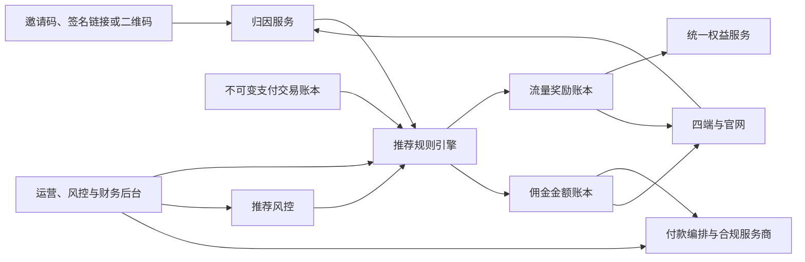

# VPN 邀请码与推广返利设计规格

- 状态：已完成方案评审，待用户审阅书面规格
- 日期：2026-08-04
- 关联规格：[VPN 商业客户端、账号、计量与支付设计规格](./2026-08-04-vpn-commercial-client-design.md)
- 定价关联：[VPN 长期订阅周期折扣设计规格](./2026-08-04-vpn-subscription-discount-design.md)
- 本地化关联：[VPN 五语本地化与 RTL 设计规格](./2026-08-04-vpn-localization-design.md)
- 适用端：Android、iOS、Windows、macOS 与官网

## 1. 执行摘要

产品采用“一套推荐奖励系统、两个奖励等级”：

- 普通邀请：所有符合条件的注册用户自动获得邀请码；被邀请人完成首次有效付费后，双方获得不可提现的流量奖励。
- 认证推广：通过审核的推广者继续使用同一套邀请码、归因和反作弊能力，但可以按有效订单获得可提现佣金。

系统只消费服务端验证后的支付事件。流量奖励进入统一权益服务，可提现佣金进入独立的不可变金额账本；两者共享归因与规则引擎，但不共享余额。退款、拒付和运营纠错全部通过反向记录完成，不覆盖历史。

首发开放普通邀请。可提现推广能力只对已审核、已完成身份和付款账户验证的推广者开放。

## 2. 已确认的产品决策

1. 不建设两套独立推荐系统，普通邀请和认证推广共用邀请码、归因、活动版本、反作弊与审计能力。
2. 普通邀请采用双边流量奖励，不产生现金或可提现余额。
3. 双边流量奖励额度由活动配置；需要有效基础订阅才能使用，有效期为 90 天。
4. 认证推广默认按首次有效订单净实收收入的 20% 返佣，后续续费按 10% 返佣，最长 12 个月。
5. 税费、支付渠道费、折扣、退款和拒付不进入佣金基数；比例和期限由活动版本配置。
6. 不采用终身返佣。
7. 推广佣金冻结 30 天，每月结算一次，最低提现门槛为等值 100 美元。
8. 提现通过合规付款服务商完成；支持银行转账，并在服务商及当地规则允许时支持 USDC 等稳定币。
9. 推广者首次提现前完成身份验证、制裁筛查和必要的税务信息收集；首发不自行托管或手工发送加密货币。
10. 每个账号只能归属于一个邀请人；首次有效付费后永久锁定归属。
11. 反作弊只使用账号、设备、安全、归因和支付信号，不采集 VPN 浏览目标或内容。
12. 四端共用产品语义和 API schema，分别实现完全原生界面。

## 3. 目标与非目标

### 3.1 目标

- 为普通用户提供低成本、可理解的邀请增长机制。
- 为专业推广者提供可审计、可冲正、可提现的佣金机制。
- 在 Apple、Google Play、Web 和加密支付之间保持统一账号归因。
- 防止自邀、循环邀请、批量注册、退款套利和付款账户滥用。
- 保证重复支付通知、事件重放和局部服务故障不会重复发奖或返佣。
- 在不接触 VPN 目标流量的前提下完成风险判断。

### 3.2 非目标

- 不建设多层级分销、团队计酬或下线返佣。
- 不提供终身返佣。
- 不允许普通用户把流量奖励兑换为现金、加密货币或转让给其他账号。
- 不把邀请码作为登录凭证、付款凭证或授权密钥。
- 不通过邀请任务绕过应用商店支付规则，也不要求用户完成分享、评论或发帖才能取得已经购买的 VPN 权益。
- 首发不自托管推广者的法币或加密货币付款基础设施。

## 4. 方案选择

评审过三种产品模型：

| 模型 | 优点 | 主要问题 | 结论 |
|---|---|---|---|
| 所有人都可提现 | 传播动力强、规则表面简单 | KYC、税务、洗钱、刷号和客服成本会扩散到所有用户 | 不采用 |
| 只有不可提现流量奖励 | 成本可控、上线快 | 无法服务专业推广者，规模化渠道动力不足 | 仅作为普通邀请层 |
| 一个系统、两个奖励等级 | 共用归因和反作弊，按身份隔离提现能力 | 规则引擎和账本边界需要更严谨 | 采用 |

“一个系统”指共享推荐领域能力，不代表把不同资产混入同一余额。流量 grant 由权益服务管理；法币计价佣金由金额账本和付款服务管理。

## 5. 总体架构



边界原则：

- 推荐系统不处理银行卡、商店票据或链上付款，只消费支付域的已验证标准事件。
- 权益服务只理解流量 grant，不理解佣金提现。
- 付款服务只处理已可用的佣金，不读取 VPN 节点、协议、访问目标或设备流量明细。
- 客户端展示的是服务端投影，不能自行决定归因、奖励、佣金或风控结果。
- 运营人员不能直接修改账本余额；所有调整都必须生成带原因码的追加记录。

## 6. 领域模型

### 6.1 推荐活动与版本

`referral_campaign` 表示一个活动，`campaign_version` 表示不可变的生效规则。至少包含：

- 活动类型：`consumer_invite` 或 `affiliate`。
- 生效和结束时间。
- 可用国家、支付渠道、内部 SKU 和币种范围。
- 被邀请人和邀请人的流量奖励额度、90 天有效期以及单账号上限。
- 首单佣金率、续费佣金率、返佣月数、30 天冻结期和最低合格收入。
- 每日、每月和活动总奖励上限。
- 风险策略版本和人工审核策略。
- 状态：`draft`、`scheduled`、`active`、`paused`、`ended`。

已生效版本不可原地修改，只能发布新版本。订单和奖励始终保存命中时的版本 ID，后续改价或改比例不改变历史含义。

### 6.2 邀请码

- 每个合格账号自动生成一个 8–10 位、不可预测、非连续且不包含易混淆字符的邀请码。
- 邀请码是公开标识，不是秘密；所有验证接口都必须限速且不得泄露邀请人的非公开信息。
- 默认邀请码不能频繁修改；认证推广者可以申请经审核的唯一自定义短码。
- 自定义短码执行保留词、商标、冒充、仇恨和误导性内容检查。
- 邀请链接包含邀请码、活动引用、到期时间和服务端签名；二维码只编码同一个 HTTPS 链接。
- 账号被停用、活动结束或推广资格撤销后，邀请码进入 `disabled`，不能产生新归因，但历史账本继续保留。

核心实体建议：

```text
referral_campaign
campaign_version
referral_code
referral_click
referral_attribution
referral_qualification
reward_ledger_entry
commission_ledger_entry
affiliate_profile
payout_profile
payout_batch
risk_case
```

## 7. 归因规则

### 7.1 绑定窗口和优先级

- 签名邀请链接在注册完成后把归因绑定到账号，而不是当前设备。
- 用户可以手动输入邀请码，但必须同时满足“注册后 7 天内”和“首次付费前”。
- 归因优先级为：手动邀请码、签名邀请链接、官网 30 天归因 Cookie。
- 每个被邀请账号只能绑定一个邀请人；禁止自邀和循环邀请。
- 首次有效付费后，归属永久锁定，后续链接或 Cookie 不得覆盖。
- 首次有效付费前，客服可以基于证据和审计记录纠正误绑；付费后只能冲正奖励，不能改写原始归因。

Cookie 是弱归因信号，不能单独覆盖已登录账号的显式选择。清除 Cookie、跨设备注册或商店安装导致 Cookie 缺失时，以账号已绑定的邀请码为准。

### 7.2 合格事件

“首次有效付费”必须满足：

- 不是试用、零价订单、测试订单或工作人员订单。
- SKU、国家、渠道和净实收金额满足命中的活动版本。
- Apple、Google Play、Web 或加密支付已由服务端验证并进入不可变交易账本。
- 购买账号与归因账号一致。
- 未命中硬性反作弊规则。

默认只对基础订阅首购和合格续费计算现金佣金；加油包不参与返佣，除非新活动版本明确启用。季付、半年付和年付按实际一次收取的净实收金额计算首单佣金；每月流量 grant 不构成新的付款或佣金事件。

长期周期折扣已经包含在实际订单价格中。季付 5%、半年付 10%、年付 20% 只降低佣金基数，不改变 20% 首单和 10% 续费佣金率；不得先用未折扣月价计算佣金，再把折扣当作营销费用另行补回。

### 7.3 跨渠道订单关联

- Apple 购买使用不含个人信息的 UUID `appAccountToken` 关联内部账号。
- Google Play 使用单向散列或加密生成的 `obfuscatedAccountId`，不传递明文邮箱；purchase token 作为验证和幂等依据。
- Web 和加密发票在创建付款会话之前，把内部账号 ID 和归因快照写入服务端。
- 用户在其他设备完成付款后，奖励仍归入同一个账号。
- 无法安全关联账号的商店外购买先进入待认领状态，不产生推荐奖励。

## 8. 生命周期与事件一致性

统一业务生命周期为：

```text
clicked
  → registered
  → verified
  → qualified
  → pending
  → available
  → paid
       ↘ reversed
```

- `qualified`：首笔订单已验证，且通过基础资格检查。
- `pending`：奖励或佣金已计算，但仍处于 30 天冻结期或风险审核中。
- `available`：流量奖励可发放，或佣金可进入下一付款批次。
- `paid`：付款服务商已确认向推广者付款。
- `reversed`：原订单退款、拒付、判定欺诈或发生有审计依据的运营冲正。

所有消费者使用 Inbox/Outbox 模式：

- 支付事件使用 `payment_transaction_id` 去重。
- 奖励使用 `payment_transaction_id + campaign_version_id + beneficiary_id + reward_type` 建立唯一约束。
- 佣金使用同等粒度的唯一键，并保存计算输入和舍入结果。
- 局部事务先写领域记录与 Outbox，再异步投递；消费者先写 Inbox 再改变投影。
- 重放任何事件都必须得到相同结果，不重新发流量或付款。

## 9. 普通邀请奖励

### 9.1 双边流量奖励

- 被邀请人在首笔付款验证后获得一次性流量奖励，以便立即感知邀请价值。
- 邀请人的流量奖励进入 30 天 `pending`，冻结期结束且订单未被撤销后发放。
- 奖励额度由活动版本配置，不写死在客户端。
- 奖励生成独立的 `referral_bonus` grant，有效期 90 天。
- 只有存在有效基础订阅时才能消耗；基础订阅失效时，有效期继续流逝。
- 消耗顺序沿用统一配额规则：优先使用最早到期的 grant。
- 奖励不可提现、不可转让、不可购买商品，也不能转换成推广佣金。

### 9.2 退款和封顶

- 首单在冻结期内退款时，取消邀请人的待发奖励。
- 撤销被邀请人尚未使用的奖励流量；已经消费的流量不从历史账本删除，进入风险记录并适用账号退款规则。
- 活动必须配置单账号每日、每月及总奖励上限，防止公开大码造成无界成本。
- 达到上限后仍记录合格邀请，但明确显示“本期奖励已达上限”，不静默丢弃。

## 10. 认证推广与佣金

### 10.1 准入

- 推广者先提交申请，接受推广条款，并声明主要推广渠道、目标国家和内容类型。
- 通过账号、身份、制裁、付款账户和风险审核后，`affiliate_profile` 才进入 `active`。
- 普通用户升级为推广者时可以保留原邀请码，但升级前已产生的普通邀请不会追溯转换为现金佣金。
- 资格暂停后停止产生新佣金；已结算佣金按条款、风险和法律要求处理。

### 10.2 佣金公式

默认活动采用：

```text
首笔有效订单佣金 = eligible_net_revenue × 20%
合格续费佣金     = eligible_net_revenue × 10%
返佣截止时间     = 首笔有效订单后 12 个月
```

其中：

```text
eligible_net_revenue
= 已实际结算的商品收入
- 间接税
- Apple、Google Play 或其他支付渠道费
- 折扣与优惠
- 退款、拒付和支付冲正
```

- 佣金以内部结算币种记账，保存原币金额、汇率来源、汇率时间和舍入差额。
- 加密支付使用处理商最终结算法币金额或约定稳定币基准，不使用客户端展示报价。
- 比例、期限、SKU 和地区资格由活动版本配置，但任何修改只影响新命中的版本。
- 不允许负佣金被删除；退款发生在付款之后时，追加负向佣金并从未来余额抵扣，必要时按推广条款追偿。

### 10.3 续费归属

- 只有最初归因在推广活动下合格的账号，才产生后续 12 个月续费佣金。
- 升级、降级和渠道迁移按实际新付款事件计算，不把免费权益变更当作续费。
- 同一支付事件不能同时命中两个推广者或两个佣金活动。
- 12 个月期限结束后，用户仍保留自己的订阅权益，但不再产生推广佣金。

## 11. 提现与付款

### 11.1 结算规则

- 佣金从支付确认时间起冻结 30 天；风险案件可以延长冻结并向推广者显示原因类别。
- 每月生成一次付款批次。
- 可提现余额达到等值 100 美元才进入批次；不足部分自动结转。
- 付款前再次检查推广资格、KYC 状态、制裁筛查、负余额和付款账户状态。
- 付款币种、汇率、服务商费用和区块链网络费用在确认前清晰披露。

### 11.2 付款方式

- 首发通过合规付款服务商支持银行转账。
- 服务商和目标司法辖区允许时，可以支持 USDC 等稳定币付款。
- 稳定币付款不是匿名付款，仍执行身份、制裁、税务和记录保存要求。
- 产品服务不保存钱包私钥，不运营热钱包，也不由工作人员手工转币。
- 付款账户或钱包地址变更要求重新认证，并进入安全冷却期；高风险变更触发人工审核。
- 付款服务商 payout ID 全局唯一，重复回调不能重复记为已支付。

### 11.3 失败与冲正

- 付款失败保持可恢复状态，不重复扣减可提现余额。
- 批次状态至少支持：`scheduled`、`processing`、`paid`、`failed`、`held`、`reversed`。
- 付款提交时把佣金从 `available` 转为 `reserved`；服务商确认后转为 `paid`，失败则释放回 `available`。
- 退款或拒付发生在已付款之后时，产生负余额和审计案件，不修改原付款记录。

## 12. 反作弊

### 12.1 硬规则

以下情况默认不产生奖励，并保存可解释原因码：

- 邀请人与被邀请人为同一账号、同一强设备身份或同一付款工具指纹。
- 形成 A 邀请 B、B 邀请 A 等循环图。
- 使用测试付款、工作人员付款、已知被盗付款工具或已封禁账号。
- 活动国家、渠道、SKU 或最低净收入不满足规则。
- 归因发生在允许窗口之外，或首次付费后试图补绑邀请码。

### 12.2 风险评分

可使用的信号包括：

- 账号年龄、邮箱验证、登录和安全挑战结果。
- 设备公钥、应用完整性、模拟器或自动化迹象以及设备关联图。
- 支付处理商提供的付款工具指纹、商店购买标识、退款和拒付历史。
- 注册和兑换速率、IP、ASN、粗粒度国家以及异常时间聚集。
- 邀请图集中度、短期转化异常和推广内容投诉。

IP 或 ASN 不能单独作为拒绝依据。强网络限制环境、运营商 NAT、校园网和公共 Wi-Fi 会让大量正常用户共享出口，必须与更强信号组合。

风险处理分级：

- 低风险：自动进入正常生命周期。
- 中风险：延长冻结、要求邮箱重新验证、Passkey/TOTP 安全挑战或人工材料。
- 高风险：冻结奖励或提现并进入人工审核。

普通用户不因参与邀请而被强制要求手机号。认证推广者的提现验证与普通账号登录验证分离。

### 12.3 申诉与运营调整

- 用户和推广者可以查看通用原因类别并提交申诉。
- 风控人员看不到 VPN 访问目标或内容。
- 人工调整必须填写原因、证据引用和工单 ID，并由账本生成正向或反向调整记录。
- 大额付款、付款账户变更和高风险解冻执行双人复核。

## 13. 隐私与合规

- 不读取、存储或分析 VPN 目标域名、目标 IP、内容、DNS 查询或应用流量来判断推荐作弊。
- 推荐人与被邀请人之间只展示脱敏状态，不暴露邮箱、设备、支付方式、订单金额或详细使用量。
- 默认使用系统分享面板，不请求或上传通讯录。
- 安全 IP、设备关联和支付风险数据按目的限制、最短保存期和角色权限管理。
- 账号删除后停用邀请码并删除非必要营销数据；依法必须保存的财务、税务、争议和制裁记录以受限、假名化形式保留。
- 推广者获得佣金属于需要披露的商业关系。推广条款必须要求在推荐内容附近清晰说明可能获得佣金，并提供本地化披露模板与抽查机制。
- 稳定币付款与法币付款一样经过适用的制裁、身份、税务和记录保存评估；首发国家由法律和支付服务商共同形成允许列表。
- 具体 KYC、税表、保存期限和禁止国家不能只靠产品规格决定，必须由首发实体所在地及目标市场的专业顾问确认。

## 14. 应用商店与支付渠道约束

- 推荐功能是可选增长功能，不得成为用户取得已付订阅权益的附加任务。
- iOS 和 Google Play 版本中的套餐购买继续使用当前 storefront 允许的支付方式；邀请码页面不引导用户绕过商店支付。
- 商店订单只有在服务端验证完成后才产生奖励或佣金，客户端成功回调不能直接发放。
- Apple 使用 `appAccountToken` 把交易关联到内部账号，并通过 App Store Server API/Notifications 处理续费和撤销。
- Google Play 使用 purchase token、Developer API、RTDN、Voided Purchases API 和不含个人信息的 `obfuscatedAccountId`；不能依赖可能缺失的 order ID 去重。
- 如果某渠道不允许直接改变商店结账价格，则邀请码只发放服务端流量奖励；渠道折扣必须使用该渠道支持的 offer 或促销机制。
- Web 和加密付款可以使用同一活动，但仍按实际净实收收入、退款和渠道费计算佣金。

## 15. 四端与官网体验

### 15.1 普通用户

移动端从“账户 → 邀请奖励”进入；桌面端从“账户与套餐 → 邀请奖励”进入。页面包含：

- 邀请码、复制链接、系统分享和二维码。
- “好友完成首次有效付费后双方得流量”的明确条件。
- 已邀请人数、待确认奖励、已发放流量、90 天到期日和本期上限。
- 归因失败、退款撤销、达到上限和风险审核的可理解状态。
- 活动规则、隐私说明和申诉入口。
- 五种首发语言中一致的资格、奖励数量、等待期和到期说明；数字与复数使用原生格式化。

界面不显示被邀请人的邮箱、真实姓名、设备或订单金额。

### 15.2 认证推广者

同一入口按角色增加“推广中心”，显示：

- 点击、注册、有效付费和转化漏斗。
- 待结算、可提现、付款中、已支付和已冲正佣金。
- 命中的首单/续费比例、返佣剩余期限和活动版本。
- 身份、税务、付款方式和安全冷却状态。
- 月度付款记录、结算币种、费用和下载对账单。
- 合规披露模板、推广条款和违规通知。
- 账号通信语言对应的 KYC、税务、付款与商业关系披露；第三方托管页缺少该语言时明确标注实际语言。

统计默认采用聚合和脱敏数据，点击与注册指标注明更新延迟，金额账本显示精确结算时间。

## 16. 运营、风控与财务后台

后台按最小权限拆分：

- 运营：创建活动草稿、配置奖励、国家、渠道、SKU、上限和生效时间。
- 风控：查看关联图、风险原因、申诉材料并执行有审计的冻结或解冻。
- 财务：查看佣金账本、税务/KYC 状态、付款批次和对账差异。
- 客服：查看脱敏邀请状态和公开规则，不能修改金额或查看不必要的身份材料。
- 审计：只读访问活动版本、人工操作、账本和付款证据。

控制要求：

- 活动发布、佣金正向调整、大额解冻和付款批次提交需要双人复核。
- 后台不能执行任意 SQL 改余额，也不能删除账本行。
- 自定义短码、活动暂停和推广资格撤销都有审计日志和通知流程。
- 支持把单个活动或邀请码快速暂停，但暂停不能破坏已经获得的合法订阅权益。

## 17. API 与事件边界

建议用户接口：

```text
GET  /v1/referrals/me
GET  /v1/referrals/campaign
POST /v1/referrals/code/validate
POST /v1/referrals/attributions
GET  /v1/referrals/rewards
POST /v1/affiliates/applications
GET  /v1/affiliates/dashboard
GET  /v1/affiliates/commissions
GET  /v1/affiliates/payouts
PUT  /v1/affiliates/payout-profile
POST /v1/affiliates/appeals
```

接口要求：

- 归因写入使用客户端生成的幂等键。
- 邀请码验证返回活动资格，不返回邀请人的私有信息。
- 金额使用整数最小货币单位和 ISO 4217 币种；稳定币同时保存资产和网络标识。
- 列表使用稳定游标分页，不以累计总数作为账本真相。
- 高风险写操作要求近期重新认证。

内部事件至少包括：

```text
payment.transaction.confirmed
payment.transaction.reversed
referral.attribution.bound
referral.qualification.created
referral.reward.pending
referral.reward.available
referral.reward.reversed
affiliate.commission.pending
affiliate.commission.available
affiliate.commission.reversed
payout.batch.created
payout.completed
payout.failed
```

事件包含 `event_id`、schema 版本、发生时间、主体 ID、因果 ID 和追踪 ID，但不包含明文邮箱或 VPN 流量信息。

## 18. 可观测性与 SLO

关键指标：

- 邀请链接点击、注册、首次有效付费和分渠道转化率。
- 归因成功率、手动输入率、跨设备认领率和归因纠错率。
- 奖励/佣金从支付确认到投影可见的延迟。
- 重复事件抑制数、账本对账差异、退款和拒付率。
- 风险命中率、人工审核通过率、申诉改判率和误伤指标。
- 付款成功率、失败原因、负余额和服务商对账差异。

建议 SLO：

- 邀请码验证与绑定接口正常条件下 p95 小于 500 毫秒。
- 支付确认后，奖励和佣金状态 p95 在 60 秒内可见。
- 重复通知导致的重复奖励或重复佣金为 0。
- 佣金账本与支付交易账本每日对账差异为 0；发现差异时自动停止受影响批次。
- 付款批次提交后，状态同步遵循服务商能力，并在用户界面显示最后更新时间。

## 19. 验收测试

### 19.1 归因

- 手动码、签名链接和 Cookie 的优先级符合规则。
- 注册超过 7 天或首次付费后不能补绑邀请码。
- 跨设备和四种支付渠道仍归入正确账号。
- 同一账号不能被多个推广者覆盖。
- 归因纠错只在首付前发生，并保留完整审计。

### 19.2 幂等与账本

- Apple、Google Play、Web 和加密支付重复通知不会重复发奖或返佣。
- Outbox 重放、消费者崩溃和消息乱序不会改变最终金额。
- 每笔账本记录都能追溯到支付交易、活动版本、计算输入和风险决策。
- 退款和拒付只产生反向记录，不删除历史。
- 季付、半年付和年付只按真实付款事件计算佣金，不按月度流量 grant 重复返佣。

### 19.3 普通邀请

- 被邀请人的奖励在付款验证后可用，邀请人的奖励冻结 30 天。
- 奖励流量只能在有效基础订阅下使用，并在 90 天后过期。
- 奖励不能转让、提现或购买商品。
- 退款会取消待发奖励并撤销未使用流量。
- 达到活动上限时给出明确状态。

### 19.4 认证推广

- 未审核账号不能产生可提现佣金。
- 首单 20%、续费 10% 和 12 个月边界按活动快照精确计算。
- 税、渠道费、折扣、退款和拒付不进入佣金基数。
- 季、半年和年付按实际折后净收入计算一次佣金，月度流量 grant 不重复产生佣金。
- 30 天冻结、每月批次和 100 美元门槛行为确定。
- 已付款后发生退款会形成负余额，而不是篡改原付款。
- 付款回调重复、超时和乱序不会重复付款。

### 19.5 反作弊与隐私

- 自邀、强设备相同、付款工具相同和循环邀请被硬规则阻断。
- 共享 IP 或运营商 NAT 不会单独导致拒绝。
- 风险审核、解冻和申诉都有原因码和审计人。
- 推荐域、风控域和付款域无法读取 VPN 访问目标或内容。
- 邀请人不能通过接口枚举被邀请人的私有信息。
- 客户端不请求或上传通讯录即可完成分享。

### 19.6 渠道合规

- App Store 和 Google Play 版本不通过邀请码页面引导至不允许的外部支付。
- 商店购买在服务端验证前不产生奖励。
- Apple `appAccountToken` 和 Google `obfuscatedAccountId` 不包含明文个人信息。
- 推广中心明确显示商业关系披露要求。
- 稳定币付款只在服务商、KYC、制裁和国家允许列表均通过时可选。
- 商业关系披露模板、奖励条件、佣金和申诉文本完成 `zh-Hans`、`en`、`ru`、`fa`、`ja` 人工审核。
- 波斯语界面中的金额、订单号、稳定币资产、网络和地址保持正确 LTR 隔离，不能因 RTL 改变视觉含义。

## 20. 分阶段发布

### 阶段 0：影子验证

- 只记录签名链接、手动码和归因事件，不对用户展示奖励。
- 对 Apple、Google Play、Web 和加密支付进行历史回放与幂等测试。
- 用内部测试活动校验活动版本、佣金计算和退款冲正。

### 阶段 1：普通邀请

- 向所有合格账号开放双边流量奖励。
- 启用上限、30 天邀请人冻结、风险分级和申诉。
- 先对少量国家和 SKU 灰度，再逐步扩大。

### 阶段 2：认证推广

- 仅邀请少量推广者，人工审核准入。
- 启用 KYC、税务资料、银行转账和月度付款批次。
- 在服务商与法律允许的国家小范围启用稳定币付款。

### 阶段 3：规模化

- 自助申请、自定义短码、自动风险分层和推广者对账单。
- 根据真实获客成本、带宽毛利、退款率和欺诈率调整新活动版本。
- 保持单层归因，不扩展为多级分销。

## 21. 发布门与已知风险

发布前必须完成：

1. 按首发法律实体和国家确认佣金、广告披露、税务、KYC、制裁和记录保存要求。
2. 选择支持目标国家、银行转账及可选稳定币付款的合规付款服务商。
3. 用真实 Apple、Google Play、Web 和加密支付费率验证“净实收收入”计算。
4. 明确流量奖励额度、活动上限和单个合格用户的带宽边际成本。
5. 完成推广条款、隐私说明、申诉政策和商业关系披露模板。
6. 验证设备关联不会因运营商 NAT、家庭共享设备或强限制网络产生不可接受的误伤。
7. 建立支付账本、佣金账本和服务商付款报告的每日自动对账。

主要风险：

- 不同国家对现金返佣、税务资料和加密资产付款的定义不同。
- 商店费率、退款窗口和渠道促销会改变净收入与冻结期假设。
- 公开大码可能造成品牌滥用和异常集中，需要活动上限与快速暂停。
- 过度依赖 IP、设备指纹或模拟器检测会伤害共享网络中的正常用户。
- 已付款后的延迟拒付会形成推广者负余额，需要条款和风险准备金支持。

## 22. 参考资料

- [Apple App Review Guidelines](https://developer.apple.com/app-store/review/guidelines/)
- [Apple appAccountToken](https://developer.apple.com/documentation/storekit/transaction/appaccounttoken)
- [App Store Server API：Set App Account Token](https://developer.apple.com/documentation/appstoreserverapi/set-app-account-token)
- [Google Play Payments Policy](https://support.google.com/googleplay/android-developer/answer/9858738?hl=en)
- [Google Play Billing：Developer payload 与购买归因](https://developer.android.com/google/play/billing/developer-payload)
- [Google Play Billing：防欺诈与撤销购买](https://developer.android.com/google/play/billing/security)
- [FTC Endorsement Guides 问答](https://www.ftc.gov/business-guidance/resources/ftcs-endorsement-guides-what-people-are-asking)
- [FATF 虚拟资产风险指南](https://www.fatf-gafi.org/en/publications/Fatfrecommendations/Guidance-rba-virtual-assets.html)
- [OFAC 虚拟货币行业制裁合规指南](https://ofac.treasury.gov/system/files/126/virtual_currency_guidance_brochure.pdf)
