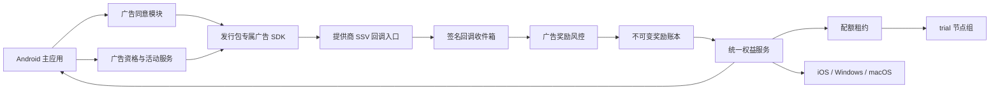

# VPN 激励广告送流量设计规格

- 状态：已完成方案评审，待用户审阅书面规格
- 日期：2026-08-04
- 关联规格：[VPN 商业客户端、账号、计量与支付设计规格](./2026-08-04-vpn-commercial-client-design.md)
- 奖励关联：[VPN 邀请码与推广返利设计规格](./2026-08-04-vpn-referral-affiliate-design.md)
- 本地化关联：[VPN 五语本地化与 RTL 设计规格](./2026-08-04-vpn-localization-design.md)
- 广告展示端：Google Play Android 与官网 Android APK
- 奖励使用端：Android、iOS、Windows、macOS

## 1. 执行摘要

产品增加“主动观看激励广告获得流量”，定位为试用延长和过期用户召回，不改变“无永久免费套餐”的商业决策。

只有试用额度已耗尽或订阅权益已经过期的账号可以观看广告；有效付费期、取消但仍在有效期、宽限期或其他仍可连接的付费状态完全不展示广告，也不初始化广告 SDK。

首发基线为每个完成且经服务端验证的广告发放 50 MB，每个账号滚动 24 小时最多 3 次，终身最多发放 1 GB。每笔奖励自服务端发放起 24 小时有效，只允许 `trial` 节点组、1 台设备和最高 20 Mbps。数值可以按国家和广告提供商使用不可变活动版本配置，但用户主动播放前必须看到确切奖励。

客户端播放完成回调不产生奖励。后端只接受广告提供商签名的 Server-Side Verification（SSV），完成验签、幂等、资格复核和风险判断后，才向统一权益中心写入 `ad_reward` grant。

广告 SDK 与 Android `VpnService`、sing-box、隧道 IPC 和 VPN 目标流量完全隔离。广告只在 VPN 断开时加载，用户拒绝同意、广告无库存或广告系统故障均不影响 VPN、账号、支付和邀请功能。

## 2. 已确认的产品决策

1. 激励广告只面向试用耗尽或订阅已过期的用户；有效付费期内完全无广告。
2. 首发仅 Android 提供观看入口；iOS 完成独立隐私和 App Review 验证后再决定是否灰度，Windows 与 macOS 不内置广告 SDK。
3. Google Play 版优先使用 AdMob SSV；官网 APK 使用支持侧载应用、签名 SSV 和非个性化广告的可替换提供商。
4. 每个 Android 发行包首发只内置一个广告 SDK，不接多 SDK 自动竞价或未知广告聚合链。
5. 每次经验证的观看奖励基线为 50 MB；滚动 24 小时最多 3 次；账号终身最多发放 1 GB。
6. 每笔奖励自发放起有效 24 小时，不累计成长期余额。
7. 广告奖励无需基础订阅即可使用，但只能使用 `trial` 节点组、1 台设备、最高 20 Mbps。
8. 奖励归账号；第一台消耗某笔奖励的设备会锁定该 grant，24 小时有效期内不能转移。
9. 购买套餐后付费权益立即优先；剩余广告流量不转换、不延期，仍按原时间过期。
10. 每日和终身上限按已验证并已发放的奖励计算，而不是按已消耗流量计算。
11. 广告只在 VPN 已断开时由用户主动播放；不使用横幅、插屏、启动广告或自动中断连接。
12. 只请求非个性化或适用地区的受限广告；应用不主动申请广告 ID。
13. 只有有效 SSV 能发放流量，客户端“播放完成”只进入等待确认状态。
14. 反作弊不得读取 VPN 目标域名、目标 IP、DNS、内容或应用流量。

## 3. 目标与非目标

### 3.1 目标

- 给尚未购买或已经流失的用户一次小额、受控的重新体验机会。
- 保持奖励成本可计算，不演变为无限循环的广告资助免费套餐。
- 在 Play 与官网 APK 使用不同广告提供商时保持相同资格、账本和配额语义。
- 防止篡改客户端、伪造回调、重复回调、批量账号和设备农场重复领取。
- 让广告、同意和风险数据与 VPN 隧道及访问数据完全隔离。
- 广告系统不可用时保证核心 VPN 和商业系统正常运行。

### 3.2 非目标

- 不建设永久免费或按月自动重置的广告套餐。
- 不向有效付费用户展示任何形式的广告。
- 不使用横幅、插屏、启动、通知栏广告或奖励式插屏。
- 不注入、重定向或修改其他应用的广告流量。
- 不把流量奖励兑换为现金、加密货币、账户余额、推广佣金或可转让商品。
- 不让客户端、客服截图或本地计时器直接触发奖励。
- 首发不在 iOS、Windows 或 macOS 内嵌广告 SDK。
- 不建设实时多广告网络竞价平台。

## 4. 方案选择

评审过三种平台策略：

| 策略 | 优点 | 主要问题 | 结论 |
|---|---|---|---|
| 四端统一内嵌广告 | 功能表面一致 | 桌面供应链差异大；iOS VPN 隐私与审核风险高；SDK 面过大 | 不采用 |
| Android 与 iOS 同时首发 | 移动端覆盖高 | iOS VPN 应用向广告网络共享技术数据存在高审核风险 | 不采用 |
| Android 首发、其他端只消费奖励 | 隔离清楚、可先验证经济性和风控 | 观看入口暂时不对称 | 采用 |

Android 内又采用两个发行渠道、统一后端协议：

- Play 版优先 AdMob，并使用其 SSV 与 Play Integrity。
- 官网 APK 使用经过采购、隐私和安全评估的侧载友好型 SSV 提供商。
- 后端通过 `RewardedAdProvider` 适配器归一化验签、交易 ID、广告单元、完成时间和撤销信号。

AdMob 可以在未发布应用中测试，但应用若未关联支持的商店会受到广告投放限制，因此官网 APK 的收入模型不能依赖未完成商店关联的 AdMob 应用。

## 5. 总体架构



架构边界：

- 广告 SDK 只存在于 Android 主应用，不进入 `VpnService`、sing-box 进程或隧道扩展。
- 广告资格服务不读取 VPN 目标流量，只读取账号权益、奖励历史、设备安全状态和广告会话。
- SSV 回调进入独立公网入口、独立密钥集、独立限速和原始事件收件箱。
- 奖励账本追加事件，统一权益中心据此投影 `ad_reward` grant。
- 节点和配额服务只消费签名 entitlement，不理解广告提供商。
- 其他三端不加载广告 SDK，只显示账号中的奖励状态并在被选为首个使用设备时消耗该 grant。

## 6. 资格与活动规则

### 6.1 账号资格

只有同时满足以下条件时才返回可播放广告：

- 已登录且邮箱已验证。
- 账号状态为试用额度耗尽或付费权益真正过期。
- 不处于 `active`、`trialing`、`grace_period` 或 `canceled_active_until_period_end` 等仍有可用权益的状态。
- 当前没有有效 VPN 隧道。
- 滚动 24 小时内已发放广告奖励少于 3 次。
- 账号终身已发放广告奖励少于 1 GB。
- 当前发行包、国家、应用版本、广告提供商和同意状态均可用。
- 没有未解决的严重风险冻结。

服务端是资格真相。客户端缓存只用于优化显示，不能据此播放或发奖。

### 6.2 活动版本

`ad_reward_campaign_version` 至少保存：

- 生效时间、结束时间、国家和发行渠道。
- 提供商、广告单元和允许的应用签名/版本。
- 单次奖励字节数，首发基线 50 MB。
- 滚动 24 小时次数上限，首发为 3。
- 账号与强设备身份终身字节上限，首发为 1 GB。
- grant 有效期，首发为 24 小时。
- `allowed_node_groups = [trial]`、`device_limit = 1`、`max_rate = 20 Mbps`。
- 风险策略版本、SSV 最大延迟、国家内容等级和最低经济性阈值。

已生效活动版本不可原地修改。变更奖励额度、上限或提供商必须创建新版本；用户播放前展示该次 `ad_session` 实际命中的固定值。

### 6.3 计数语义

- “每日最多 3 次”按服务端滚动 24 小时窗口计算，不按客户端时区或本地零点重置。
- 终身 1 GB 按已经发放的字节数计算，即使用户未使用、卸载应用或奖励自然过期也不返还上限。
- 被确认欺诈后产生的反向账本不自动恢复上限；申诉成功需要带审计的正向调整。
- 账号与强设备身份同时限额，重新注册账号不能重置设备侧终身限制。

## 7. 广告会话与 SSV 流程

### 7.1 创建会话

1. Android 客户端请求 `/v1/ad-rewards/eligibility`。
2. 用户看到确切奖励、次数、有效期和隐私说明后主动点击“观看广告”。
3. 客户端确认 VPN 已断开并提交同意状态、发行渠道、应用版本和设备安全证明。
4. 后端重新检查资格，创建一次性 `ad_session`。
5. 服务端把不透明的 session 引用作为提供商 `custom_data`，不发送账号 ID、邮箱或设备 ID。
6. 客户端使用服务端返回的广告单元加载并显示广告。

`ad_session` 至少包含：

```text
ad_session_id
account_id
viewing_device_id
distribution_channel
provider
ad_unit_id
campaign_version_id
reward_bytes
created_at
start_before
callback_accept_until
consent_snapshot_id
integrity_snapshot_id
state
```

广告必须在签发后 10 分钟内开始。SSV 可以在提供商合同定义的迟到窗口内到达；“播放开始窗口”和“回调接受窗口”不能混为一个时间。

### 7.2 SSV 验证

提供商回调必须经过：

- TLS 与请求大小限制。
- 提供商密钥 ID、签名和规范化参数验证。
- 时间戳、广告单元、发行包、奖励类型和环境验证。
- 提供商 `transaction_id` 全局唯一约束。
- `ad_session_id` 存在、未被其他交易消费且活动版本匹配。
- SSV 完成时间落在允许窗口。
- 回调奖励值只用于比对，不允许覆盖服务端活动版本中的字节数。
- 账号资格和风险状态二次检查。

客户端完成回调只能把界面切换到“奖励确认中”。只有 SSV 验证通过后才写奖励账本。

### 7.3 幂等与状态机

```text
eligible
  → issued
  → loading
  → presented
  → client_completed
  → ssv_verified
  → granted

loading / presented → abandoned | no_fill | failed
任意待处理状态 → expired | risk_held
granted → reversed
```

- `provider + transaction_id` 建立第一层唯一约束。
- `ad_session_id + reward_type` 建立第二层唯一约束。
- 重复 SSV 返回成功，但不得重复写账本或 grant。
- 乱序事件写入收件箱后按状态机重放；后到的有效 SSV 仍可完成之前的 `client_completed` 会话。
- 同一账号存在未解决的 `client_completed` 会话时短暂限制新会话；超时后可以再次观看，但每个有效 SSV 都独立计入上限。

## 8. 奖励账本与权益

### 8.1 不可变奖励记录

每笔奖励必须引用：

- 广告提供商与交易 ID。
- `ad_session_id` 和活动版本。
- 账号与观看设备。
- 发放字节数、发放时间和到期时间。
- 同意快照、安全证明快照和风险决策 ID。
- 原始 SSV 收件箱事件哈希。

账本只追加 `grant`、`reverse` 和有原因码的 `adjustment`，不能覆盖原始记录。

### 8.2 `ad_reward` grant

权益服务生成：

```text
grant_type: ad_reward
quota_bytes: campaign.reward_bytes
valid_from: server_granted_at
valid_until: server_granted_at + 24h
allowed_node_groups: [trial]
device_limit: 1
max_rate_bps: 20 Mbps
requires_base_subscription: false
transferable: false
cash_value: none
```

广告奖励与邀请奖励的差异必须明确：

- `ad_reward` 不要求基础订阅，可独立建立受限连接。
- `referral_bonus` 仍要求有效基础订阅，并沿用 90 天有效期。
- 两种 grant 使用不同类型、资格、节点组和到期策略，不能互相转换。

### 8.3 跨端与设备锁定

- 广告奖励归账号，四端都可以显示余额与到期时间。
- 第一台使用某笔 grant 获取配额租约的设备原子写入 `locked_device_id`。
- 锁定设备以外的设备不能消费该笔 grant，也不能取得由该 grant 授权的 VPN 凭证。
- 锁定持续到 grant 用尽、到期或被冲正，期间不能远程转移。
- 多笔 grant 可以各自锁定，但账号在广告资助模式下仍只有 1 台激活设备；服务端拒绝通过多笔 grant 并行扩大设备数。

### 8.4 与付费权益叠加

- 用户购买套餐后，付费 entitlement 立即成为连接和节点资格真相。
- 付费期使用 `general` 等套餐节点组，不消耗 `ad_reward`。
- 尚未用完的广告奖励不转入付费配额、不退款、不延期，仍按原 24 小时过期。
- 付费权益后来失效时，只有尚未到期的广告 grant 才可能恢复可用。
- 从广告资助连接切换到付费连接时，客户端获取新 entitlement 并安全重建连接，不把 `trial` 会话静默当作付费节点。

### 8.5 小额配额租约

50 MB grant 不能沿用过大的通用配额租约。广告奖励使用专用小租约：

- 初始建议 1–2 MB，可根据控制面负载和超额测试调整。
- 仅锁定设备可以续租。
- grant 到期、耗尽、被冲正或付费权益接管后停止签发新租约。
- 最大可超额量不得超过所有未结算广告租约之和，并纳入验收。

## 9. Android 客户端与发行渠道

### 9.1 进程和网络隔离

- 广告 SDK 只链接到 Android UI 应用模块，不链接到 `VpnService`、sing-box 或隧道专用模块。
- 广告 SDK 无权调用隧道 IPC 获取节点、协议、连接错误、目标流量或用量明细。
- 广告加载前服务端和客户端都确认隧道已断开。
- 广告请求属于主应用自身网络请求，不注入、重定向或修改其他应用流量。
- 广告域名不加入 VPN 引导、控制面镜像或救援域名；广告不可达只影响广告功能。

### 9.2 Play 发行包

- 首发优先 AdMob rewarded ads，不使用 rewarded interstitial。
- 使用 AdMob SSV，客户端奖励回调不直接发放 entitlement。
- 使用 Play Integrity standard request，把 `ad_session` 关键字段摘要绑定到 `requestHash`；后端验证返回 verdict。
- Play Integrity 失败使用有限重试和可解释降级，不把网络瞬断永久视为作弊。
- 遵守 VpnService 政策：绝不为了广告收益重定向或操纵设备上其他应用的流量。

### 9.3 官网 APK

- 官网包使用独立 `RewardedAdProvider` 实现和发行包专属广告 SDK。
- 提供商必须支持侧载应用、服务端签名回调、交易去重、隐私控制、内容等级、无库存状态和违规广告举报。
- 通过 APK 签名证书白名单、构建版本证明、设备硬件密钥、服务端注册和提供商风控组合验证来源。
- 不把 Play Integrity 当作官网 APK 的必需能力；没有 Google Play 服务的设备仍能按官网包风控策略评估。
- 提供商采购、安全评估、数据流映射和真实填充率验证是官网 APK 发布门。

### 9.4 SDK 供应链

- 每个发行包首发只包含一个广告 SDK。
- SDK 版本固定、生成 SBOM、验证来源和签名，并纳入依赖漏洞监控。
- 禁止广告 SDK 动态下载原生代码、加载未审核扩展或访问通讯录、精确位置、短信、通话、已安装应用列表和 VPN 配置。
- SDK 变更需要隐私差异审查、网络流量抓包、权限 diff、回归测试和灰度发布。
- 可以通过服务端关闭整个广告功能，但不能远程下载新的 SDK。

## 10. 用户体验

### 10.1 入口和资格显示

Android 从“流量 → 获取免费流量”进入。只有资格接口确认合格后显示入口。页面必须显示：

- 本次准确奖励，例如“观看完成并确认后获得 50 MB”。
- 滚动 24 小时剩余次数和账号终身剩余额度。
- 奖励有效 24 小时、只支持 1 台设备、`trial` 节点和最高 20 Mbps。
- 广告由第三方提供商展示及其必要数据处理说明。
- 隐私选项、广告举报和帮助入口。
- 五种首发语言中一致的奖励字节、滚动 24 小时次数、终身上限、设备锁定和 SSV 确认语义。

有效付费用户不显示入口，不加载广告配置，也不初始化广告 SDK。

### 10.2 主动观看

- 不在启动、连接、断线、节点切换、额度耗尽或购买流程中自动弹出广告。
- VPN 连接中显示“断开并观看”；只有用户明确确认后才断开，不能自动中断。
- 断开成功后重新检查资格，再初始化广告 SDK 和加载广告。
- 请求广告与同意页时传递当前合法 App 语言；第三方页面无法提供该语言时，在跳转前明确显示实际语言。
- 广告无库存、加载失败、用户提前关闭或 SDK 崩溃不消耗次数。
- 用户拒绝广告同意后返回原页面，不影响其他功能。

### 10.3 完成和异常状态

- 客户端完成回调后显示“奖励确认中”，不能先显示到账。
- SSV 到达并生成 grant 后显示可用字节、到期时间和“连接”按钮。
- SSV 延迟时允许用户退出页面，并通过账号投影或通知显示最终结果。
- 明确区分 `no_fill`、网络失败、未完整观看、确认中、风险审核、达到上限和奖励到账。
- 不要求安装广告中的应用、点击广告或完成广告之外的任务才能获得已承诺奖励。

### 10.4 其他三端

- iOS、Windows 和 macOS 的流量页可以显示 `ad_reward` 余额、到期和单设备限制。
- 三端不显示“观看广告”入口，也不包含广告 SDK。
- 第一台使用奖励连接的设备会锁定 grant；UI 在锁定前明确提示该限制。
- 若 grant 已锁定其他设备，显示设备名称的脱敏标签和到期时间，不提供转移按钮。

## 11. 同意、隐私与数据隔离

### 11.1 初始化顺序

广告 SDK 只能在以下顺序全部通过后初始化：

1. 账号资格合格。
2. VPN 已断开。
3. 当前发行渠道和国家已启用。
4. 用户看到奖励与数据处理说明。
5. 同意模块完成适用地区的选择。
6. 服务端签发 `ad_session`。

Play 版使用 UMP 或经法律审查的等效同意流程；官网版使用提供商支持且满足目标地区要求的同意模块。撤回同意后清理可清理状态，并禁止后续广告请求。

### 11.2 广告模式

- 默认请求非个性化广告；适用地区和提供商能力要求时使用更严格的受限广告。
- 应用不主动申请 Android 广告 ID 权限，也不把内部设备 ID 映射为广告标识。
- `custom_data` 只包含短期不透明 `ad_session` 引用。
- 禁止把邮箱、付款、节点、协议、国家锁定、访问目标、DNS 或流量明细发送给广告提供商。
- 非个性化不等于零数据处理；隐私说明和 Android Data safety 必须如实披露提供商实际接收的 IP、设备技术信息和广告事件。

### 11.3 数据权限与保存

- 原始 SSV、同意快照、奖励账本和风险案件按不同权限域管理。
- 客服只能看到广告会话状态和通用失败原因，不能看到提供商原始设备风险字段。
- VPN 运维人员不能访问广告同意和广告交互明细。
- 广告或风控团队不能读取 VPN 访问目标或内容。
- 保存期由欺诈、财务、广告平台和当地隐私要求共同决定，并在隐私政策中公开。

## 12. 反作弊

### 12.1 强校验

- SSV 签名无效、交易 ID 重复、广告单元不匹配或会话不存在时不发奖。
- `ad_session` 必须绑定账号、观看设备、发行渠道、提供商、活动版本和奖励字节数。
- Play 版使用与请求内容绑定的 Play Integrity verdict；官网版使用签名白名单、注册设备密钥和版本证明。
- 服务端时间决定窗口和到期，不相信客户端时间。
- 客户端无法选择奖励数值或提交任意账号 ID。

### 12.2 风险评分

可使用：

- 账号年龄、邮箱验证、安全挑战和历史封禁。
- 设备公钥、应用签名、应用完整性、模拟器或自动化迹象。
- 短期账号创建密度、观看完成速度、SSV 聚集、设备关联图和奖励消耗模式。
- 提供商无效流量、数据中心 IP、代理滥用和广告交易风险信号。
- IP、ASN 和粗粒度国家，但不能读取 VPN 隧道中的访问流量。

共享 IP、运营商 NAT、校园网和强限制网络会产生聚集，IP/ASN 不能单独作为拒绝依据。

### 12.3 风险处理

- 低风险：自动发放。
- 中风险：`risk_held`，延迟发放并要求邮箱、Passkey/TOTP 或设备重新验证。
- 高风险：不发放并进入人工审核。
- 已发放后确认无效流量时，撤销未使用字节并追加反向账本；已经使用的流量不从历史用量删除，但计入风险和终身上限。
- 用户可以查看通用原因码并提交申诉；人工调整必须带工单、证据和审核人。

## 13. 错误处理与降级

| 场景 | 用户行为 | 系统行为 |
|---|---|---|
| 广告无库存 | 显示当前暂无广告 | 不创建已完成事件，不扣次数 |
| 广告加载失败 | 提供重试 | 指数退避，不影响 VPN |
| 用户提前关闭 | 显示未完成 | 不发奖、不扣已发放额度 |
| 客户端完成但 SSV 未到 | 显示确认中 | 保留会话并异步重试/对账 |
| 重复 SSV | 无额外提示 | 幂等返回，不重复发奖 |
| SSV 验签失败 | 显示无法确认 | 记录安全事件，不信任客户端回调 |
| SDK 崩溃 | 返回流量页 | 隔离崩溃，不影响隧道服务 |
| 提供商整体故障 | 隐藏或禁用入口 | 通过 feature flag 熔断该渠道 |
| 奖励发放后权益投影失败 | 显示确认中 | 从 Outbox 重放，不重新观看 |
| grant 耗尽或到期 | 断开受限连接 | 显示额度用尽，不伪装为节点故障 |

广告提供商不可达不是控制面故障。系统不得为了获取广告而自动连接 VPN，也不得把广告域名加入网络救援白名单。

## 14. API 与事件边界

### 14.1 客户端 API

```text
GET  /v1/ad-rewards/eligibility
POST /v1/ad-rewards/sessions
GET  /v1/ad-rewards/sessions/{ad_session_id}
GET  /v1/ad-rewards/grants
POST /v1/ad-rewards/appeals
```

高风险字段不返回客户端。资格响应包含确切奖励、窗口剩余次数、终身剩余额度、到期、节点组、速率、同意要求和提供商可用状态。

### 14.2 提供商回调

```text
POST /callbacks/rewarded-ads/{provider}
```

- 每个提供商使用独立路由、验证器、密钥缓存、速率限制和原始事件 schema。
- 回调先 durable append，再异步验签和处理。
- 回调响应不泄露账号、资格或风险判断。
- 密钥轮换支持新旧 key ID 重叠，并对未知 key 主动刷新官方密钥集。

### 14.3 内部事件

```text
ad.session.issued
ad.session.client_completed
ad.ssv.received
ad.ssv.verified
ad.reward.granted
ad.reward.held
ad.reward.reversed
entitlement.ad_reward.created
entitlement.ad_reward.locked
entitlement.ad_reward.expired
```

事件包含 `event_id`、schema 版本、因果 ID、追踪 ID 和服务端时间，不包含明文邮箱或 VPN 目标流量。

## 15. 运营后台与经济性

### 15.1 活动控制

运营可以：

- 创建活动草稿并按国家、发行渠道、提供商和版本灰度。
- 配置奖励字节、次数、终身上限、有效期、内容等级和开始/结束时间。
- 查看真实填充、完成、SSV、发奖、使用和购买转化漏斗。
- 熔断单个提供商、广告单元、国家或应用版本。

已生效活动不能原地修改；提高奖励或放宽上限需要双人复核和新的活动版本。

### 15.2 单位经济

按国家和提供商持续计算：

```text
广告净收入
- 广告提供商费用与无效流量扣回
- 奖励流量的带宽与节点边际成本
- 风控、客服和支付转化机会成本
= 广告奖励贡献毛利
```

- 只有在预期贡献毛利为正且风险率可接受时开放国家。
- 单次奖励值由活动版本决定并在播放前明确显示，不能看完后根据 eCPM 临时减少。
- 不以广告收入补贴 `general` 节点质量；广告奖励固定使用 `trial` 资源池。
- 关键经营指标包括广告后 7/30 天付费转化，而不只看广告收入。

### 15.3 后台权限

- 运营可配置草稿，不能直接修改账本。
- 风控可冻结或解冻，但需要原因码和审计。
- 财务可查看提供商收入、无效流量扣回和奖励成本对账。
- 客服只能发起有上限的审计调整，不能伪造 SSV。

## 16. 可观测性与 SLO

关键指标：

- 资格人数、入口曝光、主动点击、填充率、开始率和完成率。
- 客户端完成到 SSV 到达的延迟分布。
- SSV 验签失败、重复交易、会话不匹配和迟到率。
- grant 发放、设备锁定、消耗、到期和撤销字节数。
- 按账号、设备、IP/ASN 和提供商的风险命中与申诉改判率。
- 广告 SDK 崩溃率、ANR、耗电、启动时间和包体积增量。
- 每千次完成净收入、每 GB 奖励成本和广告后付费转化。

建议 SLO：

- 资格接口正常条件下 p95 小于 500 毫秒。
- SSV 到达后，奖励账本与 entitlement 投影 p95 在 30 秒内完成。
- 重复 SSV 导致的重复 grant 为 0。
- 广告 SDK 故障导致的隧道崩溃或连接状态损坏为 0。
- 付费用户广告 SDK 初始化次数为 0。
- 广告域故障不会降低控制面、支付或 VPN 连接 SLO。

## 17. 验收测试

### 17.1 资格与额度

- 有效付费、宽限期和取消但仍有效的账号看不到入口且不初始化 SDK。
- 试用耗尽和真正过期的账号可以获得资格。
- 滚动 24 小时第 4 次被拒绝，客户端改时区或时间无效。
- 终身累计发放达到 1 GB 后永久停止新奖励。
- 未消耗和自然过期的 grant 不返还终身上限。
- 国家、渠道和版本活动开关按服务端版本生效。

### 17.2 广告和 SSV

- 客户端伪造完成回调不能获得流量。
- 有效 SSV 能发放一次，重复和乱序回调不重复发放。
- 签名错误、未知 key、错误广告单元、会话错配和过期回调被拒绝。
- 回调处理崩溃后可以从 Inbox/Outbox 安全重放。
- `custom_data` 不包含账号、邮箱或设备标识。
- 无库存、加载失败、提前关闭和 SDK 崩溃不计入已发放次数。

### 17.3 权益与配额

- 50 MB grant 自服务端发放起 24 小时到期。
- 只能连接 `trial` 节点组、1 台设备、最高 20 Mbps。
- 第一台使用设备原子锁定 grant，并发首连不能锁定两台设备。
- 四端可以显示，且只有锁定设备可以消耗。
- 小额配额租约把最大超额控制在验收阈值内。
- 购买套餐后立即使用付费权益，不继续消耗广告 grant，也不延长其到期。
- grant 耗尽显示广告额度用尽，不显示为节点故障。

### 17.4 隔离与隐私

- 广告 SDK 不存在于隧道模块依赖图和隧道进程。
- VPN 连接时无法加载或播放广告，必须由用户明确断开。
- 广告 SDK 网络抓包不包含 VPN 访问目标、节点、协议或流量明细。
- 拒绝或撤回同意后不发送新的广告请求。
- 有效付费用户冷启动、前后台切换和连接全流程都不初始化广告 SDK。
- Android 权限 diff 不包含广告 ID、精确位置、通讯录、短信或已安装应用列表等新增权限。

### 17.5 渠道与故障

- Play 包只加载 Play 配置的 SDK 和 SSV 验证器。
- 官网包只加载官网配置的 SDK，不依赖 Play Integrity 才能运行资格流程。
- 提供商不可达、DNS 污染、证书错误和回调延迟不影响 VPN、支付或邀请系统。
- 服务端 feature flag 可以在不发版时关闭单渠道广告入口。
- SDK 崩溃、ANR 和内存泄漏经过独立压测，不能拖垮 `VpnService`。
- `zh-Hans`、`en`、`ru`、`fa`、`ja` 均显示相同活动事实，服务端只返回资格码和数值，不返回驱动逻辑的预翻译状态。
- 波斯语 RTL 中的次数、字节、到期时间与广告提供商标识显示正确，语言切换不初始化 SDK 或影响隧道。

### 17.6 反作弊

- 同一交易 ID、会话 ID、账号和强设备身份无法重复获得奖励。
- 重装、清数据、换账号和修改本地时间不能重置上限。
- Play Integrity 与官网包安全证明分别绑定到具体会话请求。
- 共享 IP 或运营商 NAT 不会单独导致拒绝。
- 风险冻结、人工复核、反向奖励和申诉均有审计链。

## 18. 分阶段发布

### 阶段 0：模拟与影子模式

- 使用广告平台测试单元和测试 SSV，不产生真实收入。
- 只记录资格和假想奖励，验证每日/终身上限及成本模型。
- 对 Play 与官网包分别完成 SDK 权限、数据流、崩溃和供应链审计。

### 阶段 1：内部与小国灰度

- Play 与官网 APK 各启用一个提供商。
- 只开放少量账号与国家，奖励仍为 50 MB/次。
- 验证 SSV 延迟、填充、无效流量、带宽成本和购买转化。

### 阶段 2：Android 首发

- 对合格过期用户开放，滚动 24 小时 3 次、终身 1 GB。
- 启用完整风险、申诉、运营熔断和跨端 grant 显示。
- 不扩展到横幅、插屏或多 SDK 竞价。

### 阶段 3：评估扩展

- 只有 Android 数据证明隐私、经济性和风险可接受后，才单独评估 iOS。
- iOS 需要独立 App Review、VPN 数据与广告 SDK 法律审查，不因 Android 成功自动启用。
- Windows/macOS 继续只消费账号奖励，不内嵌广告 SDK。

## 19. 发布门与已知风险

发布前必须完成：

1. 完成 Play 版 VpnService 声明、广告政策、Data safety 和同意流程审查。
2. 选择支持侧载、签名 SSV、非个性化/受限广告和目标国家的官网 APK 提供商。
3. 对两个 SDK 完成 SBOM、权限、网络数据流、漏洞、崩溃和更新机制审计。
4. 在目标国家用真实填充率、eCPM、无效流量扣回和带宽价格验证正贡献毛利。
5. 明确目标国家的隐私同意、最低年龄、广告内容评级和记录保存要求。
6. 验证 50 MB grant 的小租约不会造成不可接受的控制面负载或超额。
7. 验证强限制网络下广告不可达不会误伤登录、购买、连接或控制面救援。
8. 建立提供商收入、SSV、奖励账本、发放字节和实际消耗的每日对账。

主要风险：

- 广告网络在强限制地区可能完全不可达，不能对填充率作统一承诺。
- 官网 APK 若无法关联广告平台认可的应用商店，AdMob 等平台可能限制投放。
- 非个性化广告仍可能处理 IP 和设备技术数据，披露不准确会产生合规风险。
- 广告 SDK 更新可能增加权限、数据接收方或动态代码能力，必须持续审计。
- 过高奖励会形成事实上的免费层并侵蚀带宽毛利；过低奖励则没有召回价值。
- 模拟器和设备农场可以把广告欺诈与 VPN 试用滥用结合，需要跨域风险图但不能使用 VPN 访问内容。

## 20. 参考资料

- [Apple App Review Guidelines](https://developer.apple.com/app-store/review/guidelines/)
- [Google Play VpnService 政策说明](https://support.google.com/googleplay/android-developer/answer/12564964?hl=en-GB)
- [Google AdMob 激励广告奖励政策](https://support.google.com/admob/answer/7313578?hl=en-GB)
- [Google AdMob 激励广告概览](https://support.google.com/admob/answer/7372450?hl=en)
- [AdMob SSV 验证](https://developers.google.com/admob/android/ssv)
- [AdMob 应用设置与支持商店](https://support.google.com/admob/answer/9989980?hl=en-GB)
- [AdMob UMP 隐私同意](https://developers.google.com/admob/android/privacy)
- [Play Integrity standard request](https://developer.android.com/google/play/integrity/standard)
- [Play Integrity 数据安全](https://developer.android.com/google/play/integrity/terms)
