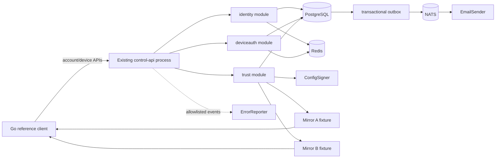
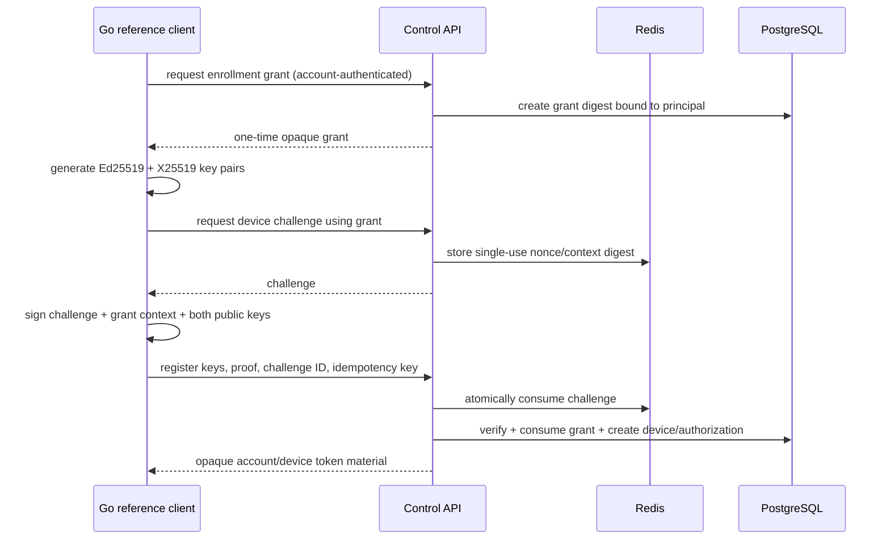

# Talenro C1 规格 1：账号主体、设备身份与配置可信根设计

- 状态：四个设计章节已确认，待正式文档复核
- 日期：2026-08-09
- 上位架构：[强网络限制环境 VPN 产品架构设计规格](./2026-08-04-resilient-vpn-architecture-design.md)
- 商业产品约束：[VPN 商业化客户端与后台设计规格](./2026-08-04-vpn-commercial-client-design.md)
- 前置基础：第 1 阶段项目基础、共享契约、数据依赖与健康服务已通过 Windows/Docker 验收

## 1. 执行摘要

本规格建立 Talenro 控制面的账号主体、设备身份和配置可信根。它不是完整 VPN 配置调度系统，也不接入 Xray、sing-box 或四端原生客户端；它交付后续节点、套餐、调度和客户端规格都必须依赖的安全基元：

1. 以邮箱为主标识的账号主体，以及密码、Passkey、TOTP、恢复码和独立会话撤销能力。
2. 以一次性 `enrollment_grant` 启动、以设备持有私钥证明完成的设备注册。
3. 账号会话和设备授权两个隔离的凭证域；短期 opaque access token、轮换 refresh token family 和重放检测。
4. RFC 8785 JCS、Ed25519 和 RFC 9180 HPKE 组成的签名加密 bundle 基元。
5. 单调可信版本、不可变主 API/双镜像分发和 Go 参考客户端互操作验证。
6. PostgreSQL 权威状态、Redis 短期安全状态、NATS 事务 outbox，以及隐私安全的错误日志和远程上报契约。

架构继续采用现有 Go 模块化单体和同一 PostgreSQL 事务边界。本规格不提前拆微服务，不把账号或设备身份委托给外部 IdP，也不让任何领域直接查询其他领域的内部表。

## 2. C1 合并计划与五规格边界

原路线图中的设备配置分发、节点/POP 控制面和账号/权益/计量能力已经合并为 C1 计划，并拆成五个可独立设计、计划、实现和验收的规格：

1. **本规格：账号主体、设备身份与配置可信根。**
2. **节点/POP 控制面。** 节点库存、出站 mTLS agent、desired state、外部 Xray/sing-box 进程适配器、健康与容量。
3. **权益、流量账本与配额。** Basic/Plus/Pro、设备上限、节点组、幂等用量账本、配额租约和硬停。
4. **调度、隧道凭据与加密配置分发。** 授权、国家/节点组、健康/容量、故障域多样性、Rendezvous、凭据滚动和主 API/双镜像 bundle。
5. **五 POP 端到端故障注入。** 不健康/满载排除、篡改/重放、镜像故障、重复用量、租约过期以及 Xray/sing-box 计量一致性。

每个规格都有自己的设计文档和实施计划。本规格只提供最小测试 bundle；真实节点候选、隧道凭据、套餐和用量不得偷偷进入本规格。

## 3. 目标与非目标

### 3.1 目标

- 建立稳定、不可由邮箱字符串替代的 opaque `principal_id`。
- 支持邮箱/密码主认证；Passkey、TOTP 和恢复码为可选且可独立撤销的增强认证。
- 支持 `required`、`grace` 和仅本地测试可用的 `disabled` 邮箱验证策略。
- 保证每个设备的 Ed25519 签名私钥和 X25519 HPKE 私钥从不进入服务端。
- 通过一次性 grant、单次 nonce、设备签名和原子事务阻止匿名或重复注册。
- 以 opaque token hash、refresh rotation 和 family replay detection 支持账号与设备会话。
- 提供 provider-neutral `ConfigSigner`、固定密码学套件和可验证的密钥轮换元数据。
- 让主 API 和两个镜像发布完全相同的不可变加密字节，并能由 Go 参考客户端验证。
- 对日志、指标、错误响应和远程错误报告实施 allowlist 与 secret-canary 验收。
- 保持 10 万并发设备目标所需的无高基数指标、索引化令牌查找和水平扩展边界。

### 3.2 非目标

- 节点库存、POP agent、健康聚合、容量或候选调度。
- Basic/Plus/Pro、节点组、设备套餐上限、流量账本、配额租约或硬停。
- VLESS、REALITY、Hysteria2、Xray、sing-box 或任何真实隧道凭据。
- Android、iOS、Windows 和 macOS 原生客户端；本规格只有 Go 参考/一致性客户端。
- 支付、加密货币、邀请返利、广告奖励、商业套餐 UI 或多语言 UI。
- 运行时密码学算法协商、后量子混合 KEM 或自定义密码学原语。
- 生产根密钥仪式、真实 AWS/GCP/Vault signer 和最终邮件供应商适配器。

## 4. 安全原则

1. **PostgreSQL 是权威事实源。** Redis 和 NATS 不得成为账号、设备、撤销或最高可信版本的唯一事实源。
2. **私钥归持有者。** 设备私钥只存在于设备安全存储；配置签名私钥只存在于 signer provider；服务端业务代码只持有接口和公钥元数据。
3. **先认证，后注册。** 没有绑定 `principal_id` 的短期一次性 grant，不得创建设备。
4. **先部署，后签发。** 后续规格必须先让候选节点接受凭据，再把含该凭据的 bundle 发给设备。
5. **版本只增不减。** 服务器签发状态和客户端最高可信版本均不可因 ack、过期、运行时回退或离线而降低。
6. **失败关闭有边界。** nonce、登录、token rotation、授权和新签发在安全依赖不可用时失败；错误上报、邮件发送和 NATS 投递不能反向阻塞已提交权威事务。
7. **公开输出是有限集合。** HTTP 错误、日志、指标和遥测只能出现 allowlist 字段和有限枚举。
8. **协议契约优先。** 未知字段、重复 JSON 属性、错误长度、越界集合和未声明算法全部拒绝。

## 5. 总体架构



### 5.1 模块职责

#### `identity`

- 账号、邮箱 identity、密码 credential 和邮箱验证策略。
- Passkey、TOTP、恢复码及其独立撤销。
- 账号 session、refresh token rotation 和安全事件。
- 账号状态和高风险操作重新认证。

#### `deviceauth`

- 一次性 enrollment grant。
- 设备 Ed25519 公钥、HPKE 公钥和密钥版本。
- 设备 PoP challenge、设备授权、token family 和撤销。
- `grace` 邮箱策略产生的 provisional 设备策略快照。

#### `trust`

- bundle schema allowlist、字段/集合/大小限制和 JCS。
- `ConfigSigner`、签名 key ID、trust metadata 和轮换验证。
- HPKE envelope、bundle issuance、ack 和最高可信版本。
- 主 API 与两个镜像的不可变字节一致性。

### 5.2 应用层接口

- `EmailSender`：只接收模板 ID、语言、一次性 delivery ID 和最小必要收件信息；供应商错误不能穿透领域边界。
- `ConfigSigner`：接收域分离后的待签名字节，返回固定算法、`key_id` 和签名；业务层无法导出私钥。
- `SensitiveFieldProtector`：执行 key-versioned lookup HMAC 和应用层字段加解密；本地实现只供测试。
- `ErrorReporter`：只接收 allowlist DTO；有界队列和独立超时，不能成为业务依赖。
- `Clock`、`RandomSource`：生产实现使用系统安全能力，测试实现提供确定时间和向量；不得在生产配置中替换为弱随机源。

生产部署没有合格的 signer、敏感字段密钥来源、邮件 provider 或 TLS 时，release gate 必须失败。模块之间只能调用应用接口或消费版本化事件，不能查询对方内部表。

## 6. 权威数据模型

所有权威记录使用随机稳定 ID、乐观版本或状态版本、创建/更新时间。安全历史不以普通软删除覆盖；删除流程通过明确状态和最小化/匿名化任务完成。

### 6.1 `identity` schema

- `accounts`
- `email_identities`
- `password_credentials`
- `passkey_credentials`
- `totp_credentials`
- `recovery_code_sets`
- `account_sessions`
- `account_refresh_tokens`
- `security_events`

### 6.2 `deviceauth` schema

- `enrollment_grants`
- `devices`
- `device_authorizations`
- `device_token_families`
- `device_refresh_tokens`
- `device_policy_snapshots`

### 6.3 `trust` schema

- `trust_root_metadata`
- `signing_key_metadata`
- `bundle_issuances`
- `bundle_acknowledgements`
- `highest_bundle_versions`

### 6.4 共享基础表

- `transactional_outbox`
- `consumed_event_ids`
- `idempotency_records`

`idempotency_records` 以 principal、operation 和高熵 `Idempotency-Key` 组成隔离作用域，保存规范化请求摘要、完成状态和响应摘要。同一作用域同一键但请求摘要不同必须返回固定冲突；并发首写由唯一约束和事务串行化。

### 6.5 敏感字段

- 邮箱：版本化规范化后，以 key-versioned HMAC 作为查找索引，以应用层密文保存可恢复值；不做 provider-specific 的点号或 `+tag` 合并。
- 密码：Argon2id，记录参数版本、随机 salt 和输出；成功登录时按当前策略升级旧参数。
- opaque token：数据库只保存不可逆摘要、family、轮换/使用/撤销时间和最小上下文。
- TOTP secret：应用层加密；恢复码只显示一次并保存不可逆摘要。
- Passkey：只保存 credential ID、公钥、签名计数和安全元数据。
- 设备：只保存 Ed25519 公钥、X25519 HPKE 公钥和不含 PII 的 key ID；设备私钥不得上送。
- bundle：可以保存 ciphertext 和安全摘要，不保存可被日志、指标或错误报告读取的明文配置副本。

## 7. 状态机与不变量

### 7.1 账号

```text
pending_email -> active -> suspended -> deletion_pending -> deleted
```

- `required` 模式下，邮箱验证前保持 `pending_email`，不能取得 enrollment grant 或配置能力。
- `grace` 模式下可以产生一个 provisional 设备授权，但策略快照固定为单设备、受限试用节点组、最长 24 小时；本规格只验证快照，不实现节点组。
- grace 到期且仍未验证时停止新配置和后续配额能力；仍允许完成邮箱验证或账号恢复。
- `disabled` 只允许 local/test profile；production profile 配置该值时拒绝启动。
- suspended、deletion_pending 和 deleted 状态不能通过普通更新回到 active。

### 7.2 Enrollment grant

```text
unused -> consumed
unused -> expired
```

- grant 为高熵 opaque secret，数据库只保存摘要。
- grant 绑定 `principal_id`、授权上下文和到期时间。
- 消费 grant、验证设备 PoP、创建设备与 device authorization 必须在同一 PostgreSQL 事务完成。
- 并发或重放只能得到同一稳定结果，不能创建第二台设备。

### 7.3 Device authorization

```text
provisional -> active -> suspended | revoked
```

- `required` 验证完成或 `grace` 策略创建 authorization。
- 邮箱完成验证后，可在事务中将 provisional 升级为 active。
- suspended/revoked 不得签发新 token 或 bundle。
- 撤销设备时撤销其账号 session、device token family、配置解密身份和后续规格中的节点凭据。

### 7.4 Refresh token family

```text
active -> rotated -> rotated ...
used token replay -> compromised -> revoked
```

- 轮换是单一事务；旧 token 标记 used 和新 token 创建必须原子提交。
- 已使用 token 再次出现时，整族进入 compromised/revoked，产生有界安全事件。
- 账号 refresh 和设备 refresh 属于不同凭证域，不能互换。

### 7.5 Bundle version

- `highest_issued` 按 device authorization 单调递增。
- 客户端按 audience 持久化 `highest_trusted`；只有完整解密、验签和语义验证通过后才能提高。
- ack、bundle 过期、本地运行时回退、镜像故障或设备离线不能降低最高可信版本。
- HPKE 不提供应用级完整防重放；版本、有效期、audience、locator 和持久化最高版本共同承担重放保护。

## 8. 账号与设备流程

### 8.1 注册与邮箱策略

1. 客户端提交邮箱、密码、语言和 `Idempotency-Key`。
2. `identity` 严格解析并版本化规范化邮箱，查找 HMAC 索引。
3. 无论邮箱是否已存在，未认证边界返回相同形状、状态和时序预算的结果。
4. 新账号、password credential、安全事件和 email delivery outbox 在同一事务写入。
5. worker 消费 outbox 并调用 `EmailSender`；失败有界退避和去重，不回滚账号事实。
6. 一次性邮箱令牌验证成功后激活账号或升级 provisional 授权。

普通邮箱密码登录不依赖每次邮件验证码。邮箱变更、密码重置、Passkey/TOTP/恢复码管理和高风险撤销要求重新认证；这些安全能力可独立撤销。

### 8.2 账号会话

- 密码、Passkey 或恢复流程成功后创建独立 account session 和 refresh family。
- access token 为短期高熵 opaque token；服务端根据摘要查询 PostgreSQL 权威状态。
- refresh 轮换要求 refresh token、单次 challenge 和设备签名共同证明。
- 修改密码触发高风险 session 复核；明确风险事件可以撤销当前、其他或全部 session。
- 未知邮箱、密码错误、账号暂停和未知 session 在未认证边界统一为 `authentication_failed`。

### 8.3 设备注册



签名上下文必须域分离并覆盖：protocol version、challenge、grant digest、两个公钥、请求操作、服务端 audience 和客户端生成的请求 nonce。任何字段替换都会使 PoP 失败。

### 8.4 Device token renewal

1. 设备以当前 refresh token 请求单次 challenge。
2. 设备签名 challenge、token family、operation、audience 和请求上下文。
3. 服务端原子消费 challenge、旋转 refresh token，并检查 account/device authority。
4. 旧 token 重放立即撤销整族；HTTP 返回稳定 `authentication_failed`，内部记录固定安全类别。

Redis 不可用时，challenge 和 rotation 失败关闭。已持有的短期 access token 仍可回源 PostgreSQL 验证，直到自身到期或权威状态撤销。

## 9. 配置可信根与密码学信封

### 9.1 固定套件

本规格固定以下算法，不提供运行时协商：

- JCS：RFC 8785，严格 I-JSON。
- 签名：Ed25519，RFC 8032。
- HPKE mode：RFC 9180 Base mode。
- KEM：`DHKEM(X25519, HKDF-SHA256)`。
- KDF：`HKDF-SHA256`。
- AEAD：`ChaCha20-Poly1305`。
- Go 实现：Go 1.26 标准库 `crypto/hpke`；不增加 CIRCL 生产依赖。

Go 标准库提供固定构造函数，应用不得用来自请求的数值调用通用算法选择 API。后量子 KEM 必须通过后续独立协议版本和迁移规格引入。

HPKE Base mode 负责“只有目标设备能读取”，内层 Ed25519 签名负责“内容确由受信配置 signer 产生”。不使用 HPKE Auth mode 重复表达 signer 身份，避免形成两套发送方密钥轮换和信任语义。

### 9.2 Payload

类型化 payload 至少包含：

- `schema_version`
- `bundle_id`
- `bundle_locator`
- `bundle_version`
- `audience`，只包含密文内的 opaque principal/device authorization 引用
- `issued_at`、`not_before`、`expires_at`
- `policy_snapshot`
- 本规格使用的最小测试配置内容

签名 schema 中的版本、长整数和时间采用受限字符串格式，避免跨语言 IEEE 754 舍入。对象字段和集合都有 allowlist 与硬上限；未知字段、重复属性、非法 Unicode、NaN、Infinity 或超限输入立即拒绝。

### 9.3 唯一生成顺序

1. 构造并完整验证类型化 payload。
2. 生成 RFC 8785 JCS UTF-8 字节并计算 SHA-256。
3. 对 `"TALENRO-CONFIG-BUNDLE-SIGNATURE-V1\x00" || payload_jcs` 执行 Ed25519 签名。
4. 将 exact `payload_jcs`、摘要、`signer_key_id`、算法和签名放入 signed bundle。
5. 按固定大小桶加入服务端生成的随机 padding；密文长度仍视为可观察元数据。
6. 使用设备 X25519 HPKE 公钥建立 sender context。
7. 外层 header 的 RFC 8785 JCS 字节作为 AAD，固定 `info = "talenro-config-bundle/v1"`。
8. HPKE 加密整个 signed bundle。
9. 将最终 outer envelope 规范化为不可变字节，计算 distribution SHA-256。
10. 同一份字节发布到主 API、Mirror A 和 Mirror B；任一副本重新序列化都视为错误。

不能先加密后签名，不能只签摘要而不绑定 exact JCS payload，也不能让镜像重新生成信封。

### 9.4 Outer envelope

公开外层只包含：

- `envelope_version`
- 固定 KEM/KDF/AEAD ID
- 每 bundle 不可关联的 opaque `recipient_key_id`
- 高熵随机 `bundle_locator`，至少 128 bit
- HPKE encapsulated key `enc`
- ciphertext

设备 ID、账号 ID、邮箱、签名 key 元数据和配置内容不出现在 URL 或外层明文。外层 `recipient_key_id` 不是数据库中的稳定 key ID，而是截取 `SHA-256(domain || recipient_public_key || bundle_locator)` 得到的 128-bit per-bundle selector；目标设备可为当前/上一把本地公钥计算 selector，观察者不能据此关联同一设备的多个 bundle。二进制字段使用固定 base64url 编码规则。外层 header 在生成 `enc` 后构造，排除 ciphertext 本身并作为 AAD。

### 9.5 客户端验证顺序

1. 在分配前检查 HTTP 和 outer envelope 总大小。
2. 严格解析固定 outer schema，验证 suite 和字段长度。
3. 使用设备 HPKE 私钥执行 Open。
4. 在解析前检查解密明文上限。
5. 严格解析 signed bundle，验证 exact payload bytes 符合 JCS 重规范化结果。
6. 通过单调 trust metadata 找到 `signer_key_id` 并验证 Ed25519。
7. 验证摘要、audience、locator、schema、有效期和配置语义。
8. 拒绝低于客户端 `highest_trusted` 的版本。
9. 先原子持久化新最高版本和 bundle，再替换运行配置。
10. 发送幂等 acknowledgement；ack 失败不回滚本地最高可信版本。

### 9.6 Trust metadata 与 key rotation

- 客户端内置 trust root public key 或由受控安装过程提供。
- root-signed metadata 包含单调 metadata version、允许的 config signing keys、算法、有效期和状态。
- 新 signing key 必须先进入受信 metadata，再用于签发；旧 key 在 grace 窗口后撤销。
- 客户端不能接受低版本 metadata、未知 root 或未声明算法。
- 本规格用测试 root 和本地 signer 完成轮换一致性测试；生产 root ceremony 和真实 KMS/Vault adapter 是 release gate，不以本地 key 替代。

## 10. 分发与 API 契约

### 10.1 资源族

本规格细化商业产品规格中的概念性 `/auth/*` 路径。最终 OpenAPI 使用资源化 `/v1` 契约，至少包含：

#### 账号

- `POST /v1/accounts`
- `POST /v1/email-verification-deliveries`
- `POST /v1/email-verifications`
- `POST /v1/account-sessions`
- `POST /v1/account-token-rotations`
- `POST /v1/account-session-revocations`
- Passkey registration/authentication option 与 credential 资源
- TOTP enrollment/verification/revocation 资源
- recovery-code rotation/consumption 资源

#### 设备

- `POST /v1/device-enrollment-grants`
- `POST /v1/device-auth-challenges`
- `POST /v1/devices`
- `POST /v1/device-token-rotations`
- `POST /v1/device-revocations`

#### Bundle

- `POST /v1/config-bundle-resolutions`
- `POST /v1/config-bundle-acknowledgements`
- 主 API 与两个独立镜像的不可变 `GET /b/{bundle_locator}`

账号 access token 不能调用 device-only API，device token 不能管理账号安全设置。OpenAPI security scheme 必须显式区分两个 opaque token 域。

### 10.2 Resolution

`config-bundle-resolutions` 在认证和授权后返回：

- opaque locator
- envelope SHA-256
- 主 API 和两个独立镜像 URL
- 每个位置相同的 immutable cache policy

URL 不含设备或账号标识。镜像不拥有解密或签名能力，只托管已经生成的字节。locator 不替代密码学授权；即使 URL 泄露，非目标设备也不能解密。

### 10.3 Idempotency

创建、轮换、撤销和 acknowledgement 写操作必须携带高熵 `Idempotency-Key`。

- 作用域：authenticated principal + operation + key。
- 首次请求在同一事务保存请求摘要和结果。
- 完全相同的重试返回原结果，不重复发送 grant、轮换 token 或创建记录。
- 相同 key、不同请求摘要返回 `idempotency_conflict`。
- retention 不得短于该操作允许的最大客户端重试窗口；安全突变的 tombstone 不得因普通缓存清理失效。

### 10.4 稳定错误

客户端可见错误固定为：

```json
{
  "code": "authentication_failed",
  "action": "reauthenticate",
  "retry_after_ms": 1000,
  "trace_id": "opaque-request-correlation"
}
```

- `code` 和 `action` 为有限枚举。
- `action` 只允许 `retry`、`reauthenticate`、`reenroll`、`upgrade_client`、`contact_support`。
- `retry_after_ms` 只在明确可重试场景出现。
- 客户端按 code 本地化，不能解析服务端自然语言控制流程。
- 未认证边界的未知邮箱、错误密码、暂停账号、未知设备或错误 token 使用相同 `authentication_failed` 形状和时序预算。
- 响应不包含 raw error、邮箱、设备/key/token 片段、密码学失败细节或第三方正文。

建议的稳定状态映射：

- 400：`malformed_request`
- 401：`authentication_failed`
- 403：已认证后的 `action_not_allowed`
- 409：`idempotency_conflict`、`state_conflict`、`version_rollback`
- 413：`request_too_large`
- 422：`unsupported_schema` 或受控语义错误
- 429：`rate_limited`
- 503：`dependency_unavailable` 或 `signing_unavailable`

## 11. 故障与降级语义

### 11.1 PostgreSQL

- 仅 `/livez` 和静态进程信息继续。
- 登录、token 校验/轮换、grant、注册、授权、新签发和 ack 全部失败关闭。
- readiness 立即为 down。

### 11.2 Redis

- 已持有短期 access token 可回源 PostgreSQL 验证；非敏感只读能力继续。
- 新登录、PoP challenge、token rotation、邮件重发和依赖限流的操作失败关闭。
- 短暂故障先记录 degraded；连续失败超过有界阈值后 readiness 为 down。
- 禁止把 nonce 或撤销事实静默降级到进程内内存。

### 11.3 NATS

- PostgreSQL 领域事务与 transactional outbox 原子提交后，业务结果可以成功返回。
- publisher 后台有界重试，consumer 按 event ID 去重。
- 安全决策读取权威表，不等待尚未投递的事件。
- readiness 不直接等同 NATS socket 状态，而按 outbox oldest age 和 backlog size 的有界阈值降级或 down。

这会细化第 1 阶段“所有依赖直接参与 readiness”的基础实现；调整必须保留 PostgreSQL/Redis/NATS 各自可观测状态和故障注入测试。

### 11.4 EmailSender

- 账号和 email delivery outbox 事务成功后返回通用结果。
- provider 失败不回滚账号；worker 去重并有界退避。
- `required` 不发 grant；`grace` 仍严格受 provisional 快照限制。
- 远程 provider 原始错误和响应正文不得进入日志或 HTTP。

### 11.5 ConfigSigner

- 新 bundle issuance 失败关闭。
- 未过期、已发布的 immutable bundle 仍可读取。
- 生产环境不得回退 local signer 或临时生成 key。

### 11.6 ErrorReporter

- 业务路径、readiness 和本地日志不依赖远程 reporter。
- reporter 使用有界内存队列、批量发送和独立超时。
- 队列满或 provider 不可用时丢弃报告并增加有限标签计数；禁止递归上报 reporter 自身错误。

## 12. 输入限制、重试与配置护栏

### 12.1 输入限制

- 认证类请求体最大 64 KiB。
- 加密 bundle HTTP 响应最大 1 MiB。
- JSON 拒绝未知字段、重复属性、非法 UTF-8 和 trailing data。
- 邮箱、显示名、credential、签名、公钥、集合和嵌套深度均有固定上限。
- Ed25519/X25519 key 和签名必须满足精确编码长度。
- 服务端生成 padding 并放入固定大小桶；客户端不能请求任意 padding 大小。

### 12.2 重试

- 客户端只自动重试带 `Idempotency-Key` 的安全写入，或明确返回 `action=retry` 的 429/503。
- 指数退避必须带随机抖动、最大次数和总时间预算。
- 密码验证、PoP 和 refresh 不做无限隐式重试。
- 网络超时后的幂等重试必须返回第一次已提交结果。

### 12.3 并发

- grant consumption、refresh rotation、device revocation 和最高 bundle version 使用数据库唯一约束、条件更新或行锁串行化。
- 不能以“先查询再插入”的无约束模式保证唯一性。
- 所有并发失败都返回稳定状态，不泄露竞争者、token 或内部 SQL。

### 12.4 可配置预算

以下值可由服务端配置，但启动时强制安全范围；客户端不能覆盖：

| 配置 | 默认值 | 允许范围 |
| --- | ---: | ---: |
| `request_deadline` | 5s | 2–10s |
| `redis_timeout` | 250ms | 100–1000ms |
| `signer_timeout` | 2s | 500ms–5s |
| `error_report_timeout` | 1s | 100ms–2s |
| `clock_skew` | 120s | 30–300s |

`email_verification=disabled`、local signer、无生产敏感字段密钥来源或无 TLS 的 production profile 必须拒绝启动。其他凭证 TTL、限流阈值和 Argon2id 参数使用版本化服务端策略，并在实施计划中以安全下限和负载基准固定；它们不是客户端或套餐可调参数。

时钟偏差只能提供 `not_before`/`expires_at` 的有界容忍，不能降低最高可信版本或延长已过期授权。

## 13. 日志、指标与错误上报

### 13.1 结构化日志

允许字段：

- `event`
- 有限 `category`
- 随机 `trace_id`
- `component`
- 有限 `outcome`
- 静态、代码定义的 `error_fingerprint`

禁止直接输出 wrapped/raw error 字符串。数据库地址、Redis/NATS URL、第三方响应、密码学错误、HTTP request body 和 header 均不能自动序列化到日志。

### 13.2 ErrorReporter

ErrorReporter DTO 使用编译期 allowlist，不接受任意 map 或 raw error。允许固定事件、类别、组件、结果、构建版本和 trace ID；所有 provider SDK 都必须位于 adapter 内部。

以下数据永不收集：

- 邮箱、手机号、密码、token、nonce。
- principal/device ID、bundle locator、公私钥。
- bundle 明文、密文、节点或未来隧道凭据。
- IP 原文、访问目标、DNS、请求正文或第三方正文。

安全失败聚合可使用按周期轮换的服务端 HMAC 摘要；摘要只用于短期限流和检测，不能跨轮换周期跟踪用户。

### 13.3 指标

- 标签只能使用固定 operation/result/reason/component 枚举。
- 不得使用邮箱、principal、device、key、locator、trace ID、路由原文或错误原文作为标签。
- 请求 method 和 route 必须继续使用现有 bounded normalization。
- reporter drop、outbox age/backlog、auth failure category 和 crypto validation category 只暴露聚合计数。

## 14. 测试策略

### 14.1 TDD 与契约

- 每个状态转换、并发不变量和失败关闭路径先有行为测试。
- OpenAPI、SQL、事件 schema 和生成代码确定性验证；clean regeneration 必须无 diff。
- Go 参考客户端与服务端共享 schema 语义但不共享验证实现捷径，避免同一错误同时通过两端。

### 14.2 密码学

- RFC 9180 已知答案测试。
- RFC 8785 官方测试向量和非法输入。
- Ed25519 正/负向向量。
- 生成进程与独立参考客户端进程的跨进程互操作。
- 对 payload、摘要、签名、AAD、locator、audience、key ID、ciphertext 的逐字段篡改测试。
- 旧版本、未来版本、过期、时钟偏差、未知算法、超限和截断输入测试。

### 14.3 并发与故障注入

- 并发消费同一 grant 只产生一台设备。
- 并发 refresh 只有一个成功；旧 token 重放撤销整族。
- 同 idempotency key 同请求返回相同结果；不同请求固定冲突。
- PostgreSQL、Redis、NATS、EmailSender、ConfigSigner 和 ErrorReporter 逐一故障。
- NATS 重复/乱序投递不重复执行消费副作用。
- 主 API 和两个镜像中断、恢复和字节一致性。

### 14.4 隐私与稳健性

- secret canary 覆盖 HTTP、日志、指标、ErrorReporter、panic、超时和第三方失败。
- JSON/JCS/envelope/token/challenge parser fuzz。
- `go test -race`、高重复次数并发测试、`go vet` 和固定 golangci-lint。
- 数据库迁移 `up/down/up`，integration tag 和 Docker smoke。
- 账号枚举防护验证响应形状一致，并对真实/不存在身份使用相同密码哈希成本路径。

## 15. 验收标准

### 15.1 功能闭环

- `required`、`grace`、local/test `disabled` 三种邮件策略均有端到端测试。
- 邮箱/密码、Passkey、TOTP、恢复码和会话撤销可独立工作和撤销。
- grant + device PoP + atomic registration 成立；匿名注册和重复 grant 失败。
- account/device token 域隔离；rotation 和 replay family revocation 成立。
- Go 参考客户端取得、解密、验签、单调应用测试 bundle 并发送 ack。

### 15.2 协议与可信根

- RFC 9180/RFC 8785/Ed25519 向量通过。
- 任一签名、AAD、locator、audience 或 ciphertext 篡改失败。
- 旧版本、过期、未来时间、错误 key ID 和超限输入失败关闭。
- trust metadata 轮换先发布后签发，客户端拒绝回滚。
- 主 API、Mirror A 和 Mirror B 的 envelope SHA-256 完全相同。

### 15.3 故障与并发

- 并发 grant 只创建一台设备。
- used refresh replay 撤销整族。
- 所有六类依赖故障符合第 11 节矩阵，且不会泄露 raw error。
- outbox 重复事件不产生重复副作用。
- race、fuzz、重复执行、迁移和 Docker smoke 均通过。

### 15.4 隐私与发布门

- HTTP、日志、指标和 ErrorReporter secret-canary 扫描通过。
- 无高基数/攻击者控制标签。
- OpenAPI/SQL/事件生成确定性且固定依赖校验通过。
- threat model、signing key rotation/recovery、token compromise 和 email provider outage runbook 完整。
- production profile 缺少真实 signer、敏感字段密钥来源、邮件 provider 或 TLS 时构建/部署验收失败。

## 16. 交付物

- `identity`、`deviceauth`、`trust` 领域与应用模块。
- 可逆迁移、sqlc queries 和 repository adapters。
- 版本化 OpenAPI 与事件契约。
- 本地 EmailSender、ConfigSigner、SensitiveFieldProtector、ErrorReporter fixtures。
- Go 参考/一致性客户端和官方向量 fixtures。
- 主 API + 两个独立 HTTP mirror fixtures。
- 故障注入、隐私、race、fuzz、integration 和 smoke 验收。
- 威胁模型、密钥轮换/恢复和依赖故障 runbook。

## 17. 实施顺序约束

正式文档复核后必须先使用 `writing-plans` 编写实施计划，再进入任何生产代码修改。实施计划至少按以下依赖顺序拆分：

1. 契约与数据迁移。
2. identity 状态和认证基元。
3. device enrollment、PoP 和 token family。
4. trust metadata、JCS、signer 与 HPKE envelope。
5. API、参考客户端和三源分发 fixtures。
6. 故障注入、隐私、并发和完整验收。

不能并行实现尚未冻结的下游规格，也不能用真实 tunnel-core 集成替代本规格的最小测试 bundle。

## 18. 规范依据

- [RFC 8032：Edwards-Curve Digital Signature Algorithm (EdDSA)](https://www.rfc-editor.org/rfc/rfc8032.html)
- [RFC 8785：JSON Canonicalization Scheme](https://www.rfc-editor.org/rfc/rfc8785.html)
- [RFC 9106：Argon2 Memory-Hard Function](https://www.rfc-editor.org/rfc/rfc9106.html)
- [RFC 9180：Hybrid Public Key Encryption](https://www.rfc-editor.org/rfc/rfc9180.html)
- [Go 1.26 `crypto/hpke`](https://pkg.go.dev/crypto/hpke)
- [Web Authentication Level 3 Candidate Recommendation](https://www.w3.org/TR/webauthn-3/)
- [AWS KMS asymmetric key specifications](https://docs.aws.amazon.com/kms/latest/developerguide/symm-asymm-choose-key-spec.html)
- [Google Cloud KMS algorithms](https://cloud.google.com/kms/docs/algorithms)
- [Vault Transit secrets engine](https://developer.hashicorp.com/vault/docs/secrets/transit)
