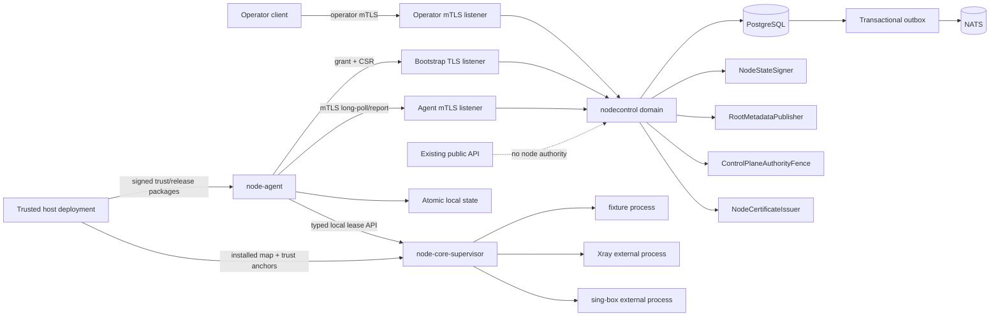

# Talenro C1 规格 2：节点与 POP 控制面设计

- 状态：设计决策已确认，待正式文档复核
- 日期：2026-08-23
- 上位架构：[强网络限制环境 VPN 产品架构设计规格](./2026-08-04-resilient-vpn-architecture-design.md)
- 前置规格：[C1.1 账号主体、设备身份与配置可信根设计](./2026-08-09-account-device-trust-design.md)
- 基础决策：[ADR 0001：控制面基础](../../decisions/0001-control-plane-foundation.md)
- 许可证门：[依赖与许可证策略](../../licenses/dependency-policy.md)

## 1. 执行摘要

C1.2 建立节点与 POP 控制面。它交付节点库存、仅出站连接的 mTLS node agent、签名且单调的 desired state、外部 Xray/sing-box 进程适配、受控隔离，以及有限维度的健康与容量上报。

本规格延续现有 Go modular monolith 和 PostgreSQL 权威事务边界。控制面新增彼此隔离的 operator mTLS、bootstrap TLS 和 agent mTLS listener；节点上新增专有 Go `node-agent` 与最小 `node-core-supervisor`。Agent 只经 typed local lease 管理 operator 预置且按摘要 allowlist 的外部进程，不下载、嵌入、vendoring 或链接 Xray/sing-box。

已确认的核心选择是：

1. 节点以绑定 `node_id` 的短期一次性 enrollment grant 首次申领证书。
2. 权威验收同时使用确定性 fixture process 和固定来源的真实 Xray/sing-box 外部进程 smoke。
3. 控制面下发类型化白名单 IR，由 agent 本地 adapter 编译配置；不下发任意原始 JSON。
4. 控制面失联时使用有界 LKG；状态到期后排空并停止，而不是无限期运行。
5. Agent 通过 mTLS HTTPS long-poll 拉取完整快照，并幂等上报 observed state；不直接连接 NATS。
6. 节点库存和 desired state 由独立 operator mTLS API 管理；C1.2 不制作管理 UI。

独立退出条件是一条可重复的受控进程验收：节点完成 enrollment，多个进程收敛到签名 desired state，配置失败保留 LKG，崩溃或真实握手失败触发隔离，容量以有限字段上报，失联和过期语义正确，真实 Xray/sing-box adapter 通过 smoke，并在列明的扫描规则下确认三个专有二进制没有嵌入或链接任何隧道核心。

## 2. C1 边界

### 2.1 目标

- 建立 POP、故障域、节点、公开端点和 process slot 的权威库存。
- 让 operator 通过独立 mTLS API 幂等创建库存、enrollment grant 和 desired generations。
- 让 node agent 在本地生成密钥并以一次性 grant 申领短期 mTLS 证书。
- 让 agent 只通过出站 HTTPS 拉取完整、签名、版本单调且有界有效的 desired state。
- 以类型化 IR 和窄 adapter 契约管理 fixture、Xray 与 sing-box 外部进程。
- 证明配置预检、原子应用、LKG 回退、排空、重启预算和隔离状态机。
- 上报有限健康与容量事实，并产生后续 C1.4 可以读取但本规格不消费的 `accepting_new` 结论。
- 保持日志、指标、HTTP 错误、远程报告和进程输出的隐私安全边界。
- 提供 Windows PowerShell 与 repository-external Git Bash/Docker 两个权威验证入口的设计要求。

### 2.2 非目标

- Basic/Plus/Pro、设备上限、节点组授权、流量账本、配额租约或硬停；这些属于 C1.3。
- 国家/节点组策略、健康容量调度、Rendezvous 稳定性和故障域候选多样性；这些属于 C1.4。
- 真实设备级 VLESS、REALITY 或 Hysteria2 凭据，以及 deploy-before-issue 生产凭据传播；这些属于 C1.4。
- 面向客户端的生产 HPKE bundle、主 API/双镜像生产配置和客户端离线候选；这些属于 C1.4。
- 跨 Xray/sing-box 的可计费用量、配额执行或 0.1% 计量一致性；这些属于 C1.3/C1.5。
- 自动下载、安装、升级或修改 Xray/sing-box；operator 必须在 agent 启动前预置受审核 release。
- Windows/arm64 production POP node；C1.2 V1 唯一 production node target 是 `linux/amd64`。Windows 仅运行控制面开发入口和 Job Object fixture，不能据此宣称 production node 支持。
- 节点管理 Web UI、通用远程命令执行、shell、插件市场或任意脚本分发。
- 跨网络群体的客户端成功率判断；C1.2 只使用节点本地进程、资源和固定真实握手探针。
- 零中断单节点蓝绿升级；C1.2 只保证验证优先、有限 stop/start 和可回退。

## 3. 方案比较与决定

### 3.1 已选择：mTLS HTTPS pull/snapshot

Agent 使用最长 25 秒的 mTLS HTTPS long-poll，并携带当前 generation。控制面有更高 generation 时立即返回完整 signed snapshot；没有变化时返回 `204 No Content`。Agent 以独立请求上报 observed snapshot。

该方案符合“节点只出站连接”的网络边界，复用现有 HTTP、OpenAPI 和严格解析基础，避免把 NATS、Redis 或 PostgreSQL 暴露给 POP。长轮询没有双向流的连接粘性和恢复游标复杂度；秒级而非亚秒级收敛满足本规格。

### 3.2 未选择：gRPC 双向流

双向流可以更快推送，但需要额外解决负载均衡粘性、流恢复、背压、连接级授权缓存和 gateway 生命周期。当前节点规模与 25 秒 long-poll 不足以证明这些复杂度有收益。若以后测得 HTTP 通道成为瓶颈，必须以新的 ADR 和兼容迁移设计重新评估。

### 3.3 未选择：agent 直接连接 NATS

直接连接 NATS 会扩大 broker 的网络、凭据和 subject 授权边界，并把至少一次投递、重放和 durable consumer 状态推入节点。NATS 继续只承载控制面内部 outbox 事件；它不是 desired state 或节点身份的权威来源。

### 3.4 未选择：控制面下发原始核心配置

完整 Xray/sing-box JSON 会允许未审计字段、远程 URL、实验性能力或版本耦合进入执行面。C1.2 只下发自有 IR 和有限 profile ID，adapter 在节点本地编译并验证。C1.4 若需要扩展凭据或协议字段，必须增加 schema version 和显式 capability，而不是开放原始 JSON 逃生口。

## 4. 安全与一致性原则

1. **PostgreSQL 是领域事实源，外部 fence 是防回滚权威。** Redis 可以缓存可重建状态，NATS 可以重放事件，但二者都不能决定节点身份、证书状态、desired generation 或 operator 意图；9.1 的独立 `ControlPlaneAuthorityFence` 只提供不可回退的 epoch/sequence/effect receipt，不能替代领域行或payload。
2. **三个信任域互不代用。** Operator、node agent 和 HTTPS server 证书使用独立 CA/用途。任一证书不得访问另一信任域的 listener。
3. **私钥留在持有者。** Agent、operator、TLS server、issuer、NodeStateSigner、root/deployment authority 私钥不进入领域表、日志、报告或 desired state。
4. **版本只增不减。** Agent 持久化最高已见和最后已应用 generation；运行时回退不能降低最高已见版本。
5. **先验证，后触碰旧进程。** IR、签名、时间、release 摘要、渲染结果和核心原生检查全部成功后，才允许切换。
6. **失败关闭有边界。** 新 enrollment、证书轮换、desired pull 和 operator mutation 在权威安全依赖不可用时失败；仍有效的 LKG 可以在规定期限内继续运行。
7. **无任意执行。** Desired state 不含 shell、命令、路径、环境变量、URL、原始核心配置或动态插件。
8. **公开输出有限。** HTTP 错误、日志、指标和报告只出现预注册字段、枚举和数值；provider 或核心原始错误不跨边界。
9. **进程边界不是许可证豁免。** 不链接核心只保护架构边界，不替代 GPLv3+/MPL-2.0 的分发、源码、通知和修改义务。

## 5. 总体架构



### 5.1 控制面进程

现有 `control-api` 继续作为 modular monolith，但监听器和路由严格隔离：

| Listener | 认证 | 职责 |
| --- | --- | --- |
| Existing public API | 现有账号/设备认证 | 不增加节点 mutation 权限 |
| Bootstrap TLS | 服务器 TLS + enrollment grant | 仅申领首张 agent 证书 |
| Operator mTLS | operator CA + 应用层授权 | 库存、grant、desired state、查询与审计 |
| Agent mTLS | node-agent CA + 应用层节点状态检查 | 轮换、long-poll、observed report |
| Metrics | 默认 loopback | 仅聚合、低基数指标 |

Bootstrap listener 不配置可选客户端证书；它与要求 `RequireAndVerifyClientCert` 的 agent listener 使用不同端口和独立 server。这样不会因同一 TLS 配置中的“可选证书”产生绕过路径。

### 5.2 领域组件

| 组件 | 单一职责 | 依赖 |
| --- | --- | --- |
| `NodeInventory` | POP、故障域、节点、端点和 slot 权威状态 | PostgreSQL repository |
| `NodeEnrollment` | grant、CSR、首次证书和幂等重试 | PostgreSQL、issuer、clock、random |
| `NodeCertificates` | 轮换、序列号状态和撤销 | PostgreSQL、issuer、clock |
| `NodeDesiredState` | IR 校验、generation、JCS 与签名 | PostgreSQL、NodeStateSigner |
| `RootMetadataPublisher` | C1.2 root-threshold metadata/紧急撤销 ceremony | PostgreSQL、external root-sign provider、authority fence |
| `ControlPlaneAuthorityFence` | rollback-resistant epoch/sequence/effect receipt | production external provider |
| `NodeObservation` | 去重、最新 observed state、EWMA 与状态转换 | PostgreSQL、clock |
| `OperatorAudit` | 有限 actor/action/reason/result 记录 | PostgreSQL、outbox |
| `OperatorAuthorizer` | 把 operator URI SAN 映射为有限 role/POP scope | production external provider |

各领域通过接口合作，不直接查询其他领域的内部表。所有需要同时改变权威状态和发布事件的操作使用同一 PostgreSQL 事务与现有 outbox 模式。

### 5.3 节点进程

`node-agent` 是独立的专有 Go 二进制；C1.2 的 release/production support matrix 只包含 `linux/amd64`。它包含：

- enrollment/rotation client；
- signed desired-state client；
- 原子 local state store；
- 单写入者 reconciler；
- typed local supervisor client；
- fixture、Xray、sing-box 三个 process adapter；
- health/capacity collector；
- bounded observation reporter。

同机另有最小的专有 `node-core-supervisor`，由 operator 作为 root-owned service 预置。它只在本地 Unix socket 接受 exact agent UID，协议只允许 `{prepare,check,start,probe,drain,stop,renew,rollback,list_faults,clear_fault}`、完整 signed desired/root-metadata/recovery chain、slot ID、generation、可选 test-credential FD 和 opaque lease/transition/fault ID；不接受 executable path、argv、environment、shell、任意 config FD 或任意文件。Supervisor 独立读取同一 approved manifest/installed map/resource envelope、复核 file/config identity，并把每个 slot 启动为预置的独立 unprivileged core UID/cgroup。它是 process isolation/authorization TCB，不实现 control-plane network、node identity private key 或 production credential 逻辑。

Agent build 内的 `AgentSupervisorCompatibilityV1` 固定允许的 supervisor build digest 与 local protocol version；supervisor handshake 返回自身 version/boot nonce，agent 再以 Unix peer credentials 取得 PID，核对 root-owned `/proc/<pid>/exe` 的 actual image digest。Mismatch、protocol downgrade 或同 boot identity 改变会在任何 core start 前触发 `release_or_process_integrity`。Supervisor 不持有 node certificate/private key，不能调用 control-plane API。

Agent 不接受入站控制连接，不直接连接 PostgreSQL、Redis 或 NATS，也不拥有 core 安装或升级权限。以后启用 Windows 或其他 GOARCH 必须新增平台 release manifest、原生 real-core smoke、process/loader threat tests 和许可证证据，并经过新的设计批准；跨平台编译成功不等于受支持。

## 6. 信任域与节点身份

### 6.1 CA 与 provider

定义 provider-neutral `NodeCertificateIssuer`。Local/test profile 可以使用进程内测试 CA；production profile 只接受外部 issuer provider。Production 启动时如果 operator CA、node-agent CA、server TLS 或 issuer 配置缺失、互相复用或使用测试私钥，进程必须拒绝启动。

V1 node、operator 和 server leaf 都固定为 ECDSA P-256、KeyUsage **exactly** digitalSignature、`BasicConstraintsValid=true`、`IsCA=false`，禁止 keyCertSign/cRLSign/keyEncipherment、Any EKU、额外 SAN、重复 extension 和未知 critical extension。精确 profile 是：

| Leaf | EKU | 唯一 SAN | 寿命 |
| --- | --- | --- | --- |
| node | clientAuth only | `spiffe://<node-trust-domain>/node/<canonical-node-uuid>` | 固定 24 小时窗口 |
| operator | clientAuth only | `spiffe://<operator-trust-domain>/operator/<operator-id>` | 最长 8 小时 |
| server | serverAuth only | listener 配置中唯一的受控 DNS SAN | 最长 30 天 |

Node certificate 的 `NotBefore=issuer_now-5m`，`NotAfter=NotBefore+24h`；operator/server 使用同一最多 5 分钟 backdate 规则且不得超过表中寿命。每张证书使用 issuer 记录的非零 serial。

Leaf subject DN 固定为空。Extension allowlist 只有 critical BasicConstraints(`CA=false`)、critical KeyUsage(digitalSignature)、noncritical EKU、critical single SAN，以及 noncritical SKI/AKI；SKI/AKI 必须由 exact subject/issuer public key 按 profile 算法导出。缺失、额外、重复、错误 criticality、AnyEKU 或未知 critical/noncritical extension 都拒绝。Issuer chain 中的 CA certificate 另按独立 CA profile 验证，不能把 CA constraints 套给 leaf。

这里仅使用 SPIFFE 兼容的 URI 语法，不引入 SPIRE 或外部 workload-identity 服务。Production 的 trust domain 必须是 operator 控制的 DNS 名称；local/test 使用保留测试域。

Operator ID 是审计 actor，不是普通账号 principal。Node 与 operator listener 都必须在 TLS 握手后执行应用层 serial/identity/status 校验；仅验证 CA 链不足以授权请求。

Bootstrap/agent/operator client 必须预置对应 server trust root 和精确 DNS hostname，使用标准链、hostname、EKU 和时间验证；禁止 `InsecureSkipVerify`、自签首次信任或仅比较 leaf fingerprint。

所有 trust bundle 都使用 deployment-authority 签名的 canonical `TrustBundleManifestV1={schema_version="trust-bundle-manifest.v1",purpose,control_plane_authority_epoch,authority_sequence,trust_domain,bundle_version,sorted_ca_entries:[{der_sha256,status}],cumulative_deauthorized_ca_der_digests[],issued_at}`。Purpose只允许`bootstrap_server/agent_server/operator_server/node_client/operator_client`，不同purpose/domain的package/signature不能复用。Entries按digest bytewise排序、唯一，status只允许`active/retiring/compromised`；正常转换只允许active→retiring→omitted，安全事件允许active/retiring→compromised。被compromised或从retiring移除的digest同版本加入按bytewise排序、唯一、append-only且最多128项的cumulative set，current active/retiring entry不得出现在set中，未来package不得重新授权set中CA。达到上限必须out-of-band替换deployment key set、全部相关CA与consumer identity，不能截断历史。

Consumer拒绝低同流authority-sequence/bundle version、同version/sequence不同digest、cumulative set删除/重排/重授权和非法status转换。Exact CA DER只随`TrustBundlePackageV1={manifest,ca_certificates_der[],deployment_key_id,algorithm=ed25519,deployment_authority_signature}`交付；DER数组必须按digest排序、与entries一一对应且每张证书满足独立CA profile。Signature transcript固定为`TALENRO-TRUST-BUNDLE-PACKAGE-V1\x00 || JCS(TrustBundleManifestV1)`，DER内容由manifest digest完整绑定。

安装时独立预置的`DeploymentAuthorityKeySetV1`至少包含四个不同Ed25519 key，key ID固定为raw public key的lowercase hex SHA-256，并以封闭role分别授权`trust_bundle`、`host_remediation`、`operator_trust_guard`与`node_resource_envelope`；一个key不能占两个role。它与server CA、C1.2 root和control-plane online key分离，不能通过bootstrap、agent poll、当前TLS连接或package/evidence内部自举更新。Role key或key set失陷只能由out-of-band host deployment替换consumer/key set并按10.3 reenroll，不能使用另一role签名绕过。

V1 唯一的 server-CA 更新通道是既有受信 host deployment：它先把完整 package 写成 root-owned、agent 只读的临时文件，验证 deployment-authority signature、authority epoch/sequence、manifest/DER digest、CA profile与本地 RollbackGuard high-water，再以原子 rename 安装。Agent watcher只接受该路径的完整 package；成功 seal 后立即取消所有 long-poll、关闭现有 transport并重新握手。低版本/sequence、same version/sequence different digest、partial write或验签失败时，旧package只保留为已封存的取证/恢复输入，agent禁止复用或发起任何control-plane连接并记录本地security latch；bootstrap/poll响应绝不携带或授权新server-CA package。正常old→old+new→new与emergency removal都必须先经该通道到达host；host deployment不可用时节点宁可离线，不能从当前服务器下载替代信任。Poll中的server-bundle三元组仅用于诊断/rollback告警，不是分发机制。

Control-plane在启动 listener前，把 node-client/operator-client CA的 authority epoch/sequence/version/digest/cumulative-set与 PostgreSQL `control_plane_trust_bundle_high_waters`及9.1 external fence比较；只有 fence-finalized的更高版本才推进，较低、pending或冲突配置使对应 listener fail closed。Agent把authority epoch和bootstrap/agent server-CA bundle version/sequence/digest/cumulative set纳入RollbackGuard。单独回放旧部署文件或旧数据库不能降低任何consumer高水位。

受支持的production operator tooling不是任意`curl`，必须使用`OperatorClientTrustGuardV1`。它原子安装同一host-deployed package，但每次新连接及最长每5分钟还向独立rollback-resistant deployment provider提交32-byte nonce，取得`OperatorTrustGuardAttestationV1={schema_version,purpose,trust_domain,control_plane_authority_epoch,authority_sequence,bundle_version,bundle_digest,cumulative_set_digest,request_nonce,issued_at,valid_until}`；transcript为`TALENRO-OPERATOR-TRUST-GUARD-V1\x00 || JCS(payload)`，只接受role=`operator_trust_guard`的exact key，validity最长5分钟。Client以自身可信平台时间验证nonce/freshness，并要求attestation与本地package逐字段相等后才建TLS连接；provider不可用、重放、较低值、same-value fork、package atomic install/seal失败或emergency removal未到达时全部fail closed并关闭既有transport。Guard provider而非普通文件提供跨reboot单调性，因此不把本地MAC谎称为counter；它自身的identity/policy/rollback保证进入18节production conformance evidence。

CA 轮换顺序固定为：先部署 old+new trust bundle，等待 48 小时并签发新 leaf，再在所有旧 leaf 已过期后移除 old CA。紧急 CA 失陷不等待 overlap，立即以更高 bundle version 标记 compromised CA、撤销对应 identity、停止签发并执行 runbook 主机隔离/reenroll；旧版本即使仍有有效签名也不能重新授权该 CA。

TLS handshake只建立 transport，不缓存应用授权。所有 agent/operator endpoint在每个 request入口及 mutation/response commit前，用 `TrustedTimeSource`重新检查 exact peer leaf DER/public key/issuer/serial、`NotBefore <= now < NotAfter`、issuer/bundle status、identity/authority epoch和active row；同一 keep-alive连接跨 expiry/revoke/epoch后必须拒绝。Server把连接 absolute deadline设为 `min(peer_leaf.NotAfter,connected_at+30m)`，client-CA bundle removal会按issuer取消并关闭既有连接。Session tickets已禁用；以后若启用也不得绕过当前DB/time authorization。

Agent/operator client同样把 outbound连接 deadline设为 `min(server_leaf.NotAfter,connected_at+30m)`。Server-CA bundle version改变或CA emergency removal时立即取消long-poll、关闭idle/active transport并用新 bundle/`TrustedTimeSource`完整握手；既有连接不能把过期/已移除 server leaf继续当作可信。无法取得新 bundle时fail closed，不延长旧连接。

### 6.2 首次 enrollment

1. Agent 在受保护的 provisioning state directory 中生成新 P-256 私钥和 CSR fingerprint；operator 先分配 `node_id`，并通过既有主机部署秘密通道取得该 fingerprint。
2. Operator 在同一事务中创建或读取节点，生成 32-byte crypto-random grant，并保存 SHA-256 摘要、`node_id`、CSR DER SHA-256、10 分钟失效时间和未消费状态。
3. 明文 grant 只在创建响应中返回一次，并通过主机部署系统的 secret/file channel 以专用 ACL 交付；禁止命令行参数、环境变量、日志或通用配置管理明文。Local acceptance 由 harness 直接写入受限临时文件。
4. Agent 提交 canonical UUID `attempt_id`、`node_id`、grant、原始 CSR 与 32-byte `time_nonce`。
5. Bootstrap API 验证严格编码、固定算法、CSR 签名、CSR fingerprint 与 grant 绑定、节点状态、失效时间和速率限制。窃取 grant 但没有绑定私钥者不能换用自己的 CSR 抢先申领。
6. 按 9.1 先取得 authority fence reservation；一个短 PostgreSQL 事务锁定 grant 与 node identity，原子写入 immutable issuance intent：`control_plane_authority_epoch/sequence`、`issuance_id`、`attempt_id`、`identity_epoch`、`lineage_id`、`issuer_id`、CSR DER/public-key SHA-256、exact leaf-template digest 和 `pending` 状态，同时消费 grant；事务中不得调用外部 issuer。
7. 事务提交后，服务以 `issuance_id` 调用 issuer。`NodeCertificateIssuer` 契约必须保证同一 issuance ID、模板和公钥幂等返回同一证书；不满足该契约的 production provider 不得启用。
8. Issuer 返回后，服务端独立解析 leaf/chain 并验证：单一无尾随 DER、chain 到 intent 的 exact issuer、签名、CSR public key、canonical node URI SAN、6.1 全部 profile/extension、exact template validity、正数且不超过 20 octets 的 serial，以及证书/public-key digest。任何偏差都把 issuance 置为 `rejected`，绝不信任 provider 已验证自己的输出。
9. Fence-finalized activation 再次锁定 node 与 issuance，要求当前 authority epoch/sequence、`identity_epoch/lineage_id/issuer_id/template_digest/public_key_digest` 仍与 intent 相等，node state 仍允许 issuance，且不存在相同 `(issuer_id,serial)`。满足后保存 exact leaf DER digest、public-key fingerprint、序列号、authority binding 和 `active` 状态；只有 9.1 visibility gate 完成的 exact certificate identity 才授权。Disable/reenroll 会先递增 identity epoch 并原子终止旧 epoch 的所有 pending issuance，因此迟到 issuer result 只能记为 `superseded`，不能激活。
10. 完全相同的超时重试恢复 pending workflow，或在证书 `NotAfter` 前至少 5 分钟返回相同证书；更晚重试固定拒绝并要求 reenroll。任何字段不同的重放固定拒绝。

Issuer 成功而响应或数据库写入失败时，重试必须用相同 issuance ID 恢复，不能创建第二个逻辑身份。达到证书重试截止仍未完成的 issuance 进入固定 `failed` 终态，operator 必须显式 reenroll。这样不会在持有数据库锁时调用外部 CA，也不会假装 PostgreSQL 与 CA 之间存在分布式事务。

Agent不能因server声称成功就替换身份。Enrollment/rotation响应必须含`CertificateAuthorizationReceiptV1={schema_version,issuance_id,attempt_id,node_id,identity_epoch,lineage_id,issuer_id,csr_der_sha256,leaf_der_sha256,public_key_sha256,control_plane_authority_epoch,authority_sequence,status=active}`并与exact leaf/chain一起返回。Agent在独立candidate slot解析单一无尾随DER，验证leaf签名/chain到host-deployed purpose=`node_client` trust bundle、6.1 exact profile/extensions、canonical node URI、SPKI逐字等于本地pending private key/CSR、receipt/request各digest和ID、TrustedTimeSource有效期，以及authority high-water不降低；它还以本地private key对fresh challenge签名确认key pair。任一偏差删除candidate并保留旧active key/certificate/LKG，绝不“修正”SAN/profile或接受server选择的key。

全部验证成功后，agent先把new non-exportable keystore handle/public-key identity、certificate/receipt与旧identity pointer写入RollbackGuard双槽candidate并fsync（绝不写private key bytes），再递增counter，最后切换本地active pointer；crash恢复只选择counter匹配的完整pair。Rotation在该提交完成前继续使用旧active pair，response loss以同一issuance/attempt恢复；不能把半写certificate与错误private key组合，也不能因server已激活就跳过client-side验证。

证书公钥与 agent 本地私钥天然形成 proof of possession。Issuer 不接受 agent 自选 SAN、EKU、有效期或 CA 属性；服务端从权威 `node_id` 构造证书模板。

### 6.3 轮换与撤销

Agent 按证书实际 `NotBefore/NotAfter` 的 50% 时点加入最多 ±1 小时的 crypto-random jitter，并保证不晚于 `NotAfter-4h`，使用当前 mTLS 身份和新生成的 P-256 CSR 轮换。轮换使用与 enrollment 相同的持久 issuance/idempotency/activation workflow。

正常rotation激活new certificate不立即撤销同identity epoch/lineage的old certificate；old exact row只继续到自身`NotAfter`或explicit revoke，故response loss时agent仍可用old mTLS按同一issuance/attempt取回exact result。Agent完成6.2本地原子切换后优先使用new pair，server authorization始终按请求实际leaf匹配对应exact active row。每node/lineage最多4张未过期active leaf，签发前先终止已过期row；达到cap时拒绝新rotation并告警，不能无界重试。Identity/security revoke仍一次撤销该epoch全部leaf，不因overlap留下旧权限。

每次 enrollment 建立一个最长 30 天的 credential lineage。轮换后的 `NotAfter` 不能超过 lineage deadline；剩余 lineage 少于 36 小时时返回 `reenroll_required`，必须由 operator 创建绑定新 CSR 的 grant。24 小时 leaf 只限制 operator 已停止续期或执行撤销后的残余窗口；持有当前私钥的攻击者在发现前可能主动轮换，不能把 leaf 寿命错误描述成完整失陷窗口。

每个 agent 请求同时验证 TLS 链、URI SAN、node ID、issuer ID、证书序列号、exact leaf DER SHA-256、public-key fingerprint、identity epoch、control-plane authority epoch/finalized fence、证书状态和权威 node 状态；这些值必须全部匹配同一 `node_certificates` exact row，并按8.2 endpoint matrix要求该row的status。普通poll/rotate/observation只接受`active`；恢复端点才可接受明确列出的`recovery_pending/recovery_limited`，不能把“链有效”或任意非revoked row等同active。只复制合法serial/SAN但更换key、DER、issuer或authority binding的证书固定拒绝。`disabled`、证书撤销或身份冲突节点不能ordinary pull或rotate；observation endpoint也拒绝其报告，避免失陷身份污染健康事实。

Operator 怀疑节点身份失陷时执行一个原子操作：先把当前普通 operator intent 保存为不可变 `resume_operator_state`（`provisioning` 归一为 `disabled`），再递增 `identity_epoch`，使节点 `security_state` 进入 `quarantined`、operator state 进入 `disabled`、全部活跃证书撤销、旧 epoch 的 pending issuance 终止、未消费 grant 失效，并提交审计/outbox。恢复必须以新 epoch/lineage 创建 enrollment grant；旧身份或迟到 issuer result 不能自助恢复。

Identity incident 的 reenrollment 是专用恢复状态机。Security-admin `reenroll` 创建 `recovery_id`、新 epoch/lineage 与 CSR-bound grant，但保持 node disabled/incident open。新证书激活为 `recovery_pending`，只能访问 recovery-state poll、recovery-attestation，以及8.2明确列出的只会收紧权限的security-fault/incident-bound evidence endpoint；agent以该mTLS identity回显recovery ID、fresh server nonce，以及agent/supervisor/RollbackGuard/SecurityLatchGuard/TrustedTimeSource evidence digest。随后security admin调用`complete-reenrollment` saga，验证recovery-pending exact certificate、proof-of-possession attestation、10.3的fresh HostRemediationEvidence和没有旧pending issuance。若exact recovery session仍绑定active local latch fault，首阶段只把incident置`resolution_pending_agent_ack`并发布下述signed latch-clear authorization；收到agent对新latch counter/digest的attestation后，final transaction才resolve identity incident。没有local latch fault时可直接进入同一final transaction。

若此时没有其他 open incident，同一事务把新证书置 active、security state 恢复 normal，但 operator state 仍为 disabled；若仍有其他 incident，证书置 `recovery_limited`，节点保持 disabled/quarantined且只能访问 8.2 的恢复端点与只会收紧权限的security-fault/incident-bound evidence endpoint。最后一个 incident 被合法 resolve 的事务再把该证书置 active并恢复 security state，仍不自动恢复普通 operator intent。Security admin 必须另以 `If-Match` 调用 `resume-after-security`：目标只能等于已保存 `resume_operator_state` 或更严格的 `draining/disabled`，pre-quarantine 已 disabled 的节点绝不能被恢复流升为 enabled。该事务才发布严格更高的普通 generation。Health 从 unknown 开始，故 observations 收敛前 `accepting_new=false`。任一步失败都保持 disabled；普通 clear endpoint不能代替 identity 的 `complete-reenrollment`。

普通 administrative `disable` 也不能产生永久卡死状态。该事务除撤销身份外，还创建 nonterminal `NodeRecoverySessionV1`，绑定 `recovery_id/reason=administrative_disable/authority_epoch/identity_epoch/resume_operator_state`；reason=`retire` 时 resume state强制为 disabled。9.1 destructive restore 为每个节点批量创建 reason=`authority_restore` 的 session，并无条件丢弃备份中的 resume intent、固定为 disabled。此类 session可以没有 security incident，但 `reenroll`仍必须创建新 epoch/lineage grant，新证书仍是 recovery_pending，并通过 stopped recovery snapshot/attestation。`complete-reenrollment`只完成 exact session和激活 certificate，不伪造 incident resolution；administrative disable随后可由 `resume-after-security`按保存 intent恢复，authority-restore则不能。

Restore 后若确需重新启用，必须调用独立 `reauthorize-after-restore` saga：两个不同、fresh、uncached的 security-admin exact credential分别提交一次性 proposal/approval，绑定同一新 authority epoch、effect digest、current inventory/POP/profile、fresh HostRemediationEvidence、completed recovery session/attestation和 `If-Match`；两条记录都在 `min(created_at+15m,HostRemediationEvidence.completed_at+15m)` 失效。节点在 signer/fence-finalized activation事务前始终 disabled。Activation 必须对两张 exact credential 重新执行 uncached authorizer，确认它们仍 active、角色/POP scope 未缩减、authority epoch相同且不是同一 operator；任一过期、撤销、scope/epoch变化或 effect mismatch 都原子 supersede proposal/approval/signing intent，必须由两名管理员重新开始。该事务只发布全新更高 desired并显式选择 enabled/draining，绝不复用备份 desired或 resume intent。没有 completed session、所需双人批准或 fresh evidence时 disabled节点不能被 enabled。

### 6.4 Operator 应用层授权

Operator mTLS 只完成身份认证。每个请求还必须把 operator issuer ID、serial、exact leaf DER/public-key fingerprints 和 URI SAN 交给 provider-neutral `OperatorAuthorizer`；provider 必须匹配一条 active exact credential record，再把 operator ID 映射为以下有限角色及可选 POP scope：

- `inventory_reader`：只读库存、状态与审计；
- `inventory_writer`：在授权 POP 内创建/更新非安全库存字段、首次 provisioning grant、desired state 和 drain；
- `node_security_admin`：disable、证书撤销、reenroll、signed resource-envelope登记、security quarantine处置、显式`resume-after-security`和双人`reauthorize-after-restore`。

Production 必须使用外部 authorizer；local/test 才允许静态 allowlist。C1.2 不提供 operator role 自助管理 API。Mutation 在 authorizer 不可用时失败关闭；授权缓存最长 30 秒，security-admin 操作不使用缓存。Idempotency namespace 固定为 `(operator_id, operation, target_id, idempotency_key)`，不同 operator 或操作不能碰撞。

字段级授权固定为：writer 只能改变 POP/failure-domain membership、endpoint、slot、capacity-profile reference 和普通 lifecycle `provisioning/enabled/draining`；它不能直接写 `security_state`、`identity_state/identity_epoch/lineage_id`、certificate/grant status，也不能把 `disabled` 节点重新 enabled。Raw grant endpoint 只允许 `operator_state=provisioning AND identity_epoch=0 AND never_issued=true` 的首次 enrollment，并由数据库约束每个 node/epoch 最多一个 unconsumed grant；相同 idempotency key 只能返回同一 resource metadata，不能产生第二个 token 或重新披露 plaintext。节点一旦有过 issuance intent/lineage，任何新 grant 都只能由 `node_security_admin` 通过原子 `reenroll` command 创建；该 command 先撤销/终止旧 epoch，再建立新 epoch。数据库 constraint 与 handler authorization 都执行这组规则，不能只靠 UI 隐藏字段。

若首次 grant 的 plaintext response 丢失，writer 只能在仍满足 first-enrollment predicate 时，以新的 `If-Match` 和有限 reason 原子 expire 旧 unconsumed grant，再创建绑定同一 CSR fingerprint 的 replacement；该动作写 audit/outbox。Grant 已 claim、存在 issuance intent 或 fingerprint 改变时必须转 security admin，不能用“重试”绕过。

## 7. NodeStateSigner 与 signed snapshot

Node desired state 使用独立的 `NodeStateSigner` provider，不得复用 client bundle 的在线配置签名密钥。它只由 host deployment 在安装期预置的 C1.2 root set 授权；C1.1 root、metadata 或签名不能在 runtime 委托、交叉签名或授权 C1.2 node-state key。部署系统可以用自己的审批流程发布该预置物，但这不产生 agent 可验证的 C1.1 runtime chain。签名 transcript 使用固定域分隔前缀：

```text
TALENRO-NODE-DESIRED-STATE-V1\x00 || JCS(NodeDesiredStateV1)
```

签名信封包含固定 `schema_version`、`key_id`、JCS payload、Ed25519 signature 和 SHA-256 content digest。Agent 先验证受信 key metadata，再验证签名、digest、JCS 等价性和 payload 语义。

签名密钥轮换使用独立的 C1.2 node-state metadata，而不是扩展或改写已经冻结的 C1.1 `talenro-trust-metadata/v1`。未知 role、算法、key ID 或 schema 一律拒绝；V1 不进行运行时算法协商。

Node agent 必须在安装时由 operator 预置 C1.2 专用的 `NodeStateRootSetV1` trust anchor及其 deployment-verified control-plane authority epoch；它与 C1.1 root/schema相互独立。初始 set固定 `root_version=1`、一个 Ed25519 key、`threshold=1`。Bootstrap响应只能携带由该既有 set授权、authority epoch相等的 metadata/rotation chain，不能把未交叉签名的新 root或更高 epoch当作首次信任。仅依赖 bootstrap HTTPS接受新根会把 server TLS失陷升级为 desired-state签名权限，因此明确禁止。

### 7.1 NodeStateTrustMetadataV1

C1.2 定义独立信封 `talenro-node-state-metadata/v1`。`NodeStateRootSetV1` 的 canonical payload 固定包含：`schema_version`、正整数 `control_plane_authority_epoch`、`authority_sequence`、正整数 `root_version`、`threshold`，以及按 `key_id` bytewise ascending 排序的 1–5 个 `{key_id,algorithm=ed25519,public_key}`；key ID 必须唯一，`1 <= threshold <= key_count`。Root set 本身没有 wall-clock expiry，以免离线节点陷入不可恢复的 root-expiry deadlock；operator policy 至少每 180 天轮换一次，agent 的在线授权期限由 metadata/snapshot/time-attestation 控制。Metadata envelope 固定包含 authority binding、`root_version`、canonical payload，以及按 key ID 排序、无重复的 `{key_id,signature}`。未知签名可以忽略但不能计入 threshold；已知 key 的 malformed/duplicate 签名使整个 envelope 无效。其 root-signature transcript 是：

Metadata envelope 外层 authority epoch/sequence 必须与 canonical payload 逐整数相等，root version 也必须相等；parser不得选择性相信某一层。Root rotation body 的 authority binding必须与 embedded `new_root_set` 逐整数相等，且该 sequence就是本次 finalized rotation operation sequence。任一 nested mismatch 在验签前后都固定拒绝并进入 negative-vector corpus。

```text
TALENRO-NODE-STATE-METADATA-V1\x00 || JCS(NodeStateTrustMetadataV1)
```

Payload 是完整 key-set snapshot，只包含 control-plane authority epoch/sequence、单调正整数 `metadata_version`、签发/失效时间、固定 role `node_state`、下一次刷新建议、累计 `revoked_key_ids[]`，以及按 `key_id` bytewise ascending、唯一且最多 64 项的 `keys[]`。`key_id` 固定为 raw Ed25519 public key 的 lowercase hex SHA-256，不能由 operator 自选。每项固定为 `{key_id,algorithm=ed25519,public_key,status,not_before,not_after,revoked_at,revocation_reason,incident_id}`；status 只允许 `active/retiring/revoked`，active/retiring 的后三个 revocation 字段必须为空，revoked 必须有不晚于 metadata `issued_at` 的 `revoked_at` 和有限 reason。所有 validity window 都按半开区间处理。Active/retiring key 必须满足 `not_before < not_after` 且其 window 与 metadata window 相交；所有 active key window 的 union 必须无间隙覆盖整个 `[metadata.issued_at,metadata.valid_until)`，因此至少一把 active key 在 `issued_at` 已生效且任一时刻都可产生 snapshot/time attestation。Key 的 not-before 可以早于本 metadata，以表达跨版本 overlap。

Metadata 最长有效 7 天，`next_refresh_at` 必须不晚于 `metadata.valid_until-48h`，控制面也必须至少提前 48 小时发布更高版本。新版本完整替换旧 key set：缺失 key 立即不再授权；正常 status 只允许 `active→retiring→revoked`，同 key ID 的 public key/algorithm/time 不可改变，也不能从 revoked 复活。Signer 只用 active key 产生新 snapshot；agent 可用 active/retiring key 验证 `issued_at` 落在 key window 内的 snapshot，revoked key 一律拒绝。

正常 retirement 的 `revocation_reason=scheduled`，只有该 key 最后一份 snapshot/attestation 已过 composite deadline 才允许从 retiring 进入 revoked。安全事件是唯一例外：root-threshold-signed 的更高 metadata 可以把 active/retiring key 立即置 revoked，但必须 `revocation_reason=security_incident` 且绑定 control plane 中 exact open `online_signer_equivocation` incident ID。Agent 接受该 metadata 后立刻使该 key 签过的所有尚未到期 desired/time evidence失效，停止/隔离相关 slot 并进入 node security quarantine；它不等待旧 snapshot 自然过期。缺 incident binding 的提前 revocation 或把 scheduled 冒充 emergency 都拒绝。

`revoked_key_ids[]` 按 bytewise ascending 排序、唯一、最多 4096 项，并在每个 metadata 中完整携带；它在版本之间只能追加，不能删除。Key 进入 revoked 的同一版本必须把其 ID 加入该集合，active/retiring key 不得出现在其中。完整 revoked tombstone 在 `keys[]` 至少保留 30 天且超过该 key 最后一份 snapshot 的 `valid_until`，之后可以从 `keys[]` 缺失，但 ID 永久留在累计集合。Agent 把集合及 digest 纳入 RollbackGuard，并拒绝已累计 revoked ID 的重新出现；这样跳过中间 metadata 的离线节点也不会把已撤销 key 当新 key。累计集合达到 4096，或 30 天保留窗内 64 项不足时，control plane 必须 fail closed，走受信 host-deployment root replacement/rebootstrap 与 reenroll，不能截断历史或在网络上重置集合。

Agent 要求 envelope authority epoch 等于本地 active root set、`root_version` 等于本地 active root version，并验证至少 `threshold` 个不同有效 root signature。更高 metadata version 还必须有严格更高 authority sequence。Agent 原子持久化最高 metadata version/authority sequence/digest；低值拒绝，同 version/sequence 不同 digest 视为 node security fault。

Root rotation 使用独立 `talenro-node-state-root-rotation/v1`。其 unsigned body `NodeStateRootRotationBodyV1` 固定为 `{schema_version,control_plane_authority_epoch,authority_sequence,previous_root_version,new_root_set,issued_at,valid_until}`，其中 authority binding 已由 9.1 finalize、`new_root_set.root_version=previous_root_version+1`、有效期最长 7 天，且 keys/threshold 满足上述 canonical 规则。两个签名数组 `current_signatures` 与 `new_signatures` 都对以下同一 transcript 签名，并各自按 key ID 排序、禁止重复：

```text
TALENRO-NODE-STATE-ROOT-ROTATION-V1\x00 ||
JCS(NodeStateRootRotationBodyV1)
```

Agent 只有在 body authority epoch 等于本地 root set、authority sequence 严格增加、current signatures 满足本地 current threshold、new signatures 满足 body 内 new threshold、时间有效且 previous version 精确等于本地 version 时，才原子切换 root set 并 authenticated-seal 新 version/authority sequence/digest。低版本/sequence 拒绝，同值不同 digest 进入 node security quarantine；不能跳过中间版本，服务端必须返回从 agent current version 开始的连续 rotation chain。更高 authority epoch 不可通过该网络 rotation 自举，只能由 9.1 restore runbook 的受信 host deployment 连同全新 root set 替换。Root set 总体失陷或丢失到无法满足 current threshold 时同样没有网络恢复路径：必须替换 agent/root set、撤销旧 node identity 并重新 enrollment。该 schema 和测试向量属于 C1.2，不改变 C1.1 client trust metadata。

离线节点若错过某个 rotation envelope 的 `valid_until`，不得在以后忽略时间补链；它已超过 C1.2 的可远程 root-recovery 窗口，必须走受信 host deployment/rebootstrap 与 reenroll。Server 可以为仍在有效窗内的节点保留 chain，但“保留旧签名”不能延长 envelope validity。

### 7.2 发布与轮换顺序

Operator 先发布同时含旧 active key 与新 active key、且 active-window union 连续覆盖完整 metadata window 的更高 metadata version，等待所有在线 agent ACK 或达到固定 24 小时传播窗口，之后才允许 NodeStateSigner 使用新 key。把旧 key 标记 retiring 前必须先完成或 supersede 绑定它的所有 nonterminal signing intent；旧 key 以 retiring 保留到它签发的最后一个 desired snapshot 失效，之后更高 metadata 才能把它标记 revoked，并按 7.1 保留 tombstone/累计 revoked ledger。任何版本缺失 overlap、产生 coverage gap、在 issued_at 没有 active key、重复 key、逆向 status 或提前 revocation 都拒绝。

Agent long-poll 请求同时携带 `highest_trusted_root_version` 和 `highest_trusted_metadata_version`。只要 root、metadata 或 desired state 任一发生变化，响应就返回 `200`：依次携带连续 root-rotation chain、所需完整 root-signed metadata，再携带可选 signed desired snapshot。Agent 必须按顺序验证并原子持久化每层信任，再验证引用新 key 的 snapshot。没有任何变化才返回 `204`。

### 7.3 已签名服务器时间证据

Root-signed metadata 的 `issued_at`、NodeStateSigner-signed snapshot 的 `issued_at` 和以下 `NodeTimeAttestationV1` 都只是已签名的服务器时间证据；它们必须由 12 节既有 `TrustedTimeSource` 判断 freshness，自己不是时间权威。HTTP `Date`、TLS 握手时间和未签名 JSON 字段同样没有任何时间权限：

```text
TALENRO-NODE-TIME-ATTESTATION-V1\x00 ||
JCS({schema_version,control_plane_authority_epoch,node_authority_checkpoint_sequence,
     node_id,request_nonce,issued_at,valid_until})
```

Time attestation 绑定 canonical node ID 和 poll 请求的 32-byte crypto-random nonce，有效期最长 5 分钟，并由当前 metadata 授权的 node-state key 签名。`node_authority_checkpoint_sequence` 只取 9.1 provider 中作用域包含该 node或全局 node trust artifact的最高 committed sequence；其他节点的高频操作不会推进它，签每次 attestation也不 reserve新 sequence。Agent用它检测本 node authority checkpoint回滚，不把它与各对象 creation sequence横向比较；相同 checkpoint的重复 attestation不产生 RollbackGuard write。Attestation 的 `valid_until` 还不得越过 authorizing metadata 或 key window。只有 server TLS 已使用现有 `TrustedTimeSource` 完整验证、authority epoch匹配、node checkpoint不低于本地高水位、nonce单次匹配、`abs(issued_at-trusted_now) <= 5m`且 `trusted_now`位于 attestation window内时才接受。接受它只证明本次 authenticated server response的 freshness，绝不设置、提高、降低或暂停 `TrustedTimeSource`/持久 floor；重复取得每次向未来偏移5分钟的有效签名也不能棘轮本地时间，更不能绕过过期或尚未生效的 TLS leaf。

### 7.4 Signed node state 的签名与激活

外部 `NodeStateSigner` 不能在持有 PostgreSQL lock 时调用，也不能与数据库伪装成原子事务。每次 desired/recovery state mutation 或自动 refresh 使用以下持久 workflow：

1. 先按 9.1 以 command/signing ID reserve authority sequence；第一个短事务再锁定 node/current pointer，验证 `If-Match`、operator/security/inventory/capacity 前置条件和该 node/kind 没有 nonterminal intent。从对应单调 allocator 保留一个从未使用的 desired 或 recovery generation，写 immutable signing intent：authority epoch/sequence、`signing_id`、kind、idempotency namespace、base/current generation、reserved generation、canonical payload/digest、root/metadata version、expected active key ID/public-key digest、captured authority/identity/inventory/security versions、activation deadline和 `pending`。它不更新 active pointer或发送 outbox。失败/取消的保留 generation 永不复用，因此 active generation可以有可审计 gap。
2. 事务外以 `signing_id` 和 exact transcript 调用 signer。Provider 必须对同一 ID/payload/key 幂等返回同一 Ed25519 signature，拒绝任一字段改变，并且只向获准 control-api caller 返回结果；它没有 agent delivery API，也不能发布 pending bytes。
3. Control-api 独立验证 signature、JCS/digest、key ID/public key、当前 root/metadata authorization 和时间。Desired `valid_until` 必须不晚于 `min(issued_at+24h,authorizing_metadata.valid_until,authorizing_key.not_after)`，该最小值才是运行态 `effective_authorization_deadline`。Recovery snapshot 的独立上限是 `min(issued_at+15m,authorizing_metadata.valid_until,authorizing_key.not_after)`，永不进入 LKG/lease语义。Signer 超时或返回偏差把 intent 置为 failed，不产生 active envelope。
4. 9.1 fence finalize/visibility activation 再次锁定 node/intent，要求 active pointer 仍为 captured base、authority epoch/sequence及所有 captured identity/inventory/security versions未改变、expected key仍 active且 intent未过 activation deadline。满足后才把 exact envelope写入对应 immutable active table、推进 kind-specific pointer、提交 audit/outbox并置 intent active；否则置 superseded/failed。Serving path只能按 active pointer读取 fence-finalized active row，任何 pending/failed/superseded signature即使密码学有效也不可返回。

响应丢失或进程崩溃后，相同 idempotency key 恢复同一 intent/signer result/active response；不得另建 payload或重用 generation。Key rotation、disable、security quarantine 或 inventory version change 会先 supersede 不兼容 pending intent。这样没有跨系统原子性承诺，同时把可能产生的 orphan signer result 限制在 signer/control-api 内部，永远不进入 agent 可达存储或响应。

### 7.5 RootMetadataPublisher workflow

Root/metadata发布不复用7.4的online signer或queue。每个scheduled metadata、emergency revoke或root rotation先以`publish_id`向9.1 reserve authority sequence；首个短事务锁定current root/metadata pointers并写immutable `node_root_metadata_publish_intent`：operation kind、idempotency namespace、authority epoch/sequence、base root/metadata versions/digests、reserved next versions、canonical unsigned body/digest、required current/new threshold、排序expected key IDs/public-key digests、exact incident/root/key-status snapshot、activation deadline和pending状态。全局最多8个nonterminal intent；同一base pointer只允许一个，reserved version失败后永不复用。

事务外，publisher按`(publish_id,key_id,payload_digest,signature_role=current|new)`向彼此独立的root-key provider/ceremony请求share；每个provider必须幂等返回同一Ed25519 signature，不能读取其他share、改payload或写数据库。同一physical/key identity最多贡献一个share；control-api逐份验证7.1 exact transcript、key ID/public key、role和signature，把valid share作为immutable row保存，malformed/duplicate/unknown share不计threshold。Root rotation分别收齐current与new threshold；metadata只收current threshold。Online NodeStateSigner credential在provider ACL、schema和negative test三层都没有root-share权限。

达到threshold后，control-api按key ID排序组装exact envelope并再次从零验证canonical bytes、全部distinct shares、status transition、window/coverage/cumulative revoke rules和effect digest；随后在锁外按9.1 finalize provider receipt。最后短事务重新锁定pointers/intent，要求authority/root/keyset/incident/status、base pointer、expected keys和deadline全部仍相等，才写immutable envelope、推进active pointer并提交audit/outbox；否则intent/share全部标记superseded且迟到share永远不能激活。Serving只读fence-finalized active pointer，pending/partial/orphan envelope不可达。Response loss以publish ID返回同一terminal result；incident新增/resolve、root/key变化或并发publish都会supersede stale intent，不能把旧threshold ceremony结果套到新authority state。

## 8. API 契约

三个 listener 使用三个独立 OpenAPI 文件和生成包：

- `api/openapi/node-bootstrap-api.v1.yaml`
- `api/openapi/node-agent-api.v1.yaml`
- `api/openapi/node-operator-api.v1.yaml`

所有 JSON 使用现有 strict decoder：最大请求体、未知字段、重复属性、无效 UTF-8、尾随内容、越界字符串和集合全部拒绝。生成结果提交仓库并由固定工具确定性重建。

### 8.1 Bootstrap API

最低端点：

- `POST /v1/node-enrollments/claim`

响应只包含节点证书、issuer chain、6.2的`CertificateAuthorizationReceiptV1`、node-state trust metadata和`NodeTimeAttestationV1`；不返回私钥、operator数据或其他节点信息。首次TLS连接必须已有可用可信时间，bootstrap响应不能自举绕过server certificate时间校验，返回certificate也必须先通过agent-side exact key/profile/chain/time验证再原子安装。

### 8.2 Agent API

最低端点：

- `POST /v1/node-agent/certificates/rotate`
- `POST /v1/node-agent/desired-state:poll`
- `POST /v1/node-agent/recovery-state:poll`
- `POST /v1/node-agent/observations`
- `POST /v1/node-agent/security-faults`
- `POST /v1/node-agent/trust-conflict-evidence`
- `POST /v1/node-agent/recovery-attestations`

Endpoint certificate-state matrix是封闭allowlist：rotate、ordinary desired poll与observation只接受current-epoch `active`，且node必须处于各自允许的normal operator/security state；recovery-state poll与recovery-attestation只接受下文恢复authorizer列出的`active/recovery_pending/recovery_limited`及exact open incident/session；trust-conflict evidence只接受上文所述incident-bound credential。Security-fault是唯一的收紧型例外：它可由current-epoch `active/recovery_pending/recovery_limited` exact credential提交，但只允许创建/聚合fault、停止权限和返回下述receipt，不能读普通payload或改变为更宽状态。任何未列出的status/endpoint组合固定拒绝。

Long-poll body 包含 `boot_id`、agent build、capability schema、control-plane authority epoch/node-authority checkpoint，以及 server-CA bundle、desired seen/applied、root和metadata每个流各自的 `{version_or_generation,authority_sequence,digest}`，另有可选一次性 `time_nonce`。服务器最多等待25秒；root chain、metadata、desired state或请求的 time attestation任一可返回时就返回 `200`和所需完整对象，没有变化且未请求time attestation时返回 `204`。响应不得返回 desired-state delta；root rotation只能按7.1的连续完整 envelope chain返回。

服务器在决定 `204` 之前和 final authorization recheck 中都逐流比较三元组：same version/sequence+same digest是幂等。Same values+different digest，或 client high-water 高于 server 可由连续 active records解释的值，首先只能隔离该 node/exact credential、创建有界聚合的 `unverified_client_highwater_conflict` 或 `client_highwater_ahead` incident，并返回不含普通 payload的固定 `conflict`；单个 client claim 绝不能关闭全 listener、推进全局 high-water、轮换 key或定性 signer/root/metadata/bundle equivocation。后台必须直接查询9.1 external provider与数据库；只有这些独立权威证据确认 provider/DB mismatch时，才按9.1关闭相关 listener。若独立权威一致，其他节点继续服务。

Node 可向 `trust-conflict-evidence` 提交它实际持有的 exact signed conflicting envelope/package；请求最大 1 MiB、最多两个 artifact、禁止压缩、每 node/credential 每小时最多 4 次且全局使用独立低优先级有界队列。该 endpoint 使用独立authorizer，只允许触发该告警的exact current-epoch credential在存在对应open unverified incident时调用，即使node已disabled/quarantined；它不开放poll/report/rotate或任何其他能力。服务端必须独立验证完整 canonical bytes、root/deployment-authority/key signature、authority epoch/sequence、version/generation、digest和该artifact的schema/validity；只有server自身fence-finalized artifact与一份提交物，或两份提交物，构成相同authority identity与相同version/sequence、但不同digest且均有效的证据时，才把incident升级为相应typed equivocation。Client自报digest、截断内容、未知key或没有第二份独立有效artifact永远不足以升级。Observation的seen/applied generation也必须携带并核对exact digest/authority sequence，不能只比较整数。

Admission-time mTLS/application authorization 不能授权整个 wait。Disable、revoke、identity-epoch change 或 quarantine commit 会按 node ID 取消 waiter；无论是否收到取消，handler 在写 `200/204` 前都用新的短 transaction snapshot 重新验证 exact certificate DER/key/issuer/serial/status、identity epoch、operator/security state 和 `TrustedTimeSource`。任一变化只返回固定 `unauthenticated/forbidden` 且 body 不含 root/metadata/desired/time payload；response commit 与该 final authorization snapshot绑定。证书在等待边界过期同样拒绝。

`security-faults`有一个更窄且不能泛化的self-invalidating mutation规则：handler先锁定并验证exact credential、identity epoch、`local_fault_id`/body digest和当前state；按9.1预留sequence后的首个短事务幂等创建/聚合incident、立即执行fail-closed quarantine/revoke，并持久化不可交付的`SecurityFaultReceiptV1={local_fault_id,incident_id,request_digest,authority_epoch,authority_sequence,result=accepted}` intent。Provider finalize在锁外完成，最后短事务只有在captured identity/effect仍exact且没有并发authority变化时才把receipt置deliverable。Response commit只可返回这份fence-finalized固定receipt；这项例外不重新授权credential，也不携带root/metadata/desired/time或其他节点数据。若finalize不确定则保持隔离且不返回ACK，按operation ID恢复；若响应在commit后丢失，新recovery credential可从下述signed recovery snapshot取得同一binding，旧credential不能为取ACK而恢复普通权限。

服务器以 `highest_seen_generation` 决定是否有新 snapshot；`last_applied_generation` 只用于状态与告警。若 seen 高于 applied，服务器不把同 generation 当作新修复反复下发，operator 必须看到 failed observation 并发布更高 generation。

普通 desired-state poll 只授权 exact active certificate、`operator_state in {enabled,draining}` 且 `security_state=normal` 的节点。Recovery-state poll 是独立 authorizer：只授权当前 identity epoch 的 exact certificate status `active/recovery_pending/recovery_limited`、operator state disabled，且存在 exact open incident或 nonterminal `NodeRecoverySessionV1` 的节点；body必须绑定`recovery_id`、排序唯一但可陈旧的known incident IDs、root/metadata/fence high-water、32-byte nonce和`highest_recovery_generation/authority_sequence/digest`。Incident set只有administrative-disable/authority-restore session时可以为空。Known set只是cache high-water，不能授权/限制server权威set：它若是当前set的严格子集，或server在wait中新增incident，server取消waiter并返回绑定完整current set的更高signed recovery generation；client声称未知额外ID、同generation/sequence不同digest或错误recovery ID才固定conflict并隔离。它绝不返回普通running desired state、credential或任意操作参数；响应最多包含按现有trust anchor可验证的连续root chain、完整metadata、nonce-bound time attestation，以及最长15分钟的signed`RecoveryStateSnapshotV1`：

```text
TALENRO-NODE-RECOVERY-STATE-V1\x00 ||
JCS({schema_version,control_plane_authority_epoch,authority_sequence,
     node_id,identity_epoch,recovery_id,recovery_reason,session_version,
     sorted_open_incident_ids,sorted_acknowledged_local_fault_bindings,
     sorted_supervisor_fault_bindings,
     remediation_evidence_digest,
     root_version,metadata_version,recovery_generation,issued_at,valid_until,
     required_action,all_slots_stopped=true})
```

`sorted_acknowledged_local_fault_bindings`最多64项，按local fault ID排序且每项只含`{local_fault_id,incident_id}`；每项必须来自已持久化的exact `SecurityFaultReceiptV1`，并引用当前snapshot中的open或`resolution_pending_agent_ack` incident，不能由client自报。`sorted_supervisor_fault_bindings`最多16项，按supervisor fault ID排序且每项固定`{supervisor_fault_id,evidence_digest,incident_id}`，必须来自server已ACK的local/supervisor binding。`remediation_evidence_digest`通常必须为null；只有下述clear action时必须是对应一次性evidence的exact SHA-256。普通snapshot只能让agent幂等把binding写入LocalSecurityLatch。

只有security-admin command已验证exact fresh HostRemediationEvidence、把这些incident置resolution-pending，且snapshot绑定其digest并给出唯一`required_action=clear_security_latches`时，agent才先按13.2让supervisor清exact pending fault，再原子移除exact local bound fault/overflow并在latch中保留`last_clear_authorization={recovery_id,snapshot_digest,resulting_counter}`。该tombstone不授权core，但让断电/响应丢失后可重试attestation；服务端只有同时验证新supervisor/local counter/digest和snapshot后才finalize incident resolution。没有supervisor fault时同一action的supervisor集合为空。其他`required_action`只是有限状态提示，不能携带路径、命令、参数或授权latch mutation。

Recovery state 必须使用 7.4 的 kind=`recovery` signing workflow：intent 绑定 exact authority/identity epoch、recovery ID/reason/session version/status、排序 incident set/local-fault bindings、root/metadata/key versions和 reserved recovery generation；外部 signer幂等，second activation只在该 exact set/session仍 nonterminal且 authoritative时推进 recovery active pointer。Session completed/superseded后 authorizer立即取消 waiter并使其 active recovery pointer失权。Response loss、incident新增/resolve、identity/key rotation会恢复或 supersede同一 intent，generation永不复用；serving只读 fence-finalized active pointer。

Recovery generation 独立单调并写入 RollbackGuard；低 generation/authority sequence拒绝，同 generation/sequence不同 digest是 security fault。Agent 只能验证、authenticated-seal该 snapshot、保持所有 slot stopped并提交绑定 digest的 recovery attestation，不能把它交给普通 reconciler或据此启动 core。Root/metadata失陷时，host deployment必须先按 7.1/10.3恢复可验证 trust anchor；该 endpoint不提供首次信任或绕过 threshold。服务端只按当前权威open/resolution-pending incident与session计算唯一`required_action`，从不按client遗漏的ID缩小scope；agent只接受排序唯一的完整signed set并以更高generation更新本地known set，因此server-side新incident有可验证发现路径而recovery identity不能跨subtype扩权。

Observation 请求以 `(node_id, boot_id, sequence)` 去重。相同 key、相同 digest 返回相同 ACK；相同 key、不同 digest 固定拒绝并产生安全状态转换；低 sequence 作为已处理旧报告 ACK，不改变权威 latest snapshot。

### 8.3 Operator API

最低端点：

- POP、故障域、节点、端点和 process slot 的 create/update/get/list；
- `POST /v1/operator/nodes/{node_id}/enrollment-grants`；
- `PUT /v1/operator/nodes/{node_id}/desired-state`；
- `POST /v1/operator/nodes/{node_id}/actions/drain`；
- `POST /v1/operator/nodes/{node_id}/actions/disable`；
- `POST /v1/operator/nodes/{node_id}/actions/reenroll`。
- `POST /v1/operator/nodes/{node_id}/actions/complete-reenrollment`。
- `POST /v1/operator/nodes/{node_id}/actions/register-host-security-incident`。
- `POST /v1/operator/nodes/{node_id}/actions/register-resource-envelope`。
- `POST /v1/operator/nodes/{node_id}/actions/clear-security-quarantine`。
- `POST /v1/operator/nodes/{node_id}/actions/resume-after-security`。
- `POST /v1/operator/nodes/{node_id}/actions/reauthorize-after-restore`。

创建 enrollment grant 的 body 必须携带 agent 已生成 CSR 的 DER SHA-256 fingerprint；服务端不接受未绑定 CSR 的 bearer grant。Raw endpoint 严格执行 6.4 的 first-enrollment predicate，曾有 identity 的节点返回 `conflict` 并要求 security-admin `reenroll`。所有 mutation 必须携带 operator mTLS identity、`Idempotency-Key`、有限 reason code；更新现有资源还必须携带 `If-Match` generation。缺少或过期前置条件返回固定冲突，不执行 last-write-wins。

`drain`、`disable`、`reenroll`、`complete-reenrollment`、`register-host-security-incident`、`register-resource-envelope`、`clear-security-quarantine`、`resume-after-security`和`reauthorize-after-restore`都经过相同`If-Match`/idempotency/authorizer检查，不是第二套状态来源。`drain`允许writer，其余八项只允许security admin。Resource-envelope command只接受11.1 exact signed package metadata/bytes与fresh host evidence，独立验role/host capacity/authority后按9.1推进inventory pointer，不能由body覆盖limit。每个命令有唯一command ID和一个最终audit outcome，但需要signer的命令明确是7.4 saga，而不是伪装成一个数据库事务：

- `drain` 的首事务保持当前 operator state、写 `pending_operator_transition=draining` 和绑定它的 signing intent；pending 期间服务端立即派生 `accepting_new=false`。Signer 成功后的 activation 事务才原子推进 desired pointer、把 operator state 置 draining并清 pending；失败/超时则终止 intent和 pending，普通 state 不被半更新。
- `disable` 和 security quarantine 以第一个事务立即保存 resume intent、创建/绑定 `NodeRecoverySessionV1`、置 disabled/quarantined、递增所需 identity epoch、撤销 certificate/grant/pending issuance并写 audit/outbox；该安全效果不依赖 signer。Administrative disable 可没有 security incident，但 session不可省略。它不宣称同步下发 stopped desired，失联主机仍受 15 节 deadline/host isolation约束。
- `reenroll` body 必须携带新 CSR DER SHA-256，并在身份事务撤销旧身份、递增 epoch/lineage、创建绑定该 CSR 的一次性 grant；`complete-reenrollment`、host-incident registration 与 security clear分别执行 6.3/10.3 的 recovery state machine，不在完成前开放普通 poll。
- `resume-after-security` 首事务要求没有 open incident、active current-epoch certificate、fresh recovery attestation和目标不比保存 intent 更宽；它保持 disabled，写 `pending_operator_transition=resume` 和 signing intent。只有 signer result 激活事务才能同时推进普通 desired pointer、恢复明确 operator target 并清 pending。Signer outage、abort 或 concurrent security action 一律保持 disabled，后者 supersede resume intent。
- `reauthorize-after-restore` 使用6.3规定的两个不同 operator ID/exact credential proposal/approval rows；两者 scope/effect digest必须相同，第二人不能修改字段，且任一 credential不能代表两人。Approval后才创建 pending transition/signing intent；只有在15分钟窗口内重新 uncached 验证两张 credential并完成9.1 finalized activation，才能清除 restore session并恢复明确 target。

Operator query 可以返回 node ID、POP、slot、证书状态和有限诊断详情，但不得返回 grant、CSR、证书私钥、desired-state 签名私钥、核心原始输出或测试凭据。

所有operator list使用唯一stable key加bytewise ascending keyset pagination，默认page size=50、最大200，禁止offset pagination、无界`include`、任意sort和同步total count。Filter字段/数量使用OpenAPI有限enum/长度。Opaque `OperatorListCursorV1`由server AEAD封装`{schema_version,endpoint,operator_id,exact_role_pop_scope_digest,normalized_filter_digest,last_sort_key,page_size,issued_at,expires_at}`，最长15分钟；跨endpoint/operator/scope/filter复用、篡改、过期或scope在页间缩减都拒绝，server每页重新uncached/正常cache规则授权并执行最多2秒DB statement timeout。单页wire/decoded response都不超过1MiB，序列化前按item和byte budget双重截断并只给next cursor；不能先物化无界结果。

### 8.4 错误与期限

公开错误 code 只允许：`invalid_request`、`unauthenticated`、`forbidden`、`not_found`、`conflict`、`rate_limited`、`dependency_unavailable`、`internal`。响应不得包含 provider、TLS、数据库、核心或路径错误。每个 handler 使用 2–10 秒的配置化 request deadline；25 秒 long-poll 使用独立 30 秒上限。

三个 listener 都只启用 TLS 1.3 与 ALPN `h2`，禁止0-RTT、renegotiation和 session tickets；`MaxHeaderBytes=16KiB`，TLS handshake/read-header timeout各5秒、idle timeout35秒。Bootstrap/operator可用10秒 server write timeout；agent listener不得让全局 write deadline覆盖25秒long-poll等待，而是在 wait结束、即将写header时用 response controller设置 `now+10s` 的 response-phase write deadline。Accept loop在创建 handler goroutine前执行 semaphore：agent/operator/bootstrap total accepted connection cap分别为1,600/64/128，另外全局未认证 handshake cap=256；认证后 agent每 node最多2连接、operator每 credential最多4连接，bootstrap每 source最多10并有60/min token bucket。HTTP/2每连接最多4 concurrent streams，且仍受全局 in-flight cap。Overload只返回固定 `rate_limited/dependency_unavailable`后关闭；TLS前超限直接关闭，不分配无界 goroutine/缓冲区。

除 `trust-conflict-evidence` 的明确1 MiB wire/decoded、最多两个artifact例外外，所有API request body的wire/decoded上限都是64 KiB；bootstrap/rotate/poll和operator read/list response的wire与decoded上限分别固定1MiB，root chain仍最多32、metadata keys/revoked IDs、desired及list items各自执行更小语义上限。Client发送`Accept-Encoding: identity`并拒绝任何非identity`Content-Encoding`；server不压缩。Chunked/HTTP2 DATA使用bounded streaming reader，在JCS/JSON/DER分配和验签前累计计数，越限立即取消/关闭response body。Oversized content-length、无content-length流、truncated/chunked body和compression bomb均不得触发部分state advance。

Endpoint rate limit在读取完整body、查询重依赖或调用provider前执行。每node ordinary/recovery poll持续速率最多1/20秒、burst=2；nonce-bound time attestation最多1/60秒、burst=1；observation遵循14.3的1/4秒；rotate最多2/小时；security-fault/recovery-attestation各1/分钟且相同 idempotency key不重复计费。Operator mutation按credential+target最多10/分钟，普通read最多120/分钟、list最多30/分钟且每credential最多4个in-flight DB query；bootstrap还受上述source/grant限制。超限固定429并且DB/signer/provider call count保持不变。

NodeStateSigner使用三个有界优先级queue且总并发8：security stopped/recovery state保留2个worker、desired activation/refresh最多4个、time attestation最多2个；各queue cap分别32/64/128。低优先级不能借用security保留容量，weighted fairness又防止正常desired永久饥饿。Queue满或deadline不足时fail closed并返回固定 dependency error；time-nonce flood不能阻断stopped/recovery签名。Online NodeStateSigner没有 root key、root signature或 metadata发布权限。

Emergency metadata/revocation只走7.5独立`RootMetadataPublisher`的threshold ceremony/provider和持久、最多8个pending operation的有界workflow；输入绑定9.1 reserved authority effect与exact open incident，只有threshold envelope完成、provider finalize且activation recheck通过后才可serve。它不能调用/借用online NodeStateSigner queue或key。队列满、root signer不足、receipt不确定或验证失败时停止新authority grant并保持相关节点fail closed，绝不能用online key替代root signature。

### 8.5 内部 Protobuf/outbox 事件

ADR 0001 要求 service event 以 Protobuf 为 governing contract。C1.2 在 `api/proto/talenro/nodecontrol/v1/events.proto` 定义 `NodeControlEventV1` envelope：canonical UUID `event_id`、UTC `occurred_at`、`aggregate_type`、canonical `aggregate_id`、正整数 `aggregate_version`、`event_type`，以及下列 `oneof payload`。生成的 Go artifact 提交仓库并由 pinned tool 重建；字段号永不复用，breaking change 使用新 package/version。

| Event type | 最低 payload；禁止额外敏感内容 |
| --- | --- |
| `node_inventory_changed.v1` | node ID、inventory version、POP code、operator state |
| `node_desired_state_published.v1` | node ID、generation、content digest、valid-until、有限 reason |
| `node_availability_changed.v1` | node ID、observed boot/sequence、health、accepting-new、有限 reason |
| `node_security_state_changed.v1` | node ID、opaque incident ID、fault subtype、security state、有限 reason |
| `node_certificate_status_changed.v1` | node ID、opaque certificate record ID、status；不含 serial/DER/CSR |
| `node_operator_action_recorded.v1` | audit ID、opaque operator ID、action、target、result、有限 reason |

Subject 固定为 `talenro.nodecontrol.v1.<event_type>`。同一 PostgreSQL 事务写领域行与 outbox row；outbox row 保存 exact serialized bytes、subject、event ID 和创建时间。JetStream 至少一次投递，consumer 必须先按 `event_id` 去重；需要 aggregate 顺序时再比较 `aggregate_version`，不得以 broker sequence 代替领域版本。Payload 不含 endpoint address、grant、CSR、certificate serial/material、signed desired bytes、测试/生产凭据、核心输出、capacity raw sample 或任意高基数 label。Golden wire vector、redelivery、乱序、未知 enum/oneof、generated-tree drift 与 privacy canary 都是权威验收的一部分。

## 9. PostgreSQL 权威模型

概念表及职责如下；实施计划可以调整物理命名，但不能合并互相独立的权威语义：

| 表 | 权威内容 |
| --- | --- |
| `node_pops` | POP 代码、ISO 国家/区域、operator lifecycle、version |
| `node_failure_domains` | `facility/compute/upstream` 类型与 opaque stable ID |
| `node_inventory` | node ID、POP、operator/security/identity state、security 前 `resume_operator_state`、monotonic identity epoch、resource-envelope version/digest、version |
| `node_failure_domain_membership` | node 与有限故障域关联 |
| `node_endpoints` | 公开地址、端口、协议能力；不含设备凭据 |
| `node_process_slots` | slot ID、adapter、capacity profile ID/version、`required`、operator lifecycle |
| `node_capacity_profiles` | immutable profile version 与各维度硬上限；desired state 只引用 ID/version |
| `node_resource_envelopes` | host-deployment签名的node aggregate limits、authority/version/digest与active pointer |
| `node_enrollment_grants` | token digest、绑定 CSR fingerprint、失效、消费与幂等结果 |
| `node_certificate_issuances` | immutable identity epoch/lineage/issuer/template/public-key intent 与 pending/active/rejected/superseded/failed workflow |
| `node_certificates` | `(issuer_id,serial)`、leaf DER/public-key fingerprints、identity epoch、issued/expiry/revoked state |
| `node_state_signing_intents` | kind=`desired/recovery` 的 immutable signing ID、kind-specific reserved generation、payload/key/authority binding 与 pending/active/failed/superseded workflow |
| `node_root_metadata_publish_intents` | root-threshold metadata/rotation operation、incident/authority binding、签名份额与pending/active/failed/superseded状态 |
| `node_desired_states` | immutable generation、canonical bytes、digest、signature、validity |
| `node_recovery_states` | immutable recovery generation、exact incident set、canonical bytes、digest、signature、validity |
| `node_observed_states` | 每节点最新 boot/sequence、applied generation、健康和容量 |
| `node_state_transitions` | 有意义的有限状态变化；不保存每次原始采样 |
| `node_security_incidents` | immutable incident ID/subtype、bounded first/last evidence digest与 occurrence count、trust/version context、open/resolved/overflow state |
| `node_security_fault_receipts` | local fault/request digest、可选supervisor fault ID到incident的唯一fence-finalized ACK binding |
| `node_recovery_sessions` | recovery ID、identity/authority epoch、reason、incident set、resume operator intent 与 pending/completed/superseded state |
| `node_restore_reauthorization_approvals` | 一次性proposal/approval、两个exact operator credential、effect/scope digest、15分钟期限与superseded状态 |
| `node_operator_audit` | actor、action、reason、target、result 和时间 |
| `control_plane_trust_bundle_high_waters` | 每个purpose/listener/trust domain已接受的authority epoch/sequence、bundle version/digest和cumulative-set digest |
| `control_plane_authority_fences` | external authority epoch/sequence、operation/effect digest、provider receipt、DB timeline/commit LSN 与 visibility state |

`node_desired_states`/`node_recovery_states` 的唯一键分别为 `(node_id,generation)`，各自 generation 必须正数且在独立 allocator 中严格递增；active rows 可以因 terminal signing intent 存在 gap，但同一 kind/generation永不复用。每个 node/kind最多一个 nonterminal signing intent，并有独立 allocator/active pointer；pointer只能引用同 kind、status=active且 fence-finalized的 exact envelope。`node_observed_states` 每节点只有一行 latest snapshot；更新必须检查 boot/sequence。Grant digest、证书 fingerprint 和 signed-state digest使用定长二进制列，不使用可变文本。

`node_certificates` 对 `(issuer_id,serial)` 和 leaf DER digest 分别唯一；active authorization index 还包含 node ID、identity epoch、public-key fingerprint 与 status，任何一项都不能仅由 serial 推导。`node_certificate_issuances` 的终态不可回到 pending/active，identity epoch 增加时由同一 node lock 批量把旧 pending intent 标记 superseded。

`node_security_fault_receipts`对`(node_id,identity_epoch,local_fault_id)`和request digest唯一；若绑定supervisor fault，还要求`(node_id,supervisor_boot_id,supervisor_fault_id)`唯一且receipt与agent报告的subtype/evidence digest逐字一致。只有9.1 finalized row可进入recovery snapshot。Root-metadata publish全局最多8个nonterminal intent且任何online signer result不能填其threshold share。Restore approval以`(node_id,recovery_id,effect_digest,operator_id)`唯一，同一operator不能占两个角色；数据库期限/check/partial unique constraint与activation的uncached authorizer共同执行6.3规则。

`node_capacity_profiles` 的 V1 行一经引用便不可修改；变更必须创建新 `(profile_id, version)`。它还保存非空、排序且无重复的 `required_metrics`，每个 required metric 必须由对应 approved-release capability 声明为 supported。`node_resource_envelopes`只保存已独立验role signature并由9.1 finalized的immutablepackage metadata/exact bytes；每node只有一个active pointer，低版本/sequence、same-value fork或普通writer提交都拒绝。Desired signing intent同时捕获envelope pointer，activation前再次重算最多8 slot aggregate reservation。

字段与数据库/IR 硬边界固定为：`egress_limit_bps` 1,000,000–1,000,000,000,000，`connection_limit` 1–10,000,000，`handshake_limit_per_second` 1–1,000,000，`cpu_quota_millicores` 100–64,000，`cpu_limit_basis_points` 1–10,000，`memory_limit_bytes` 67,108,864–1,099,511,627,776，`task_limit` 32–4,096，`file_descriptor_limit` 64–1,000,000，`queue_limit` 1–1,000,000，`packet_loss_limit_basis_points` 1–10,000。`task`严格指 cgroup v2 pids controller计数的 process/thread task。任何缺字段、零分母、越界值、unsupported required metric或 adapter不匹配都使 desired generation无效，而不是回退到默认上限。

Desired generations、operator audit 和 resolved security incident 默认保留 180 天；open incident 永不由 retention job 删除。终态 grant、issuance 与过期/撤销证书元数据默认保留 30 天；原始 5 秒 observation 不落历史表。删除任务只删除已超过固定期限且不再被 active state 引用的数据，并保留有限审计 tombstone。

Redis 不保存上述任何唯一权威事实。若以后加入 observation cache，它必须可由 PostgreSQL latest snapshot 重建，并在 Redis 不可用时保持安全正确性。

### 9.1 Control-plane authority fence 与数据库恢复

Production 必须配置独立于 PostgreSQL backup/restore domain 的 rollback-resistant `ControlPlaneAuthorityFence` provider，例如 deployment-authority/HSM/KMS-backed append-only service。它维护很少变化的单调 `control_plane_authority_epoch`（control-plane incarnation）和该 epoch 内逐次递增的 `authority_sequence`。Local/test 可以使用 deterministic fake，但普通数据库表、同一 PostgreSQL 集群、可回放磁盘文件或可变 deployment config 不能充当 production provider。

所有能授予、改变或撤销 node/operator authority 的 workflow 都必须使用 fence：trust-bundle/root/metadata publish、grant create/claim、certificate activation/revocation、identity epoch、security incident open/resolve、desired/recovery state activation、operator transition和 credential authorizer record。Observation、纯诊断和不影响已签 state 的 inventory read 不消耗 sequence。Workflow 在构造 canonical payload前以 idempotent operation ID向 provider reserve下一个 sequence；所有相关 DB intent/row、`TrustBundleManifestV1`、certificate authorization record、signing intent和该 operation创建的 C1.2 signed payload都绑定同一 authority epoch/sequence。Per-poll time attestation是明确例外：不创建 authority effect，只绑定 current epoch和 node-scoped committed checkpoint。Provider append-only记录 reserve、effect digest和最终 committed/aborted状态，不保存 grant、key、certificate bytes、desired payload或其他 secret。

Access-granting effect 在 provider committed receipt 前只能以 `fence_pending` 落库，serving query、listener authorizer、signer和 active pointer都不可见；receipt 后的短 PostgreSQL activation transaction 才使其 active并推进数据库 fence high-water。Revocation/disable/quarantine 等 fail-closed effect可以在首个 PostgreSQL transaction 立即生效，但在 fence finalize 前不能返回成功。若 PostgreSQL commit、provider finalize或最后 activation任一结果不确定，exact aggregate乃至 listener保持 fail closed；recovery 只能按 operation ID查 provider并幂等完成，不能猜测成功。7.4/6.2 的 issuer/signer workflow在各自外部调用之外还必须遵守这个 visibility fence，且不得持有数据库 lock 调 provider。

Control-api 启动和持续 readiness 都比较 provider 的 `(authority_epoch,latest reserved/committed sequence,digest)` 与 PostgreSQL `control_plane_authority_fences`。Provider 不可用、DB epoch较低、sequence缺口、同 sequence不同 digest、未决 reservation无法解释，或 PostgreSQL system identifier/timeline/commit LSN 早于 provider receipt时，bootstrap/agent/operator listener与 NodeStateSigner全部不得启动/继续 serving。这样从 revoke/disable 之前的 PITR/旧 backup 启动不会复活旧证书、grant、identity epoch、bundle或 desired pointer。

若无法证明 restore 连续包含全部 fence record，唯一恢复路径是 out-of-band deployment runbook：保持所有 listener/signer关闭，向 provider提交更高 authority epoch，轮换 node/operator/server CA、C1.2 root/metadata/signer和 operator authorizer credentials，撤销/丢弃全部旧 grant/certificate/pending intent，令所有 node disabled/unknown，并为每个节点 materialize reason=`authority_restore` 的 `NodeRecoverySessionV1`，要求 host rebootstrap/reenroll/stopped attestation。旧 epoch 数据不能“人工确认后继续用”。完成演练必须从 revoke 前备份恢复，证明旧 node/operator certificate与旧 desired均不可访问，再完成全量 authority rotation/rebootstrap；provider 本身失陷按 19 节最高级 control-plane compromise处理。

## 10. 库存状态

### 10.1 Operator 状态

节点 operator 状态只允许：

- `provisioning`：尚未完成 enrollment，不可调度；
- `enabled`：允许根据派生健康事实判断是否可用；
- `draining`：不接受新分配，等待 slot 排空；
- `disabled`：普通证书与 grant 失效，不得 ordinary pull、rotate 或 report；只有 6.3/8.2 精确授权的 recovery identity 可以访问 recovery API。

### 10.2 派生健康状态

派生健康状态只允许：

- `unknown`：尚无有效报告或重启后的观察不足；
- `healthy`：必要 slot 通过真实握手且利用率正常；
- `degraded`：持续资源压力或非致命探针退化；
- `offline`：心跳超时、必要进程退出或无法完成探针；
- `quarantined`：必要 slot 进入 slot quarantine，或 node security state 已隔离。

### 10.3 安全状态与两级 quarantine

节点 security state 只允许 `normal/quarantined`，并与 operator/health state 分列：

- **slot quarantine** 是可恢复运行故障，例如崩溃循环、配置检查或真实握手失败。它派生 node health=`quarantined`，但不撤销节点身份；带 `clear_slot_quarantine` reason 的更高 generation 可以在修复后恢复。
- **node security quarantine** 是身份或完整性故障，例如证书身份冲突、同 generation 不同 digest、root/metadata 回滚、local state 损坏或 approved release 摘要不符。进入时事务先保存当前普通 operator intent 为 `resume_operator_state`，再把 operator state 设为 disabled、`security_state` 设为 `quarantined`，停止全部 slot并固定 `accepting_new=false`；它不能由普通 desired update 清除或自动恢复普通 intent。
- Control-plane 检测到的 node security fault 在改变 `node_inventory.security_state` 的同一 PostgreSQL 事务创建 `node_security_incident`。Agent 本地检测不能假装与 PostgreSQL 原子：它先停止 core，并在独立 `SecurityLatchGuard` 可用时向 rollback-resistant `LocalSecurityLatchV1` 写 `local_fault_id/subtype/evidence_digest/identity_epoch/boot_id`，即使 main RollbackGuard 已损坏也不跳过；随后用仍有效 mTLS 幂等上报 security-fault endpoint，服务端按 local fault ID 创建/关联 incident并 ACK。Latch provider 不可用时保持停止并转 host recovery。Latch只有取得exact ACK binding、fresh host remediation和8.2中security-admin授权的signed clear snapshot后才能移除fault；服务端再以clear attestation最终resolve incident，不能由任何一方单独伪造原子完成。

- 若 state/certificate/RollbackGuard 或网络不可用，agent 只做 fail-closed，不伪造 ACK 或继续 LKG；control plane 暂时只能观察 offline。Host remediation 时，security admin 必须先用 fresh `HostRemediationEvidenceV1` 调用 `register-host-security-incident`，materialize/对账 server incident，再进入 subtype recovery。找不到 server incident 不是 clear 理由。同节点可以有多个 open incident，全部 resolved 前不能恢复 normal。

Open incident cardinality必须有界：每 node/subtype最多一个open aggregate incident，重复 fault只以saturating occurrence count与fixed first/last evidence digest更新该row；最多15个普通open subtype加一个保留的 `incident_overflow`。Recovery snapshot的 sorted incident IDs最多16。每node最多保留64个open local-fault idempotency bindings；到达任一cap时不再创建普通row/binding，而是幂等materialize唯一 overflow、保持LocalSecurityLatch/quarantine并返回公开 code `conflict`、固定有限 reason `incident_capacity_exceeded`，不能伪造ACK或新增公开错误类。Overflow只能由fresh host evidence执行typed batch reconciliation后resolve；数据库partial unique/check constraint与handler同时执行上限。

映射是确定性的：两个均通过当前信任验证的同-generation/different-digest snapshot 是 `online_signer_equivocation`；metadata 低版本是 `metadata_rollback`、同版本不同 digest 是签署它的 root set equivocation；root 低版本是 `root_rollback`、同版本不同 digest 是 `root_equivocation`；RollbackGuard/state seal 失败是 `local_state_corruption_or_rollback`；release/config/process image/UID/lease 失败是 `release_or_process_integrity`。

| Fault subtype | 唯一恢复证据；不满足时 clear 固定拒绝 |
| --- | --- |
| `identity_compromise` | 不允许 clear；必须 6.3 revoke、identity epoch increment、host isolation 与 reenroll |
| `online_signer_equivocation` | 更高 root-threshold-signed metadata 明确 revoke 涉事 online key，且新 desired 由另一个 active key 签名 |
| `metadata_rollback` | 高于或等于本地 high-water、digest 精确匹配的 fresh root-signed metadata；same-version/different-digest 升级为 signer/root equivocation |
| `root_rollback` | 从本地 trusted root digest 开始的连续 cross-signed chain 恢复到不低于 high-water；same-version/different-digest 升级为 `root_equivocation` |
| `root_equivocation` | 不允许 remote clear；受信 host deployment 替换 agent/root set，递增 identity epoch并 reenroll |
| `unverified_client_highwater_conflict` / `client_highwater_ahead` | 先由服务端直接查询9.1 provider/DB并验证bounded exact artifact；有效冲突升级为对应equivocation，provider/DB rollback走9.1全局恢复。若独立权威一致且无有效冲突，则必须host remediation重建本地guard/trust package并reenroll，不能仅删除自报high-water |
| `server_trust_bundle_conflict` | 受信host deployment以更高authority sequence安装已验签package、证明旧package隔离与transport重建，并按需要递增identity epoch/reenroll；same-version fork或deployment-authority失陷不能remote clear，必须替换deployment trust anchor |
| `trusted_time_rollback_or_unavailable` | platform provider恢复到不低于已seal floor、fresh provider attestation与cold-reboot验证、所有slot stopped；provider identity/measurement改变或无法证明连续性时必须host rebuild并reenroll |
| `local_state_corruption_or_rollback` | RollbackGuard 重建、旧 state 全部隔离、必要时 fresh enrollment、host attestation，并验证/seal 8.2 的 stopped recovery snapshot；clear 前不得应用 running desired 或恢复旧 LKG |
| `release_or_process_integrity` | host deployment 复验/替换 release，增加 installed-map version，supervisor/agent 对 exact image、UID/cgroup、config digest 共同给出新 evidence |
| `profile_binding_mismatch` | 更高 inventory version 与 desired generation 恢复 exact profile binding，随后三个有效 observation 一致 |

`clear-security-quarantine` 必须携带 incident ID、typed evidence reference、最新 stopped `RecoveryStateSnapshotV1` digest 和对应 agent attestation，由saga按subtype查询并机器验证上述权威行/签名/version；不能接受自由文本“已修复”。Online signer/root recovery时agent只运行受限recovery-state poll，不启动core。Command只处理指定incident；无local latch binding时final transaction可直接resolve，存在binding时首阶段只置`resolution_pending_agent_ack`并发布绑定exact fault set/remediation digest的更高recovery generation。Agent按8.2清latch并attest后，final transaction才resolve；若仍有incident，再发布绑定剩余exact set的更高recovery generation。最后一个incident resolved的final transaction只恢复`security_state=normal`/certificate state，operator state仍为disabled，也不发布running desired；只有6.3的独立`resume-after-security` saga才能按保存intent发布严格更高普通generation。Server未收到clear attestation时始终disabled，agent已清latch也不能自行启动；attestation/response丢失可从latch tombstone幂等重试。同一潜在失陷signer单独签出的更高desired generation永远不是解除trust fault的充分证据。

Host-side evidence 由 provider-neutral `HostRemediationVerifier` 验证 `HostRemediationEvidenceV1`：evidence ID、canonical node ID、incident ID、action enum、agent/supervisor build digest、agent RollbackGuard、SupervisorRollbackState与SecurityLatchGuard各自counter identity/value、TrustedTimeSource provider identity/floor、installed-map version/digest、完成时间、deployment key ID与signature。Transcript固定为`TALENRO-HOST-REMEDIATION-EVIDENCE-V1\x00 || JCS(unsigned_evidence)`，只接受上文key set中role=`host_remediation`的exact Ed25519 key；trust-bundle role不能签该证据。Production只接受配置的外部deployment authority，15分钟内一次性使用并落审计；local/test才能使用harness signer。该evidence证明一次受控重装/重建动作已发生，但不能替代subtype所需的root/metadata/identity条件。

任何代码不得把一个枚举同时表达 operator 意图、security state 和运行观察。C1.4 只能在 `operator_state=enabled`、`security_state=normal`、`health_state=healthy|degraded` 且 `accepting_new=true` 的集合中继续做授权和调度。

## 11. NodeDesiredStateV1

### 11.1 完整快照

逻辑结构如下：

```json
{
  "schema_version": "node-desired-state.v1",
  "control_plane_authority_epoch": 3,
  "authority_sequence": 1842,
  "node_id": "01234567-89ab-4cde-8f01-23456789abcd",
  "generation": 42,
  "inventory_version": 7,
  "node_resource_envelope_version": 4,
  "node_resource_envelope_digest": "0123456789abcdef0123456789abcdef0123456789abcdef0123456789abcdef",
  "issued_at": "2026-08-23T12:00:00Z",
  "valid_until": "2026-08-24T12:00:00Z",
  "minimum_agent_version": "1.0.0",
  "minimum_supervisor_version": "1.0.0",
  "processes": [
    {
      "slot_id": "xray-primary",
      "adapter": "xray",
      "release_id": "xray-approved-v1",
      "required": true,
      "lifecycle": "running",
      "test_profile": "xray-loopback-vless-tcp-v1",
      "capacity_profile_id": "edge-standard",
      "capacity_profile_version": 1,
      "required_metrics": ["cpu_basis_points", "egress_bps", "memory_bytes", "open_file_descriptors", "task_count"],
      "capacity_limits": {
        "egress_limit_bps": 1000000000,
        "connection_limit": 100000,
        "handshake_limit_per_second": 1000,
        "cpu_quota_millicores": 2000,
        "cpu_limit_basis_points": 8000,
        "memory_limit_bytes": 1073741824,
        "task_limit": 512,
        "file_descriptor_limit": 65536,
        "queue_limit": 4096,
        "packet_loss_limit_basis_points": 100
      },
      "probe_profile": "real-handshake-v1",
      "restart_profile": "bounded-v1"
    }
  ]
}
```

一个快照最多 8 个 process spec，总 canonical payload 最大 64 KiB。所有 ID 使用长度上限、ASCII allowlist 和 canonical 形式。`adapter` 只允许 `fixture/xray/sing_box`，`lifecycle` 只允许 `running/stopped/draining`，`required` 是不可省略的 boolean。Required slot 失败会使节点不能 `healthy`；optional slot 失败最多使节点 `degraded`，除非失败同时触发 node security quarantine。

Host deployment还必须原子安装role=`node_resource_envelope`签名的`NodeResourceEnvelopeV1={schema_version,node_id,control_plane_authority_epoch,authority_sequence,envelope_version,max_slots=8,agent_limits,supervisor_limits,core_parent_limits,aggregate_slot_fd_reservation_limit,aggregate_tmpfs_bytes,aggregate_tmpfs_inodes,detected_host_capacity_digest,issued_at}`；signature transcript固定为`TALENRO-NODE-RESOURCE-ENVELOPE-V1\x00 || JCS(payload)`。`agent_limits/supervisor_limits/core_parent_limits`分别给出finite CPU millicores、memory bytes、task与FD上限；host preflight要求三者总和加固定OS headroom（至少1GiB memory、256 tasks和1 CPU）不超过受信host capacity readback。Envelope只可由更高authority sequence/version替换，same-value fork、回放或role错误进入security quarantine；agent与supervisor各自把version/sequence/digest纳入rollback state。

所有core slot是`core_parent_limits` cgroup下的children；agent和supervisor在受保护sibling cgroup，core不能耗尽其headroom。Supervisor在任何child前设置/read-back parent finite `cpu.max/memory.max/memory.swap.max=0/pids.max`，再在全局reservation lock下要求所有running/draining slot、当前candidate、唯一ephemeral check/probe-client的CPU/memory/task/tmpfs及per-process FD hard-limit之和不超过envelope。FD没有cgroup controller，因此用不可超额的worst-case reservation和每process exact RLIMIT共同界定；reservation在child create前取得，在证明cgroup empty/FD closed后释放。Reconciler串行check/transition，故V1全node同时最多一个ephemeral check或smoke-client。任何sum overflow、checked arithmetic overflow、parent/child readback差异或host headroom不足都在触碰旧process前拒绝整个generation。

`slot_id` 在快照内唯一，并且 `slot_id/adapter/required/capacity_profile_id/capacity_profile_version/required_metrics/capacity_limits` 必须逐项匹配同一事务读取的 active inventory slot 与 immutable capacity-profile row；envelope version/digest也必须匹配host-deployment签名package和inventory登记值。不能用desired state悄悄改变库存、单slot或node aggregate上限。改变这些字段先以`If-Match`更新库存，再在同一operator command中发布引用新inventory version的更高generation；envelope登记只允许security admin提交已验签package metadata，普通writer不能修改。Enabled节点的每个active slot都必须在完整快照中恰好出现一次，control plane在签名intent前以checked arithmetic执行同一aggregate sum，agent/supervisor再独立重算。

Agent 使用签名 snapshot 内的 `capacity_limits` 计算本地 fail-fast 与 `accepting_new`，并在 observation 中只回显 profile ID/version 和原始测量值；它不回显或覆盖 limit。Control plane 用 PostgreSQL 的同一 immutable row 独立重算，并要求 profile ID/version 与库存、desired generation、observation 三者一致；不一致的 observation 拒绝并进入固定 `profile_mismatch` 状态。这样 agent 不需要读取 PostgreSQL，也不能自报更宽松的容量。

`release_id` 由两个只读来源共同解析：

1. 随 node-agent build发布并受该制品签名保护的 `ApprovedReleaseManifestV1`固定单调 manifest version，以及每个 release的 ID、adapter、精确上游版本、来源 URI/OCI digest、executable与动态依赖 SHA-256、逐字 argv、capability、`SandboxProfileV1`（thread clone flags、tmpfs需求、exact loopback endpoints、native-check/start deadline）、provenance record和 license ID；更新它必须产生新的 agent build并通过供应链复核。
2. Operator 在主机安装时写入受严格权限保护的 `InstalledReleaseMapV1`，它具有单调 map version，只把已批准 release ID 映射到本机绝对、版本化、不可写的 release root；它不能覆盖摘要、argv、adapter、dependency closure 或 license。

Agent 只接受两个集合的交集，authenticated-seal 已接受的最高 manifest/map version，并拒绝回滚。Release root 的每个路径组件都必须由 root/Administrator 或专用部署主体拥有、对 agent service identity 不可写，且不是 symlink、mount escape、Windows junction 或 reparse point。Manifest 必须覆盖 executable 和运行时动态依赖；loader search path 固定在该 release root，禁止当前目录、`PATH`、用户目录或系统可写目录参与解析。

Agent 先验证 release/profile，supervisor 再独立验证并从验证持续到 spawn 保存 OS file identity/handle；能从已验证 handle 执行时必须这样执行，否则 supervisor 在创建进程前立即复验 identity/digest，并在 spawn 后从 OS 查询实际 process image 与 dependency origin 再复验。Agent 只生成无副作用 preview；可执行配置由 supervisor 从已验签 process spec 确定性编译，在原生检查前 fsync/原子封存到 generation-isolated run directory并设置为目标core UID只读，check/start都引用同一未变化`ConfigSealV1`。Agent核对preview digest，supervisor核对实际config seal/digest；任一不一致都停止全部slot并进入node security quarantine。

Desired state 不携带路径或摘要覆盖值。Profile ID 映射到 agent build 内的版本化类型化模板；未知 ID 必须拒绝整个 generation。发现 CVE 但没有 exploit/integrity迹象时，planned maintenance保持 `security_state=normal`，先以普通 draining generation令 `accepting_new=false`，再由主机部署替换 release。若疑似已利用、release完整性不可信或政策要求紧急撤销，则进入 security quarantine并发布/执行 stopped intent，按13.2最多5秒强杀；`quarantined+draining`组合非法。后续 C1.4只消费该事实并排除候选，C1.2不执行调度。Control API不提供远程 registry更新。权威 smoke开始前，manifest条目必须已经给出上述全部精确值并完成审查；缺少值时验收直接失败，不存在 `latest`、隐含默认或运行时版本选择。

### 11.2 明确禁止字段

IR 不得包含：

- shell、命令字符串、任意 argv 或环境变量；
- 任意本地路径、UNC 路径、设备文件或 socket 路径；
- HTTP(S) URL、stdin 配置源或远程下载地址；
- 原始 Xray、sing-box、YAML、TOML 或 JSON 配置；
- 设备、账号、隧道或任何 production credential；
- 日志目的地、外部遥测目的地或动态插件；
- 运行时算法协商或未知扩展 map。

### 11.3 测试握手凭据例外

真实核心 smoke 的握手凭据不是设备或生产隧道凭据。Test-only `CoreSmokeCredentialProvider` 在每次测试运行的临时 state directory 中生成随机、单次使用的 loopback credential，并返回两个严格 typed handle：server-side material只通过`prepare` single-use FD交给supervisor adapter compiler，匹配的client-side material只通过`probe` single-use FD交给supervisor-owned独立ephemeral smoke-client sandbox。Agent renderer只能看到secret-free preview，production build/profile不注册该provider；两个handle不可互换或在第二次operation重放。

这些 credential 不进入 desired state、OpenAPI、PostgreSQL、NATS、日志、指标、镜像、仓库或发布物；测试结束时清零内存并删除临时文件，cleanup gate 证明无残留。它们不能标识账号/设备，也不能被 C1.3/C1.4 消费。

### 11.4 generation 与有效期

任何会发布 desired state 的 mutation 都按 7.4 workflow 锁定节点 current generation，要求 `If-Match` 与权威值一致，从 `next_generation` 保留未使用 generation，并只在 signer result 通过独立验证与激活事务后原子写 active snapshot、pointer、领域状态变化、audit/outbox。普通 inventory-only mutation 不调用 signer。自动有效期刷新也保留新 generation并使用有限 reason `lease_refresh`；失败 intent 留下可审计 generation gap，绝不把同一 generation 分配给不同 digest。

Snapshot 最长有效 24 小时。控制面至少提前 6 小时发布刷新 generation；agent 正常 long-poll 会立即获得。更短有效期只允许测试 profile 或明确的安全处置。

Agent 原子持久化：

- `control_plane_authority_epoch` 与 `highest_node_authority_checkpoint_sequence`；
- `highest_seen_generation`；
- `highest_seen_authority_sequence`；
- `highest_seen_digest`；
- `last_applied_generation`；
- `last_applied_digest`；
- `highest_trusted_root_version`；
- `highest_trusted_root_authority_sequence`；
- `highest_trusted_root_digest`；
- `highest_trusted_metadata_version`；
- `highest_trusted_metadata_authority_sequence`；
- `highest_trusted_metadata_digest`；
- `highest_recovery_generation/authority_sequence/digest`；
- `revoked_key_ids` 累计集合及 digest；
- bootstrap/agent server-CA bundle version/authority-sequence/digest/cumulative deauthorized set；
- 当前证书及 authority binding、approved manifest version、installed map version、node-resource-envelope version/digest和 supervisor build/protocol version。

Creation sequence只在 root、metadata、desired、recovery、bundle各自版本流内随更高版本严格增加，不做跨类型大小比较；node-authority checkpoint是独立的 node-scoped committed watermark，control-plane全局 fence只在server端9.1校验。任何同一 kind/version/sequence不同 digest、authority epoch降低或 node checkpoint降低都是 security fault。

Agent 可以在普通、可丢弃的诊断文件中记录 `last_authenticated_server_time_hint`，但它不参与 TLS、snapshot authorization、RollbackGuard 或任何时间 floor，也不因更新而递增 platform counter。

Agent 把 payload `node_id` 解析为 canonical 16-byte UUID，并要求它与本地 enrollment identity 及当前 node certificate URI SAN 中的 node ID 三者逐字节相等；为其他节点签名的有效 snapshot 也必须拒绝。只有 authority epoch、同流 authority sequence、root/metadata、签名、JCS、该 node-ID audience、时间和全部 IR 语义验证成功后，agent 才推进 `highest_seen`。低 generation/creation sequence拒绝；同 generation/sequence同 digest是幂等，同值不同 digest是 node security fault。新 generation的 running-to-running应用失败时 `highest_seen`仍前进，`last_applied`保留；修复只能发布更高 generation和同流 sequence。

`lease_refresh` 虽然生成更高 generation，但只有 process specs、release/profile、capacity binding 和全部 config-affecting semantic digest 与当前 applied state 逐字相同时，reconciler 才走 13.2 的 supervisor-verified lease rebind，只更新已验证 generation/有效期而不重启进程。任何差异都走正常 transition；`stopped`、`draining` 或 operator 安全处置是 fail-closed intent，不能伪装成 refresh 或回退成继续运行旧状态。

## 12. Agent 本地状态与时间

Agent 私钥优先使用不可导出的平台安全 keystore；无法使用时只允许专用 service account 可读的文件和严格 ACL/`0600`。Production 启动时若 key、certificate、registry 或 state file 权限宽于策略，必须拒绝运行。

Production Linux V1固定要求SELinux，不支持以AppArmor-only或“任意LSM”声称等价。Host deployment在agent/supervisor启动前安装canonical `HostMemoryIsolationPolicyV1={schema_version="host-memory-isolation-policy.v1",node_id,control_plane_authority_epoch,authority_sequence,policy_version,kernel_release_and_config_digest,selinux_binary_policy_sha256,selinux_policy_version,required_enforcing=true,allowed_service_uid_to_domain_map,closed_service_domain_set,core_domain_set,deny_unknown=true,sysctls,coredump_unit_mask_digest,issued_at}`及`HostMemoryIsolationPolicyPackageV1={policy,deployment_key_id,algorithm=ed25519,deployment_authority_signature}`；只接受role=`host_remediation` key，transcript固定为`TALENRO-HOST-MEMORY-ISOLATION-POLICY-V1\x00 || JCS(policy)`。低policy version/authority sequence、同值不同digest、node/role错误或partial install全部触发security fault，agent与supervisor分别把version/sequence/digest纳入自己的rollback state。

`sysctls` exact值为`kernel.yama.ptrace_scope=3`、`kernel.unprivileged_bpf_disabled=1`、`fs.suid_dumpable=0`、空`kernel.core_pattern`和`kernel.core_uses_pid=0`。Policy对agent/supervisor及全部core/native-check/smoke-client domain都不授予SELinux `perf_event` class的`open/cpu/kernel/tracepoint/read/write`或BPF map/program/token load/run权限；service UID映射只能进入该封闭domain set，无login、user session、cron或unconfined transition。Conformance attacker刻意使用与target相同的exact core UID和SELinux core domain，而不是另建一个更严格domain。Host还禁用/mask任何会重写pipe型`core_pattern`的coredump unit，并以policy digest绑定exact unit mask。

Agent与supervisor直接read-back五个sysctl、SELinux enforcing状态、`/sys/fs/selinux/policy` digest、自己的domain与签名package，并要求全部逐字匹配；不能仅信任部署脚本自报成功。Yama mode 3和`unprivileged_bpf_disabled=1`在本次boot均不可降低，service/core UID也没有修改其他sysctl、policy或unit的能力。这里不能只依赖`RLIMIT_CORE=0`，因为Linux在`core_pattern`以`|`开头时会忽略该limit；也不能只依赖Yama，因为perf对同UID target的权限路径不等同于ptrace attach。Agent与supervisor在读取key/config前、每次child prepare前及每次lease renewal都重复上述readback；任一缺失、permissive、policy/package fork或漂移立即使全部lease non-accepting、停止child并写security fault，不能继续LKG。

Agent与supervisor systemd unit仍固定`LimitCORE=0`；其自有进程入口在读取key/config前设置并read-back`RLIMIT_CORE={0,0}`和`prctl(PR_SET_DUMPABLE,0)`。对于未修改的external core/native-check/smoke-client，规格明确承认普通非特权`execve`会把dumpable设为1，因而不把pre-exec `PR_SET_DUMPABLE=0`或proc owner冒充post-exec证明。Supervisor先完成全部UID/GID/filesystem-ID与SELinux domain transition，验证target及dependency closure没有setuid/setgid bit或file capability，以已验digest且保持open的`O_PATH` FD执行`execveat(AT_EMPTY_PATH)`，并在exec前设置/read-back hard+soft `RLIMIT_CORE={0,0}`、`no_new_privs`、namespace/cgroup/SELinux与seccomp；filter拒绝提高rlimit以及`ptrace/process_vm_readv/process_vm_writev/pidfd_getfd/perf_event_open/bpf`、`PR_SET_PTRACER`和namespace escape。Exec后dumpable=1的残余风险由host级空`core_pattern`/collector mask关闭dump通道，并由Yama mode 3、SELinux perf/BPF default-deny、不可降低的unprivileged-BPF禁用、每slot独立UID/PID namespace、hidepid proc和seccomp阻断memory attach；这些层缺一不可。Supervisor用pidfd/start token在启动后核对exact `/proc/<pid>/exe`、UID/GID/capability、SELinux domain、`NoNewPrivs`、seccomp、cgroup和`prlimit`，但该readback是持续隔离证据，不声称发生在target第一条指令前；任何不一致立即kill整个slot并写security fault。任一preflight/readback失败不启动或不保留child。Windows只做portability fixture，但也必须以run-owned platform policy禁用exact fixture executable的WER/local dump capture、验证后启动并在finally恢复；无法证明时fixture失败，不能把test credential带入可dump process。

Production 还必须提供 `RollbackGuard`：TPM 2.0 NV monotonic counter 或具有同等跨 reboot anti-rollback 保证的 platform counter；普通文件、wall clock、MAC 或数据库序列不能替代。一个 state blob 包含 `state_epoch`、counter identity，以及 control-plane authority epoch/node-authority checkpoint、root/metadata/desired/recovery各自 version+creation-sequence+digest、revoked-key-ledger、identity epoch/certificate/server-CA-bundle/manifest/map/host-memory-isolation-policy/supervisor/LKG的全部 high-water values与整体 digest，再由 platform keystore中独立密钥 authenticated-seal。

每次上述安全 high-water 改变时采用双槽提交：先把 epoch=`counter+1` 的完整 sealed candidate 写入 inactive slot 并 file+directory fsync，再原子递增 RollbackGuard，最后更新可选 pointer。启动时忽略 pointer，验证两个 slot，只接受 seal/digest 完整且 `state_epoch == hardware_counter` 的唯一 blob；预写但 counter 未递增的未来 slot 可删除。这样在 counter 递增后崩溃仍能读取已 fsync candidate，而完整旧 blob 即使 MAC 有效也因 epoch 较低而拒绝。

读取到截断、重复、未知版本、MAC/digest 不匹配、两个同 epoch 不同 digest、counter/blob mismatch 或 RollbackGuard 不可用时，agent 在启动任何 LKG 前停止并进入 node security quarantine。该状态不允许从文件备份恢复；operator 必须走 subtype-specific host recovery/reenroll，重建 root、identity 与 fresh desired state。Windows portability code 可用等价 atomic replace/ACL 测试，但 V1 production guard 只验收 `linux/amd64`。具有完整 root/Administrator 的攻击者仍按 19 节主机失陷处理。

`LocalSecurityLatchV1` 不复用上述可能已经损坏的 main-state counter。Production 为它配置独立的第三个 `SecurityLatchGuard` NV monotonic counter/keystore identity 和独立双槽目录；payload固定包含`latch_epoch`、已知时的canonical node/identity epoch、最多64个排序唯一的active `{local_fault_id,subtype,evidence_digest,boot_id,server_ack_incident_id}`、`overflow`、首次overflow evidence digest、可选`last_clear_authorization`以及整体digest。第65个不同fault只把overflow从false置true并seal首次digest；其后洪泛保持fail closed但不继续写NV或逐项扩容，直到fresh host batch reconciliation。写入顺序与上文双槽提交相同，只有新增fault、首次overflow、绑定server ACK或消费8.2 signed clear authorization时才递增；poll、report和普通high-water不写该counter。Agent启动时先验证latch，再验证main state；任一active/overflow fault、counter/blob mismatch、两个同epoch不同digest或provider不可用都在读取/启动LKG前fail closed。`last_clear_authorization`只支持恢复attestation重试，本身不授权desired/LKG；新fault仍重新阻断。Main state损坏时agent可仅从当次检测事实向latch写`local_state_corruption_or_rollback`，不得猜测、重建或降低任何main-state high-water。两套guard同时不可验证时仍保持停止并只允许out-of-band host recovery，不能以新空latch覆盖旧状态。

定义 provider-neutral `TrustedTimeSource`。Production 必须配置自身能跨 reboot 防回滚的硬件、虚拟化平台或 OS secure-time provider，并在同一次 boot 内以 monotonic clock 推进；它的 anti-rollback state 与 write/endurance 责任属于 provider，不复用 RollbackGuard NV counter。NodeTimeAttestation、metadata/snapshot timestamp 和普通诊断 time hint 都不能改变该来源。所有 TLS leaf 验证通过 `tls.Config.Time` 使用该来源；desired `issued_at/valid_until` 使用同一时间。

RollbackGuard counter 只在本节列出的安全 high-water、LKG/certificate/supervisor state 或 recovery generation 改变时递增；每分钟 time sampling 和 `last_authenticated_server_time_hint` 明确不触发写入。Provider time 回滚由 provider 自身证明/拒绝，不能用 app-level MAC、频繁 TPM NV 写或签名服务器时间替代。

跨 reboot secure-time 是 production 启动前置条件，不提供 wall-clock fallback。Provider 不可用、sealed floor 回滚，或当前时间低于持久 floor 时，agent 不得启动/继续任何受管进程，也不得在弱化证书校验的模式下连接控制面；必须先由受信平台时间源重新建立不低于 floor 的时间，再用正常 hostname/chain/EKU/time 规则完成 TLS，并取得新鲜 metadata、time attestation 和 generation floor。普通 wall clock、旧 HTTP `Date` 或“忽略一次证书时间”均不能解除该状态。

Snapshot 的 `issued_at` 不得晚于 trusted now 5 分钟，`valid_until` 必须晚于 `issued_at`，且 agent 重新计算并要求它不越过 `min(issued_at+24h,authorizing_metadata.valid_until,authorizing_key.not_after)`；该最小值是所有 LKG、lease、health 和 drain 判断共用的 `effective_authorization_deadline`。Metadata 和 time attestation 也分别执行其固定未来偏移/有效期边界。检测到 wall-clock rollback、secure-time provider rollback 或无法提供可信时间时立即停止受管进程并进入 node security quarantine；绝不跳过 server-certificate 时间验证来“自助校时”。

具有本机 root/administrator 权限的攻击者可以替换 agent、内核或 keystore，超出应用内自保护能力；该事件按主机失陷处理，必须从云/编排层隔离并重建节点。本规格不声称普通文件 MAC 能抵抗完整特权主机回放。

## 13. Reconciler 与 adapter

### 13.1 单写入者

每个 agent 只有一个 reconciler 可以改变 process、config 或 local applied state。更高 generation 到达时：

1. 若当前仍在可取消的 prepare/check 阶段，取消旧计划并合并到最新 generation。
2. 若已进入 stop/start/rollback 临界区，先完成该临界区，再重新计划最新 generation。
3. 任意取消都必须清理 staging 文件和未启动 candidate，不得留下半应用配置。

### 13.2 adapter 契约

Supervisor 预置与 agent 相同的 C1.2 root set 和 canonical node ID，并用独立 TPM NV index/keystore key 维护 `SupervisorRollbackStateV1`：control-plane authority epoch/node-authority checkpoint、root/metadata各自 version+creation-sequence+digest、revoked-key-ledger、highest-verified generation/creation-sequence/digest、highest-applied generation/digest、manifest/map/resource-envelope/host-memory-isolation-policy high-water、下述pending security faults，以及transition/rollback capsule的稀疏安全点。Active lease/deadline、renew heartbeat和probe sample只存在于绑定supervisor boot nonce的易失`BootLeaseTableV1`，不写TPM；supervisor restart按本节规则杀死旧core而不收养lease。它直接读取production `TrustedTimeSource`，不接受agent提供的时间。`prepare`时它独立验证连续root chain、完整metadata、signed desired、node audience、authority binding、trusted time、minimum supervisor version、generation单调性、resource envelope、HostMemoryIsolationPolicy package/readback与目标slot/process spec；agent的“已验证”声明不算证据。更高generation必须有更高同流creation sequence并走正常transition；新supervisor boot下，等于highest-applied的exact same generation+sequence+desired/root/metadata/manifest/map/envelope/memory-policy digests可以重新compile/check/start而不降低或重写high-water。Same generation/sequence不同digest、较低generation/sequence或较低authority epoch/node checkpoint永远是security fault。

Supervisor 内含同版本的 deterministic `AdapterCompilerV1`，只从已验签 process spec 与 build 内 profile template 生成 config；C1.2 test profile 还可读取严格类型/长度的 single-use credential FD，production profile 不接受该 FD。`prepare` 编译并内部签封 `ConfigSealV1={node_id,generation,desired_digest,slot_id,process_spec_digest,compiler_version,release_id,config_digest,supervisor_boot_nonce,lease_nonce}`。`check` 只对该 seal 用 manifest 固定 argv/core UID/deadline执行一次native check，stdout/stderr走13.2的bounded null drain，并把seal原子标记checked；`start`只接受同boot、同slot、checked且尚未使用的seal。跨slot、旧generation、不同digest、不同boot、跳过check或重放seal一律拒绝并产生integrity incident。Agent永远不能向supervisor注入预渲染core config。

Native check 与 running core 同样是不可信的上游 executable，必须先进入独立 ephemeral check cgroup/sandbox：只读暴露 exact release/dependency closure 与 sealed config，使用私有 mount/PID/network namespace、最小只读proc/dev、无veth/default route/任何网络访问、parent-death policy、core UID、`no_new_privs`、同等或更严格的seccomp/LSM，以及不高于slot profile的finite CPU/memory/pids/FD hard limits。Supervisor 在 child create 前设置并read-back这些限制；success、failure、timeout或disconnect后都强杀exact check cgroup、证明empty并销毁namespace/config view，只有exit success且cleanup成功才把seal标记checked。Check不能复用running cgroup/lease、留下child/helper、读取host/agent/其他slot或产生任何网络流量。

每个 running lease 的 deadline 固定为 `min(effective_authorization_deadline,supervisor_trusted_now+60s)`；agent 至少每 20 秒以同一 node/slot/active lease binding、当前完整 trust chain 和仍有效 signed desired 调用 `renew`。Supervisor 每次独立复验 metadata/key/snapshot 的 composite deadline 后才能移动 deadline，且永远不能越过该 deadline。Agent pidfd death、local session EOF、普通 lease deadline 或无 security fault 的 authorization expiry会立即把 slot 置为 non-accepting、销毁 rollback seal并执行固定 graceful drain；`hard_stop_at=min(drain_started_at+10m,lease_deadline+10m,effective_authorization_deadline+10m)`，且旧 lease不能取消已开始的 drain。Supervisor 重启不收养旧 PID：parent-death/cgroup unit 先杀死旧 core，boot nonce 改变使所有旧 lease/config seal 失效。

Integrity/trust/identity security fault、emergency key revocation、RollbackGuard/TrustedTimeSource failure、release/process/config mismatch 或明确 stopped security intent不使用上述 10 分钟宽限。Supervisor 立即撤销相关/全部 lease，先发送固定 termination signal并在最多 5 秒后对 exact owned cgroup 强制 kill，再证明 cgroup empty；core 忽略 drain/TERM 也不能延长。无法证明 empty 继续保持 quarantine并交给 host-isolation runbook，绝不回退 LKG。

Supervisor自身发现的integrity/trust/ownership fault不能只返回给agent。检测路径先把所有lease置non-accepting并触发上述kill，同时在处理任何后续`prepare/check/start/renew`前，把`SupervisorSecurityFaultV1={supervisor_fault_id,subtype,evidence_digest,boot_id,first_seen_at}`写入`SupervisorRollbackStateV1.pending_security_faults`并完成双槽/counter提交；最多16个按subtype聚合，额外fault只设置一次overflow digest。带pending fault的已fsync future candidate在boot时不能按普通“counter未增”candidate删除：supervisor必须先幂等完成exact next counter提交，失败则只允许stop/list_faults。`list_faults`让exact agent取得bounded记录；agent必须先写LocalSecurityLatch并经security-fault endpoint绑定server incident，但agent ACK不能清supervisor记录。

清除只能走`clear_fault`：agent提交当前完整root/metadata、signed stopped recovery snapshot、exact HostRemediationEvidence和两类latch attestation；supervisor独立验证snapshot列出的fault ID/evidence/incident、`required_action=clear_security_latches`、remediation digest、trusted time、authority/generation high-water且所有owned cgroup empty，才seal移除exact pending fault/overflow。随后agent消费同一authorization清LocalSecurityLatch并向server attestation新supervisor/local counter+digest；server在两者都匹配前不finalize incident。任一crash可从两个guard的pending/tombstone幂等恢复，不能因agent或supervisor单独重启遗忘quarantine。

普通 `renew` 的 desired generation/digest 必须等于 active lease binding。对 reason=`lease_refresh` 的更高 generation，supervisor 重新验证完整 snapshot，并以同一 compiler 计算 config semantic digest；只有 lifecycle 仍为 running、node/slot/process spec/release/profile/capacity binding/config semantic digest 全部与 active lease相等且只改变 generation/issued-at/valid-until 时，才生成 single-use `LeaseRefreshSealV1={old_lease_binding,new_generation,new_desired_digest,semantic_digest,new_valid_until,boot_nonce}` 并原子推进 highest-verified/highest-applied 与 lease binding，不重启进程。Changed-spec、伪造 refresh、stopped/draining/security intent 必须拒绝 rebind并进入正常 transition或立即 fail closed；旧 generation 后续 renew 也拒绝。

Running→running transition 在旧进程停止前，由 supervisor 生成 single-use `RollbackSealV1` 并在自己的 rollback state 中 authenticated-seal：它绑定 exact prior highest-applied desired/config seal、candidate desired/config seal、slot、transition ID、boot nonce、prior effective authorization deadline、authorizing root/metadata digest和 key ID/status，以及两者 release/process digests。只有 supervisor 自己观察到该 candidate 在 startup deadline 内 check/start/probe 失败，且两分钟 rollback window 未过、prior composite deadline/metadata/key 仍有效且未 revoked、没有更高 prepare、没有 stopped/draining/security intent且 lease 未失效时，`rollback` 才能消费 seal并从 capsule 生成一个新的 one-time start seal。Agent 不能指定任意旧 generation或自行声明 candidate failure。Rollback 不降低 highest-verified generation，highest-applied 在 candidate commit 前仍是 prior generation；candidate healthy commit 后或任一 fail-closed/newer intent 到达时立即销毁 capsule。跨 transition、跨 boot、重复消费或回放旧 running desired 全部拒绝。

Supervisor TPM counter 只在 root/metadata/revoked ledger、manifest/map、highest-verified/highest-applied 或 transition capsule create/consume 这些稀疏安全点改变时递增；renew/deadline/heartbeat/probe 不触发 NV write。Provider 返回 `NV_RATE`/backpressure 时对应 prepare/commit 必须等待有界重试且 core state不前进，超过 manifest deadline 就 fail closed。验收在 provider 声明的最小 endurance/rate envelope 下执行最大允许 generation burst，证明不会把 lease cadence转成 NV wear；control plane 也按 node 对 desired activation 限流，不能用签名 spam 绕过 provider envelope。

Local socket framing 固定为最多 1 MiB 的 big-endian length-prefixed strict binary `SupervisorRequestV1`，payload 上限仍受 desired 64 KiB、8 slots、root chain 最多 32、metadata 64 keys/4096 revoked IDs 的更小语义限制。Socket backlog=1，只允许一个经 `SO_PEERCRED`+pidfd 绑定的持久 agent session、每 slot 最多一个 in-flight、全局最多 8 个；unknown/duplicate field、非 canonical order、oversize/truncated frame、额外 trailing bytes 和超限 chain 在分配大对象前拒绝。`prepare/renew/list_faults`2秒，`check/start/probe/rollback/clear_fault`取manifest或recovery snapshot固定且最多10秒，`stop`最多30秒；`drain`的10分钟是process deadline，不占用request handler。

SCM_RIGHTS只允许test-profile`prepare`或`probe`各恰好一个、role分别为server/client的credential FD；它必须`CLOEXEC`、不可写且带`F_SEAL_WRITE|F_SEAL_SHRINK|F_SEAL_GROW|F_SEAL_SEAL`的anonymous memfd、大小1–4096 bytes，并通过exact role/schema/run/slot/lease/length后单次读取。两role互换、跨run/slot重放、production profile、其他op、零个以外的unexpected FD、`MSG_CTRUNC`、socket/device/directory/普通路径文件都拒绝；decoder在成功、错误、timeout和disconnect的每条路径关闭全部接收FD。Supervisor自有config/client-config FD只在内部创建且不由protocol接收。

统一契约包含：

```text
ValidateInstallation → Render → Check → Start
→ Probe → Snapshot → Drain → Stop
```

- `ValidateInstallation` 核对 release registry、绝对路径、常规文件、所有权、权限和 SHA-256。
- `Render` 在 agent 内只做无副作用 preview；实际可启动 config 只能由 supervisor 的 `AdapterCompilerV1` 从同一 signed process spec 编译并封存。
- `Check` 先执行内部 schema 检查，再通过 supervisor 的 one-shot `check` 在上述 ephemeral sandbox中以core UID、固定参数和deadline执行核心原生检查；只有同一`ConfigSealV1`的成功结果与已证明empty的check cgroup能授权`start`。
- `Start` 通过 length-prefixed `SupervisorRequestV1` 引用未使用的 `ConfigSealV1`；supervisor 从 manifest 选择固定 executable/逐字 argv并直接启动，不经过 shell 或 `PATH`。工作目录是该 generation 的空、只读 run directory；stdin 关闭/连接 null device；环境只有 adapter 明确 allowlist 的 locale、loader 与配置变量；除标准流和 supervisor 自有 config FD 外关闭所有 FD。
- `Probe` 同时检查进程、loopback 管理面和固定真实协议握手。
- `Snapshot` 返回有限资源和连接数据，不返回原始日志或配置。
- `Drain` 立即声明不接受新分配，等待连接归零或达到期限。
- `Stop` 通常只终止 agent 持有有效 lease、且 PID/start token/image/cgroup 仍匹配的 process group。RollbackGuard/local state 已损坏而 agent 不再可信地持有 lease ID 时，exact peer UID 可以请求 `stop(all_owned=true)`；supervisor 只枚举自己内存/密封 lease table 和本 service cgroup 中已验证的 child，不能接受 PID/path/pattern，也不能越出该 node service。Windows Job Object 只存在于 portability fixture。

Xray adapter 的固定检查使用官方 `run -test` 配置校验能力；配置只能来自本地生成文件，禁止 Xray 支持的 stdin、HTTP(S) 或 Unix-socket 远程配置源。sing-box adapter 使用官方 `sing-box check`。命令的准确 argv 由每个已批准 release profile 固定并在真实 smoke 中验证，不能由 desired state 提供。

Core stdout/stderr 从启动开始由 supervisor 持续连接到 OS null sink，或由只计字节数、不保留内容且达到固定 64 KiB/s 后丢弃的 drain worker 排空；原始内容永远不进入日志、错误、report 或测试输出。Drain worker 生命周期属于 process lease，必须在进程退出后完成关闭，避免因满 pipe 阻塞核心或因孤儿 goroutine 泄漏。

Test-profile真实协议`Probe`的上游client executable同样不可信。Supervisor只从manifest选择exact client image/argv，在不同于server slot的ephemeral UID、process group/cgroup、private mount/PID namespace中启动；它只共享supervisor持有的exact server-slot network namespace，不共享mount、PID、IPC、user namespace或writable path。Client root只读暴露自身approved release/dependency与internally sealed client config，nftables只允许目标loopback endpoint；`no_new_privs`、seccomp/LSM、parent-death、RLIMIT/core parent aggregate reservation与native-check同等或更严。Success/failure/timeout后强杀client cgroup、证明empty并销毁credential/config view；client不能读/写agent、supervisor、server config/state，不能伪造server health或留下helper。Production profile没有该client/probe credential path。

### 13.3 状态机、重启与隔离

Slot 状态机是：

```text
stopped → preparing → starting → healthy → draining → stopped
                         │           │
                         └→ degraded → restarting → quarantined
```

意外退出或可恢复探针失败使用 `1s/2s/4s/8s/最高30s` 的 crypto-random ±20% jitter。5 分钟内连续 5 次失败、配置检查失败或真实握手持续失败会停止 slot 并进入 slot quarantine。解除 slot quarantine 必须由带 `clear_slot_quarantine` reason 的更高 desired generation 完成；重启 agent、重发同 generation 或仅恢复网络都不能清除。

Release 摘要不符、同 generation 不同 digest、trust metadata 回滚或 local state 完整性失败进入 node security quarantine，停止全部受管 slot，并遵循 10.3 的 security-admin 恢复路径。

### 13.4 更新与回退

新配置完成 Render 和 Check 后才触碰旧进程。若端口冲突，V1 使用有界 stop/start：停止旧进程，启动 candidate，并要求在 startup deadline 内连续通过健康探针。Running-to-running candidate 失败时恢复上一份仍有效且安装摘要仍匹配的 LKG；恢复失败则进入 slot quarantine。

目标为 `stopped`、`draining` 或 operator 安全处置时不得回退到旧的 running 状态。正常 stop 失败会升级到强制终止并验证 ownership；无法证明已停止时进入 node security quarantine，并把 `accepting_new` 固定为 false。

运行时回退只改变 active process/config，不降低 `highest_seen_generation`。报告明确区分 `seen_generation` 与 `applied_generation`。Operator 必须发布更高 generation 修复失败目标。

### 13.5 进程所有权

所有核心以前台模式运行。Linux supervisor 为每个 slot 建立独立 process group/cgroup、绑定 supervisor 的 parent-death policy 和有 13.2 TTL 的 opaque lease；agent 记录 lease ID、PID、启动 token、executable identity 和 boot ID，并在请求 signal 前由 supervisor 重新验证。除严格限定的 `stop(all_owned=true)` 外，agent/supervisor 都不得终止没有 lease 证据、身份已变化或超出该 slot cgroup 的进程。Supervisor systemd unit 使用 control-group kill 语义，保证 supervisor 崩溃/重启不会留下可收养 core。Windows Job Object 仅是 portability fixture，不属于 V1 production path。

Agent、supervisor 与 core 使用三个权限层；每个 core slot 的 UID 与 agent UID 不同，core slots 也互不共享可写 principal。Agent key、sealed state 和 trust high-water 是 agent-only；root-owned manifest/map/envelope可由agent与supervisor读取但不可写。Generation config只由supervisor compiler写入并封存，再仅向目标core UID授予read；agent只能比较secret-free preview digest，core对run directory无write且不能读取其他slot。Supervisor按12节顺序在全部credential变化后设置`no_new_privs`、seccomp/namespace/cgroup/rlimit与host dump-disable preflight，并通过digest-pinned executable FD与post-start pidfd readback验证最终process image；禁止core ptrace agent/supervisor、打开agent state、复制supervisor handle/FD、访问控制面socket或修改host dump policy。创建任何child前必须先验证11.1 parent envelope/reservation，再设置并read-back slot finite cgroup v2`cpu.max`、`memory.max`、`memory.swap.max=0`、`memory.oom.group=1`、`pids.max`和exact`RLIMIT_NOFILE/RLIMIT_CORE`；缺controller、值为`max`、read-back不同或应用晚于child create都fail closed。Agent对supervisor只有固定local protocol权限，没有`sudo`、通用systemd、管理员shell或安装权限。

V1 core必须保持单 OS process；Go/runtime thread仍是 cgroup task。Seccomp拒绝 `fork/vfork/clone3`，只允许 manifest锁定且同时带 `CLONE_THREAD|CLONE_VM|CLONE_SIGHAND|CLONE_FILES` 的 thread clone flags，并拒绝创建新 PID/namespace的组合。Mount/LSM exec policy只允许 initial approved executable及其固定 loader/dependency closure，不允许 helper executable；same-image exec不会创建第二 file table。因所有 thread共享 `CLONE_FILES`，exact `RLIMIT_NOFILE=file_descriptor_limit`就是整个 slot的硬 FD上限；`pids.max=task_limit`限制process+thread总数。若未来 release确实需要 child/helper，必须新 profile/version和独立 per-process/aggregate FD设计，不能静默放宽。

每 slot使用私有 mount namespace和只读最小 root：只暴露 approved release/dependency closure、sealed config、只读最小 `/proc`（hidepid/nosuid/nodev/noexec）及 `/dev/null`/`urandom`；不 bind host `/etc`、agent state、control socket、其他 slot或host `/tmp`。仅当 manifest明确需要时创建 private `nosuid,nodev,noexec` tmpfs，V1固定最多16 MiB/1,024 inode且页计入该 slot `memory.max`；否则没有可写路径。Core UID没有 mount capability，seccomp拒绝 mount/pivot_root/unshare/setns，rootfs/tmpfs空间或inode耗尽只能影响本 slot并由cleanup证明回收。

每 slot另有只含 loopback的私有 network namespace，无 veth、default route或host namespace FD。Supervisor预装不可由 core修改的 nftables规则，只允许 manifest中 exact loopback core/probe/test-client地址、协议和端口；raw/netlink socket、其他 listen/connect、agent/control-plane socket、其他 slot及 metadata-service地址全部阻断。C1.2 fixed Xray/sing-box profile只在该 namespace完成loopback握手；未来真实代理 ingress/egress/TUN属于后续凭据/网络 profile设计，必须重新批准，不能在C1.2默认放开host网络。

特权端口、capability、TUN、supervisor/systemd unit 和主机安装由 operator 预置。Windows Job Object fixture 验证 handle/child-tree 清理；Linux test-host 使用真实 agent UID/supervisor/core UID，验证 process group、parent-death、`0600`/fsync/rename、PID reuse，以及 core 读取 key/state、写 config、跨 slot读取、ptrace/FD duplication 均失败。

## 14. 健康、容量与 observed state

### 14.1 报告模型

Agent 约每 5 秒发送完整 observed snapshot。每个 metric 是 `{state,value,source,sample_window_ns}`；`state` 只允许 `valid/unknown/unsupported`，只有 `valid` 才有整数 value。`unknown` 表示该窗口暂时不可取得，`unsupported` 只能来自 approved manifest 的 capability 声明，绝不能用数值 0 代替。最低字段为：

- `boot_id`、单调 `sequence`、agent/supervisor build digests 与 capability versions；
- `seen_generation`、`applied_generation`、desired digest；
- 每个 slot 的 adapter、release ID、lifecycle、process state 和有限 probe result；
- egress bits/s、active connections、new handshakes/s；
- CPU basis points、memory bytes、cgroup task count、open file-descriptor count、packet-loss basis points 和 queue depth；
- 本地 `accepting_new` 与固定 failure reason code。

报告最大 64 KiB、最多 8 个 slot。所有数值使用整数、显式单位和硬边界；NaN、无穷、负数、溢出和未知字段拒绝。

容量上限来自 PostgreSQL 权威 capacity profile。Agent 只回显 profile ID/version、metric state/source 和测量值，不能自报更高上限。控制面验证 profile 与库存/desired 一致，然后重新计算利用率和状态。Required metric 为 `unsupported` 会使 desired generation 无效；连续三个窗口为 `unknown` 会使节点 `degraded` 且 `accepting_new=false`，直到恢复窗口满足 14.2。

V1 数据源固定如下：

| Metric | 权威来源与不支持语义 |
| --- | --- |
| egress bytes/rate | Xray 使用只监听 loopback 的官方 StatsService inbound/outbound byte counter；sing-box 使用 manifest 要求启用的官方 loopback V2Ray traffic-stats API。Counter tag 由 adapter 模板固定。Release 缺少该 build capability 时是 `unsupported`，不能解析 stdout/log 代替。 |
| active connections / new handshakes | 只接受 approved manifest 声明且 smoke 验证的官方 local API connection/cumulative-accept counter。C1.2 base Xray/sing-box profile 不把这两项列为 required；没有该 capability 时报告 `unsupported`，不得以监听 socket 数或 probe 次数冒充。 |
| CPU / memory / tasks / open FDs | `linux/amd64` test-host 与 production 都从 core 所属 cgroup v2/process tree 读取累计 `cpu.stat usage_usec`、`memory.current`、`pids.current` 和 open-FD count；PID/start token 必须与 ownership record匹配。`cpu.max/memory.max/pids.max/RLIMIT_NOFILE` 必须精确等于 profile 的 finite limits，`memory.swap.max=0`。 |
| packet loss / queue depth | C1.2 base profiles 固定报告 `unsupported`，不以 host-wide counter 冒充 slot fact。以后启用必须新增 immutable profile/version、inventory-bound interface/qdisc source schema 和真实 fault-injection；在此之前不得 required。 |

C1.2 base core profiles的 `required_metrics` 固定为 bytewise-sorted `cpu_basis_points/egress_bps/memory_bytes/open_file_descriptors/task_count`；以后把 connections、handshakes、packet loss或 queue加入 required set必须创建新 immutable profile/version，并先有 manifest capability与真实 smoke证据。Smoke对每个 required metric产生至少两个有效窗口，并对egress产生非零增量；如果测试某个新增 required metric，也必须施加可观察的非零刺激。合法零值必须来自成功读取的 `valid` counter，不能来自默认初始化。

CPU 以 cgroup quota 归一到 0–10,000 basis points，而不是按 host core 数：`delta_cpu_ns=delta_usage_usec*1,000`，`denominator = elapsed_ns * cpu_quota_millicores`，`numerator = delta_cpu_ns * 10,000 * 1,000`，使用 checked integer arithmetic 做 round-half-up 的 `numerator/denominator`，最后 clamp 到 10,000。Counter rollback、quota 为 `max`、quota 与 profile 不符或乘法溢出都报告 unknown/security reason，不能改用 host CPU。两核 quota 下同时用满两核仍是 10,000，而不是 20,000。

速率值来自 agent 的单调时钟采样窗口：目标 5 秒，服务端只接受 4–10 秒窗口，并按实际 elapsed nanoseconds 归一化。新 boot 的首份报告没有前一计数器，只上报 `rate_state=unknown`；计数器下降、回绕或窗口越界同样标记 unknown，而不是产生负数或突刺。

### 14.2 聚合与滞回

控制面使用 time-decay EWMA，固定时间常数 30 秒，按 `alpha = 1 - exp(-elapsed/30s)` 更新以下比率的最差值：

```text
egress / egress_limit
active_connections / connection_limit
new_handshakes / handshake_limit
cpu / cpu_limit
memory / memory_limit
task_count / task_limit
open_file_descriptors / file_descriptor_limit
queue_depth / queue_limit
packet_loss_basis_points / packet_loss_limit_basis_points
```

状态优先级与滞回固定为：

1. `security_state=quarantined` 时 health=`quarantined`、`accepting_new=false`，覆盖其他输入。
2. Required slot 已 slot-quarantined 时 health=`quarantined`；required process 缺失或 probe 失败但尚未耗尽重启预算时 health=`offline`。二者都立即 `accepting_new=false`。Optional slot fault 只贡献 `degraded`。
3. 20 秒无有效 observation 时 health=`offline`、`accepting_new=false`。新 boot 或 gap>20 秒会清空 EWMA，health=`unknown`、`accepting_new=false`，直到三个连续有效窗口。已建立状态后，任一 required metric 的一个 `unknown` 窗口立即令 `accepting_new=false` 且不更新该 EWMA；连续三个 unknown 窗口令 health=`degraded`。恢复仍需下一项的完整有效窗口。
4. 从 `unknown` 开始，三个连续有效窗口且所有 required ratio<70% 才进入 `healthy`；否则进入 `degraded`。从 `healthy` 开始，70%–<75% 保持 healthy，连续三个窗口 >=75% 进入 degraded。任一 required ratio>=90% 立即进入 degraded 并设置 `capacity_blocked=true`。
5. 从 degraded 或 capacity-blocked 恢复必须连续六个窗口所有 required ratio<70%、required probe healthy、没有 optional fault；之后进入 healthy 并清除 capacity block。中间任何不满足窗口把恢复计数归零。
6. Release 摘要、实际 process image、profile binding 或 local integrity 不符始终进入 node security quarantine，不走 EWMA。

Agent 报告的是本地候选值；控制面权威值固定为 `operator_state=enabled AND security_state=normal AND health in {healthy,degraded} AND NOT capacity_blocked AND agent_reported_accepting_new AND effective_authorization_not_expired`。因此控制面可以把 agent 的 true 收紧为 false，绝不能把 agent 的 false 放宽为 true；C1.4 以后只消费这个服务端重算值。

Agent 与 control plane 必须复用同一纯函数 `CapacityReducerV1`（固定 reducer version/ruleset digest），输入是按 boot/sequence 排序的 raw metric states、slot/probe states 和上一 reducer state，输出 health、EWMA、hysteresis counters、capacity-blocked 与 local candidate。Agent 的 local candidate 还要求 desired 未过期且所有 required lifecycle 允许 running；server 再加 operator/security 权威 AND。Observation 回显 reducer version、local health/capacity-blocked/candidate；服务端用原始值独立重放并逐项比较。不一致时置 `agent_reducer_mismatch`、权威 `accepting_new=false` 并拒绝把节点视为 healthy。权威 controlled test 在正常低负载下必须得到 local candidate=true，因此永久上报 false 不符合契约。

缺报不进行插值或延伸旧容量，所有 transition 与 recovery counter 都按 `(boot_id,sequence)` 的有效 observation 推进。

容量与健康是事实，不是调度决策。C1.2 不选择节点、不产生客户端候选，也不读取账号权益。

### 14.3 心跳与 boot/sequence

连续 20 秒没有有效 observation 时，控制面把节点标记 `offline`、`accepting_new=false`。新 boot ID 的首份报告必须 sequence=1，并在权威记录中原子替换旧 boot；同 boot 只接受更高 sequence。旧 boot 后到报告 ACK 为 stale，不改变状态。

每 node最多每4秒一份 report可以推进 raw window、EWMA或3/6-window counter。除首份外，server monotonic arrival与上一份 state-advancing report必须相隔至少4秒；更快的新 sequence返回固定 `rate_limited`/`Retry-After`，不推进 stored sequence，agent只能在到期后以同 sequence/digest重试。Agent boot-monotonic sample end必须严格增加，所称 `sample_window_ns`仍为4–10秒；arrival gap>20秒按前述规则清空 reducer而不是把多个窗口补齐。`CapacityReducerV1` replay输入包含受信 server arrival delta，故瞬间连发3/6份报告不能恢复 healthy/accepting-new。

控制面只保存 latest snapshot 和状态转换。原始每 5 秒 observation 不追加到长期历史表；重要变化通过有限 state transition 和 outbox 表达。

## 15. 失联、过期与错误处理

Agent long-poll 或 report 失败使用 1 秒起步、最高 30 秒、±20% jitter 的退避。报告队列容量为 1：新 snapshot 覆盖尚未发送的旧 snapshot；报告失败不能阻塞 reconciler 或积压无界磁盘历史。

控制面失联时：

1. Agent 不接受任何未签名本地替代，不改变 desired state。
2. 已应用且仍在 `effective_authorization_deadline` 内的 LKG 继续运行。
3. 控制面因 observation 超时把节点视为 offline，后续 C1.4 不得新分配。
4. `effective_authorization_deadline` 到达后 agent 与 supervisor 都立即把所有运行 slot 转为 draining；snapshot 自身较晚的 `valid_until` 不能延长 metadata/key authority。
5. 最长 10 分钟排空后停止，即使连接计数仍非零。

证书过期只阻止新的控制面连接；它不会延长 desired 的 composite authorization deadline。证书或 CA 恢复后，agent 仍必须满足 generation、签名、metadata/key window 和时间规则。

由于 agent 只建立出站连接，operator 的立即 disable 可以立刻撤销控制面权限，并在 C1.2 发布 `accepting_new=false` 的权威事实供后续 C1.4 消费；它不能保证一个已经完全失联或私钥失陷的主机立刻停止本地进程。该主机最多运行到 signed LKG 的 `effective_authorization_deadline`，再加固定 10 分钟 drain；需要更快处置时，runbook 必须通过云厂商、主机编排或网络层隔离节点，而不是假设控制面可以反向远程执行命令。

Adapter、TLS、数据库、issuer、signer 和核心错误在边界内映射到固定错误类。原始错误只能在最内层用于控制流，不能出现在 HTTP、日志、metrics、reporter 或 observation body。

## 16. 可观测性与隐私

### 16.1 允许字段

- 固定 event、component、operation、result、state、adapter 和 reason enum；
- 聚合 node/slot 数量；
- 聚合健康、容量 bucket、证书轮换结果和 reconcile duration；
- operator mTLS API 内经授权查询的 node ID、POP、slot 和版本化状态。

### 16.2 禁止字段

- enrollment grant、CSR、私钥、证书 PEM/DER 和签名原文；
- desired payload、渲染后的核心配置、测试或生产凭据；
- command line、环境、绝对路径、核心 stdout/stderr 或 provider error；
- 用户账号、设备、流量目标、DNS、URL、源 IP 或载荷；
- 作为 Prometheus label 的 node ID、POP、slot ID、endpoint、release/build version 或证书 serial。

Prometheus label allowlist 只包含有限 `component/operation/result/state/adapter`。逐节点诊断通过 operator mTLS API 返回固定 DTO，不通过 metrics 或公共 readiness 泄露。

所有新 HTTP、日志、metrics、reporter、panic、provider、core-output 和命令失败路径加入 secret-canary 验收。任何 canary 出现在可观察输出都阻断 C1.2 complete。

## 17. 测试策略

### 17.1 单元、属性与 fuzz

- grant、CSR、exact certificate DER/public-key/identity-epoch、SAN、EKU、BasicConstraints/KeyUsage/extensions、证书时间、轮换和撤销；agent-side response vectors替换SPKI/CSR、node SAN、issuer/chain/profile/time/receipt/authority字段或key-pair challenge时都在active pointer前拒绝；
- JCS、签名 transcript、root threshold/cross-sign vector、C1.1→C1.2 cross-schema/delegation rejection、完整 metadata key-set/status overlap/revocation、active-window coverage gap/boundary、累计 revoked ledger append/remove/reintroduction/overflow、emergency revoke 和 composite authorization deadline；online NodeStateSigner/queue 必须没有 root-sign/metadata-publish 能力；RootMetadataPublisher distinct-share/role/threshold与stale-intent模型单独属性测试；
- root/metadata/desired/recovery/bundle 的旧 authority epoch/sequence replay、same sequence different digest、外层与 nested authority binding mismatch，以及 recovery `issued_at+15m` 边界内/边界/`+epsilon`；trust-bundle schema/purpose/domain、status transition和cumulative deauthorized set删除/重排/重授权/overflow全部拒绝；
- 为其他 canonical node UUID 正确签名的 snapshot、错误 certificate URI audience 与 cross-node poll response 必须拒绝；
- IR 的所有大小、枚举、重复、未知、尾随、无效 UTF-8 和数值边界；`task_limit/task_count`必填、`pids.max` exact read-back、`operator_state=draining`与任一quarantine组合都不能得到有效running admission；NodeResourceEnvelope的8-slot CPU/memory/task/FD/tmpfs checked sum、headroom、candidate/check reservation和overflow边界；
- reconciler 状态机、取消、重启预算、subtype-specific quarantine/evidence、ownership，以及 validation/check/spawn 之间的 executable/config/dependency 替换；
- supervisor strict framing/ancillary-FD fuzz、server/client credential role swap、config seal stale/replay/cross-slot/injection、one-shot check、lease TTL/death、refresh rebind、changed-spec伪装 refresh、single-use rollback seal/跨 transition/stop 后回放、pending-security-fault candidate与NV_RATE/backpressure；API/local-socket oversized、truncated、compression/length mismatch在解析或state advance前拒绝；
- `TrustedTimeSource` 与 signed time evidence 分离：旧 hint、nonce replay、未来/过期 attestation、连续多次 `trusted_now+5m` attestation 都不能棘轮 provider；
- health/capacity metric-state/source、EWMA、优先级、70–75% 区间、滞回、boot/sequence 去重和时钟回拨；
- OperatorListCursor endpoint/operator/scope/filter/expiry tamper与page item/byte budget；日志、错误、metrics与reporter allowlist；Linux agent/supervisor self-dumpable与RLIMIT readback、external exec后的host dump-policy/post-start isolation，以及放宽/attach syscall拒绝。

Fuzz corpus 必须覆盖 JSON parser、signed envelope、CSR、local state file 和 observation report。所有 Go 包运行 race、vet、lint 和固定工具链测试。

### 17.2 PostgreSQL 集成

- migration up/down/up roundtrip 和 schema drift；
- 并发 grant claim 只有一个权威结果；
- 完全相同 enrollment/rotation retry 返回相同证书；
- normal rotation在issuer完成、DB激活、response commit、agent candidate fsync/counter/pointer的每个crash点重试同一issuance/attempt；旧exact leaf在自身到期/显式撤销前仍可取回同一结果，agent切换后优先new leaf，未过期active leaf计数始终不超过4，第5张签发在调用issuer前被拒绝；identity/security revoke一次撤销该epoch全部overlap leaf；
- issuer return 与 concurrent disable/reenroll 竞争时，旧 identity epoch 永不激活；`(issuer_id,serial)` 与 exact certificate identity 唯一；
- desired/recovery signer return/timeout/abort/response-loss、concurrent update/incident/key/identity/disable 与 retry 只激活 exact intent；pending/orphan envelope 不可由 serving query 读取，两个 kind 的 terminal generation 都不复用；
- root/metadata publish在每个share/threshold/provider-finalize/activation/response-loss crash点只推进exact active pointer；duplicate physical signer、迟到share、并发incident resolve/root/keyset change全部supersede stale intent，online signer credential无法提交share；
- inventory writer 不能为曾有 identity 的节点创建 raw grant 或直接写 security/identity 字段；
- 并发 operator update 只有匹配 `If-Match` 的 mutation 成功；
- desired generation、pointer、audit 和 outbox 原子提交；
- identity compromise 与 administrative disable 都必须经过 disabled→reenroll→recovery_pending→stopped snapshot/attestation→complete，激活新 certificate但保持 operator disabled，再由显式 resume saga发布普通 generation；存在第二 incident时保持recovery_limited，pre-disabled/pre-draining intent不得被恢复流升权；
- 本地fault请求以active credential入场、事务内自我quarantine/revoke后仍只返回exact `SecurityFaultReceiptV1`；ACK响应丢失、断电重启后，recovery-pending credential可从signed recovery snapshot恢复同一local-fault/incident binding。测试在resolution-pending、latch clear、clear-attestation与server finalization每个crash点重启：signed clear authorization前latch阻止core，之后即使latch已移除fault，operator/recovery/supervisor仍阻止core直到server finalization和显式resume；
- authority restore 从“备份时 enabled、备份后已 disabled”的节点开始也必须保持 disabled、丢弃旧 resume/desired；completed session后只有两名不同管理员在15分钟内以同epoch/effect批准才可重新授权。任一credential在proposal、approval或activation之间过期/撤销/缩scope会supersede整组记录和signing intent；
- drain/resume signer outage、activation crash 和 concurrent security transition 不得出现 operator state 与 active desired pointer 半更新；
- recovery poll对recovery ID/certificate state限权；client known set陈旧或wait中新增incident时返回更高generation的完整signed set，未知额外ID/same-generation fork才conflict。多incident逐个resolve，每次只产生stopped recovery generation，最后clear前不启动LKG；15/16/17 subtype与64/65 local-fault绑定的并发洪泛只产生有界aggregate/overflow和固定`conflict/incident_capacity_exceeded`；
- operator list在空/并发变更/200项边界使用stable keyset cursor，跨scope cursor、超1MiB预物化、慢query和read/list flood均有界且不占满pool；
- deterministic authority-fence fake覆盖reserve/finalize/abort幂等、DB commit各crash点、same-sequence fork与PITR旧证书/desired不可见；真实provider/PITR证据只由18节独立gate满足；
- wrapper/evidence contract覆盖固定Docker context/endpoint/engine identity变化、工具路径或digest漂移、intent→actual crash恢复的exact-name约束，以及过期、跨build、跨scope或字段拼接的`AuthorityFenceEvidenceV1`/`C12ScopeEvidenceV1`/`C12CompletionManifestV1`全部拒绝；
- observation duplicate/reorder/new-boot 语义；
- retention job 不删除 active 引用或越权数据。

### 17.3 mTLS 契约

分别验证错误 CA/issuer、错误 trust domain、错误/额外 SAN、错误 node/operator ID、复制 serial 但更换 DER/public key、缺少 clientAuth、AnyEKU、额外 serverAuth、错误 KeyUsage、`IsCA=true`、重复/未知 critical extension、未生效、过期、撤销、旧 identity epoch 和 disabled node。Operator 证书不能访问 agent API，node 证书不能访问 operator API，bootstrap listener 不能接受 mTLS 权限绕过。对endpoint matrix逐一穷举`active/recovery_pending/recovery_limited/revoked`，证明恢复credential不能ordinary poll/rotate/report，active disabled credential也不能绕过open incident/session条件。已建立keep-alive必须逐个跨越node/operator/server leaf expiry、credential revoke、identity/authority epoch和bundle removal，并证明每个endpoint在request/response commit前拒绝；TLS session resumption/ticket始终不可用。

Host-deployment server bundle suite覆盖old→old+new→new、emergency removal、cumulative deauthorized CA重授权、cross-purpose/domain signature、partial write、低版本、same-version fork、安装成功但agent seal/response丢失与进程重启；poll/bootstrap永远不能安装package。真实`OperatorClientTrustGuardV1`另覆盖package disk rollback/restart、fresh nonce、provider restart/unavailable和旧keep-alive关闭。Slow TLS、slow headers、idle连接、HTTP/2 stream/connection cap、oversized/chunked response和compression bomb必须按8.4有界失败。25秒long-poll的`204`与`200`在无全局10秒write-timeout误杀时成功，wait后slow reader仍在10秒内被停止。

Poll fork suite让一个合法但恶意node自报max high-water或same-version假digest，经`204`路径也只能隔离该node并产生unverified incident，其他999节点继续poll/report；provider独立一致时listener保持ready。Evidence endpoint对单份/伪造/超限材料不升级，只有两份独立验签有效的exact conflicting envelope才升级typed equivocation。

### 17.4 确定性 fixture process

Fixture 是独立测试可执行文件，不是 agent 内嵌分支。它必须可确定性模拟：

- 配置检查成功/失败；
- 延迟启动、正常健康、握手失败；
- 立即退出、崩溃循环、忽略正常终止、强制清理；
- 连接数排空、排空超时；
- 资源/容量边界、被 seccomp 拒绝的 process fork、thread task-bomb、超内存、FD exhaustion 与异常数值。

Controlled-process suite 完成 enrollment、gen1 收敛、gen2 candidate 失败后仅凭 supervisor-issued rollback seal 恢复 gen1、更高 generation 恢复、lease-refresh 不重启和 changed-spec refresh 拒绝。它还覆盖重启预算耗尽、控制面失联 LKG、metadata/key/snapshot 三种 deadline 边界、正常到期 10 分钟 drain、emergency revoke/integrity fault 5 秒强杀，以及 post-run ownership 清理。

Suite必须分别杀死agent、关闭local socket、损坏agent RollbackGuard、杀死supervisor并回放旧boot lease，证明supervisor自行drain/回收且绝不收养core；malicious core忽略drain/TERM时exact cgroup仍被强杀。Supervisor检测fault后在candidate fsync/counter/agent local-latch ACK/clear两个counter的每个crash点重启，pending/overflow都不能遗忘或启动core。它注入stale/replayed/cross-slot config/rollback/refresh seal、arbitrary config/credential FD、oversize/truncated frame、`MSG_CTRUNC`和disconnect，证明无core start、无FD/goroutine泄漏、无越界PID signal。Linux real-OS suite还让core尝试读取agent key/state、写sealed config、读取其他slot、ptrace/复制FD；每项必须被kernel/ACL拒绝。Malicious native-check与smoke-client fixture另尝试读host/agent/server文件、写host tmp、联网到非目标、fork/helper、hang、伪造health及child escape；每条路径都必须被ephemeral sandbox拒绝或在deadline强杀，随后对应cgroup为空且seal/health未伪进。

Process fork/vfork/clone3与任何非exact-thread clone fixture必须在第一个syscall被seccomp立即拒绝，不能靠耗尽`pids.max`才停止。独立task-bomb只使用13.2允许的exact thread-clone flags并命中slot `pids.max=task_limit`，且不提高host/other-slot task count；多thread共享file table，FD fault命中slot-wide exact `RLIMIT_NOFILE`。Helper exec固定被kernel/LSM拒绝。Memory fault命中`memory.max`/group OOM且不使用swap。每项都验证只隔离/清空该slot cgroup、supervisor/agent仍响应且host baseline资源不被耗尽。

Aggregate suite构造8个各自合法但合计超CPU/memory/tasks/FD/tmpfs envelope的slot、old+candidate+check临界reservation及checked-integer overflow；control plane/agent/supervisor三层都必须在spawn前拒绝。合法边界值运行时core parent命中aggregate cgroup上限而agent/supervisor sibling仍有headroom、能stop并完成cleanup。

Sandbox fixture还尝试读host `/etc`/agent state、写host `/tmp`、mount/setns、耗尽private tmpfs bytes/inodes，以及从core/probe连接或监听非allowlisted loopback端口、其他slot、control plane和metadata-service IP；全部必须由namespace/ACL/nftables拒绝，tmpfs耗尽只影响本slot且cleanup无残留。Supervisor cold restart且control plane offline时，exact same-generation/sequence/digest仍有效 LKG可以在新boot nonce下重新 compile/check/start；different digest或旧 generation/sequence拒绝。

Docker controlled-process/forced-crash suite只使用名称明确的`DeterministicHostMemoryIsolationPolicyFakeV1`：它解析并验证test-key签名package、模拟五个sysctl/SELinux/domain/unit readback、policy rollback/fork/permissive/perf-BPF allow与collector状态，并证明任一不安全输入都在credential-bearing child state transition前fail closed。它仍可在container边界内验证digest-pinned exec、hard rlimit、seccomp/cgroup/pidfd、canary清理与错误无泄漏，但不得读取、安装或声称控制outer host的SELinux policy、Yama/BPF one-way sysctl、`core_pattern`或systemd collector。其crash/attacker结果只是deterministic state-machine evidence，不是production memory-isolation证据。

真实forced-crash和memory-attach negative fixture只在18节独立attested Linux host gate执行。该host harness必须在agent/supervisor入口读取secret前验证exact signed profile；不安全host状态必须在创建credential-bearing child前fail closed。正向路径对每个最终core/native-check/smoke-client记录digest-pinned exec FD与post-start image、UID/GID/capability、SELinux domain、`NoNewPrivs`、seccomp、cgroup、pidfd和`prlimit` readback；测试预期external target在普通exec后可以是dumpable=1，但host dump channel仍关闭。把canary放入各进程后逐一崩溃，exact PID/time范围内不得出现handler/artifact或secret命中。

真实memory-attach attacker由supervisor之外的host harness以与target相同的exact core UID和SELinux core domain、不同PID/cgroup且**不继承target seccomp**启动；它实际请求`PERF_SAMPLE_STACK_USER`、user registers与高频sampling，并尝试`ptrace`、`process_vm_*`、`/proc/<pid>/mem`、`pidfd_getfd`及BPF map/program load。每项必须在LSM/syscall入口以固定拒绝类失败、没有perf ring-buffer sample或BPF object创建，target仍运行；随后再从不同UID/另一允许core domain重复。只让attacker继承target seccomp、给attacker更严格的专用domain、只检查Yama或只看audit文本都不能通过。提高core limit、修改sysctl/policy/unit或绕过pinned FD也必须失败；pre-exec dumpable readback不能替代这些真实结果。

Docker 中的 deterministic RollbackGuard/SecurityLatchGuard fake 在任何 LKG 启动前拒绝旧 sealed state，并分别覆盖 candidate write/counter increment/pointer 各 crash point；只有 18 节独立 platform gate 可以把这一结果提升为真实 hardware/provider 证明。`LocalSecurityLatchV1` 在断电、main state损坏、latch回放/损坏和无网络场景保持fail closed，网络恢复时幂等建incident；身份/state均不可用时由fresh host evidence注册并对账，随后完成stopped recovery snapshot→attestation→逐incident clear→显式resume全闭环。

Cleanup fault-injection 在每种资源的 intent 前、create 后/actual fsync 前、actual 后及 cleanup 中止点杀死 harness，随后用 exact run ID 恢复；必须证明不会漏资源或触及 baseline resource。

### 17.5 真实 Xray/sing-box smoke

真实核心 smoke 只有一种执行模型：Docker 是隔离的 **Linux node-host test substrate**，不是 production container adapter。`node-agent-test-host` 镜像只包含专有 test agent、`node-core-supervisor`、harness 和固定系统依赖，不包含任何核心，也不挂载 Docker socket。每个核心来自单独的、经过 provenance/vulnerability/license review 且按 OCI digest 固定的上游镜像；run-scoped init container 把 manifest 指定的 executable/dependency closure 复制到该次运行的只读 volume，复核 SHA-256 后卸载 source container。该 volume 在 test-host 内挂载到 manifest 的固定绝对 release root，绝不复制进专有镜像、Git 仓库或发布物。

Supervisor 在 test-host 内以独立 core UID 把该 executable 启动为普通 Linux 原生子进程，因此验证的是 agent→supervisor lease、绝对路径、摘要、UID/cgroup、process group、parent-death、config sealing 和 adapter 状态机的Linux child-process部分。Inner daemon必须给test-host一个private cgroup v2 namespace和只包含该container subtree的delegation；preflight先设置/read-back NodeResourceEnvelope core parent与agent/supervisor sibling headroom，再创建/删除probe subgroup并设置/read-back finite`cpu.max/memory.max/memory.swap.max/pids.max`，还必须实际创建private mount/network namespace、mount bounded tmpfs、安装/read-back container-local seccomp/nftables并证明无default route。Host memory policy只注入`DeterministicHostMemoryIsolationPolicyFakeV1`；test-host禁止挂载host全局cgroup tree、host network、`/sys/fs/selinux`、host `/proc/sys`或systemd control socket，也不得调用`setenforce/semodule/sysctl/systemctl`。因此Docker结果不证明真实SELinux/domain、one-way sysctl、collector或same-UID perf/BPF隔离，这些只由18节Linux host gate证明。Agent/supervisor都不调用Docker API；容器、网络与volume只由外层acceptance harness管理。Windows原生fixture专门验证Job Object/handle portability，Git Bash启动的Windows进程不得冒充Linux host覆盖。

每个已批准 smoke manifest 条目必须固定 release/version、source image digest、server/client executable与dependency SHA-256、精确check/start/client argv和profile。协议profile固定为：Xray使用`xray-loopback-vless-tcp-v1`，sing-box使用`sing-box-loopback-hysteria2-v1`。Harness让supervisor在同一slot network namespace、独立受限fixture UID/cgroup中启动digest固定的loopback echo endpoint，并按13.2启动同一已批准核心的独立ephemeral client process，消费本次`CoreSmokeCredentialProvider`生成的client config；三者只共享该network namespace。成功条件是在5秒（Xray）或10秒（sing-box）内经隧道往返匹配32-byte random nonce，同时agent probe报告healthy。仅端口打开、进程存活或原生config check不算握手成功；结束时echo/client两个cgroup都必须empty。

Smoke 必须：

1. 从类型化测试 profile 渲染本地配置；
2. 运行 Xray `-test` 或 sing-box `check`；
3. 以前台外部进程启动；
4. 使用本次运行的临时测试凭据完成上述真实 loopback 协议握手；
5. 读取有限健康与容量；
6. 排空、停止并证明无进程、容器、网络、卷或临时凭据残留。

真实核心 smoke 验证 Linux 原生 adapter 的真实性；崩溃、卡死和时间故障仍由 fixture 提供确定性覆盖。测试不得下载 `latest`、在 Go 中 import 核心 module、把 Docker socket 交给 agent，或把核心复制进专有镜像/仓库。Manifest 缺少任一精确 pin 时测试在创建容器前失败。

### 17.6 负载与收敛

权威负载测试运行在固定 Linux amd64 reference runner：8 个 dedicated vCPU、16 GiB RAM，Docker Engine、Go、PostgreSQL 和所有镜像 digest 由仓库 toolchain lock 固定。Container limit 固定为 control-api 4 vCPU/4 GiB、PostgreSQL 2 vCPU/4 GiB、load generator 2 vCPU/2 GiB；任一 limit 或 pin 缺失都拒绝把结果记为权威。本地资源不符合该 profile 时只产生诊断结果，最终门使用符合 profile 的 CI runner。

Load generator 使用固定 seed `0xC12A6E17`，以 1,000 个在前 25 秒均匀错峰的模拟 agent 运行 25 秒 long-poll 和 5 秒 observation：120 秒 warm-up，随后 600 秒 measurement，在 measurement 第 60 秒发布一个 generation。ACK 只在 control plane 成功提交一份 `applied_generation` 等于目标 generation 的 observation 时成立；收到 poll、仅推进 `highest_seen` 或 agent 本地 apply 都不算。Latency 从 desired-state PostgreSQL commit timestamp 量到该 observation commit timestamp，包含全部 1,000 个 agent；30 秒没有 ACK 的样本记为 `+Inf`。排序后用 nearest-rank `value[ceil(p*N)]` 计算 p95/p99，要求 p95<10 秒、p99<20 秒且 30 秒内 100% ACK；报告去重结果必须与生成序列完全一致。

同一reference runner还执行三个对抗阶段：time-nonce洪泛命中pre-provider rate limit，provider/signer调用数不超过已接纳token且正常1,000-node poll p99仍<20秒；选定node以外999个节点的grant/desired/report/attestation不会改变该node的RollbackGuard、SecurityLatchGuard或node checkpoint，普通report/attestation对其NV写入为零；单node瞬发3/6个新sequence不会加速EWMA/recovery窗口，只有server arrival间隔满足4秒的报告推进状态。

Control API 的数据库连接 hard cap 为 128，in-flight agent request cap 为 1,200，observation queue cap 为 2,000，单节点 report buffer cap 为 1。Heap bytes 与 goroutine 每 5 秒采样；warm-up baseline 是 warm-up 最后 60 秒 12 个样本的 median。对 measurement 最后 300 秒 60 个样本，以 elapsed seconds 为 x、测量值为 y 做 ordinary least squares，`projected_growth=max(0,slope*300)`，并要求它不超过对应 baseline 的 5%。同时 heap 每个样本小于 2 GiB，goroutine 每个样本小于 baseline+2,500。测试还断言 metrics series 数不随 node ID 增长，并在固定 60 秒 reconnect wave 中使用确定性 jitter，避免同步惊群。

## 18. 权威验收与完成条件

Windows有两个彼此独立的wrapper scope：固定PowerShell入口，以及repository-external **Git for Windows Bash**入口；两者都从干净tracked tree运行同一Docker verifier。PowerShell另执行Windows原生fixture/Job Object portability suite，但不扩大V1 production support。Linux production-provider验证是第三个、固定attested Linux runner上的**Linux-native `/usr/bin/bash`** scope，绝不把Git for Windows Bash称为Linux host；authority-fence是第四个provider scope。四份evidence最后由下述completion manifest按同一repo/toolchain/build digest结合，不能在一个shell/OS结果缺失时互相冒充。

Runner-profile toolchain lock为PowerShell、Git Bash、`docker.exe`/Compose plugin及Linux Bash分别固定canonical absolute path、file SHA-256、签名/版本与允许OS/arch；wrapper在执行前解析real path并逐项匹配，禁止PATH alias、shim或自动升级。两个Windows wrapper显式指定同一locked Docker context/endpoint，不读取persisted`currentContext`：先用read-only context inspect/version/info核对endpoint、engine ID、server version、OS/arch、security options与runner attestation，再把exact context参数传给每次调用。`DOCKER_HOST/DOCKER_CONTEXT/COMPOSE_FILE/COMPOSE_PROJECT_NAME`等override必须为空或等于lock，两个wrapper evidence中的daemon identity必须逐字相同。

两个Windows wrapper只使用同一份audited outer Compose文件和唯一project name启动/停止三个outer service/container：一次性`c12-context-init`、rootless`c12-inner-daemon`与`c12-verifier`。三项`image:`都以digest固定，Compose同时声明`pull_policy: never`，CLI使用`--pull never --no-build`；缺少预载digest立即失败，禁止fallback pull/build/tag替换。

Host Docker调用allowlist固定为：对locked context执行read-only`context inspect/version/info`；对toolchain lock中的三个exact image reference执行read-only`image inspect`并逐项匹配image ID/RepoDigest；离线`compose config`；对exact project执行`compose up/ps/stop/rm/down --volumes`；以及按ownership WAL中的exact deterministic resource name或actual ID执行read-onlyinspect/存在性复验。禁止`pull/build/load/save/run/exec/cp/logs/events/system prune`、任何list/模糊name/label枚举或访问其他project。所有调用显式携带locked context、compose path与project；命令行外不能替换daemon、file、project或image。

Outer project 的完整资源 allowlist 只有：上述三个 container、一个 internal project network，以及 `inner-data`、`context-secrets`、`verifier-output` 三个 named volume；全部名称/label 包含 exact run ID。Context-init 在 `context-secrets` 内生成 per-run CA、daemon server leaf 与 verifier client leaf 后退出；另外两个 service 只读挂载所需 cert/key。Verifier 另只读挂载 repo 并读写 output volume；daemon 独占 data volume。禁止 host port、其他 bind mount、Docker secret/config、额外 network/volume 或宿主证书目录。Cleanup 顺序固定为 verifier→inner daemon→context-init→network→三个 volume，并逐项复验 ID/label；固定 verifier/daemon/init image 本身是 toolchain input，不属于 run-owned 删除目标。

Per-run `inner-data` 初始为空，internal network 不允许访问 registry。所有 inner 固定 base/upstream image 都以 OCI image-layout 形式放在 verifier image 的专用 test-assets layer；每个 layout 的 manifest/config/layer digest、source URI、SBOM、provenance、license obligation 和 toolchain-lock entry 都在 verifier image 构建时校验。Verifier 通过 per-run mTLS Docker context 对 inner daemon 调用 streaming `ImageLoad`，随后按 image ID/manifest digest 复验；inner daemon policy 和 network test 都证明 `ImagePull` 不可用。Repo-derived control/test-host image 只能从只读 repo context和这些已加载的 fixed base 构建。Core OCI layouts 只存在于隔离 test verifier asset，不进入三个 proprietary release binary、production image 或发布批次；17.5 的 source/init container 只引用已加载的 exact digest。

Verifier 不挂 host Docker socket。它只通过 per-run mTLS 连接 inner daemon 的专用 Docker context；inner daemon 使用 run-owned data volume/network，不能看到 host daemon 的其他 container/image/volume。Repo 只读 mount 和 run-owned output volume 只进入 verifier；不把 host path、host socket 或 inner-daemon storage 嵌套挂入 test-host。Verifier 把 build context 从只读 repo stream 给 inner daemon；17.5 的 source/test-host container、external-core volume 与网络全部由 inner daemon 创建。删除 outer daemon/data volume 会形成第二层 bounded recovery，但不替代 inner ownership 检查。

两个 wrapper 随后都调用 verifier image 内同一个 canonical Bash authority script，执行 PostgreSQL、container-local Linux fixture、真实核心协议smoke和负载测试。Wrapper 只负责固定 outer Compose、环境前检、run ID/参数转交与 outer cleanup，不复制测试判定逻辑；除上述exact allowlist外不得调用host Docker API。这同时防止 shell 漂移，并验证真实Linux child process/adapter行为，但不把container结果提升为host SELinux、anti-rollback、secure-time或authority-provider证明。

Nested Docker 里的 RollbackGuard/SecurityLatchGuard/secure time/host-memory policy只能使用名称明确为 `DeterministicRollbackGuardFakeV1`/`DeterministicSecurityLatchGuardFakeV1`/`DeterministicTrustedTimeFakeV1`/`DeterministicHostMemoryIsolationPolicyFakeV1` 的 fault-injection provider，分别验证双槽、clock、policy parser/high-water、crash points和state-machine；它绝不算production anti-rollback、secure-time、SELinux/sysctl或collector证明。Fake evidence必须带`scope=container_deterministic`并被completion validator拒绝作为Linux platform evidence。Production completion还要求Linux-native Bash在固定、attested的Linux amd64 TPM/vTPM runner执行独立host-side`platform-guard`gate：为agent main state、supervisor和LocalSecurityLatch分配三个彼此独立的run-scoped NV counter/keystore identity，并固定production secure-time provider identity/version。Phase A写入三套state、active local/supervisor fault和transition capsule并保存不含secret的resume manifest；受控cold reboot后phase B以相同TPM/VM/provider identity和新boot ID分别验证旧main、旧supervisor、旧latch sealed blob replay，counter/blob mismatch或三者counter/blob交叉swap，supervisor highest-verified/highest-applied/rollback capsule replay、断电窗口、latch损坏及三个counter隔离都fail closed，且任何core在两类latch权威清除前不运行。另分别尝试wall-clock rollback、允许时的VM snapshot rollback和provider unavailable，要求TLS authorization在先且任何core在恢复前不运行。

同一attested ephemeral Linux runner还执行真实dump/memory-policy gate。先在不安全boot phase逐项证明Yama缺失/非3、`unprivileged_bpf_disabled`非1、`fs.suid_dumpable`非零、非空或pipe型`core_pattern`、错误`core_uses_pid`、collector unmask，以及SELinux permissive/错误policy digest/domain map/perf-BPF权限都会让agent/supervisor在secret/child create前fail closed；该phase不生成test credential。随后销毁该VM并从同一attested image/toolchain创建fresh positive VM，在boot早期设置不可降低的Yama mode 3与`unprivileged_bpf_disabled=1`；cold reboot前后都要求五个sysctl、SELinux enforcing/policy/domain-map digest与collector mask逐字一致。

正向运行对approved core、native-check和smoke-client各保存12节pinned-exec/post-start isolation receipt并执行canary crash，证明没有handler invocation或core artifact；随后从target seccomp之外以相同exact core UID/domain及不同UID/core-domain attacker，实际证明user-stack/register perf sampling、ptrace/process-vm/proc-mem/pidfd及BPF load全部没有取得数据/object。不要求external target伪装成dumpable=0。两台run-owned VM及其destroy receipt进入external ownership WAL，positive VM的两个one-way sysctl不尝试在线降低或恢复。Platform evidence固定包含runner/各provider identity attestation、PCR/VM measurement policy、两个boot ID、三个counter handles的不可逆摘要、before/after counter/time floors、negative/positive VM identity、signed `HostMemoryIsolationPolicyPackageV1`、kernel/SELinux policy与domain-map digest、五个sysctl和unit-mask readbacks、external-attacker result digests、post-start receipt digests、binary/toolchain digests和cleanup result；不含key。缺少三个真实counter identity、真实secure-time provider、受控reboot、attestation、任一replay/dump/memory-attach negative case、post-start isolation proof或清理时只能产生diagnostic，不得把C1.2标记complete。PowerShell/Git for Windows Bash都不冒充该Linux production-provider gate。

同一production-provider evidence bundle还必须针对真实`OperatorClientTrustGuardV1` provider运行conformance：回放较低package、same-version fork、client disk rollback后重启、provider自身restart、normal overlap与emergency CA removal都只能接受current attested digest；provider unavailable/nonce replay/attestation过期时既有与新operator transport均关闭。Fake provider或只验证agent RollbackGuard不能满足operator-client门。

Platform gate的cross-reboot resume manifest必须绑定run ID、runner/provider identity、phase、exact三个NV handles、预期counter/digest和toolchain hash，并由独立gate keystore authenticated-seal；Phase B在访问任一handle前先验seal/runner identity，禁止按TPM全局enumeration猜测资源。三个handle只从预留conformance namespace分配并写external ownership WAL；所有成功/失败路径最终按exact handle复验owner后undefine并销毁run-scoped key/state。Resume manifest缺失/篡改、handle已被占用或cleanup无法证明完成都使gate失败，不能复用旧run证据。

同样，Docker中的 `DeterministicControlPlaneAuthorityFenceFakeV1`只验证 client logic。Completion必须针对选定 production `ControlPlaneAuthorityFence`运行独立 `authority-fence` conformance gate，记录 provider identity/policy/version和不可变 evidence digest：并发 reserve给出全序且不重复的 sequence；同 operation重试幂等；effect digest变化、receipt replay/tamper和非法 abort拒绝；provider outage、DB commit前后、provider finalize前后各 crash point都符合9.1 visibility；从 revoke/disable前的真实 PostgreSQL PITR恢复时listener/signer保持关闭，旧 node/operator cert与旧 desired均不可服务。Provider必须位于与数据库backup独立的failure/restore domain并给出可验证attestation/retention policy；没有真实 provider、只用fake或未完成PITR演练时结果只能diagnostic。最终完成是两 wrapper scope、platform-guard和authority-fence四者的 conjunction。

Authority-fence gate只能使用provider侧专用、attested的conformance tenant/namespace和run-scoped credential；它必须与production authority namespace隔离，但使用同一production provider class/policy。Append-only reservation/receipt不可“cleanup”删除，而是全部绑定run ID并在结束时进入可验证terminal committed/aborted状态，按provider retention保留；任何pending operation使gate失败。PITR数据库、临时证书/credential和本地state写external ownership WAL并按exact ID清理，provider record只留不含secret的digest。Gate不得枚举、abort或改变非本run operation，也不得用删除append-only证据伪造干净结果。

Authority gate输出canonical `AuthorityFenceEvidenceV1={schema_version,run_id,started_at,finished_at,expires_at,provider_identity_policy_version,conformance_tenant,control_api_binary_and_image_digest,authority_client_protocol_version,authority_ruleset_digest,db_system_timeline,db_schema_and_ordered_migration_digest,pitr_backup_restore_ids,repo_commit_and_tracked_tree_digest,toolchain_lock_digest,test_case_result_digests,terminal_provider_record_digest,cleanup_result_digest,runner_attestation}`；`expires_at`不得晚于finished+72h。Runner attestation对domain-separated JCS digest签名。缺字段、旧schema/protocol/ruleset、与本次最终binary/migration/repo/toolchain任一不等、过期、签名/attestation不可信或cleanup非成功的evidence都不能进入completion；旧构建的真实provider证据也不可复用。

Windows PowerShell、Git-for-Windows-Bash Docker、Linux platform/provider和authority-fence四个scope各输出同样受attestation保护的`C12ScopeEvidenceV1`，至少绑定scope enum、独立run ID、OS/runner/daemon或provider identity、repo commit/tracked-tree/spec/toolchain digest、三个release binary与全部image digest、开始/完成/不晚于72h的expiry、test result与cleanup digest。最终`C12CompletionManifestV1`只引用四份content digest，并重新验证它们的repo/tree/spec/toolchain/release inputs逐字相同、scope恰好各一且都未过期；任何手工复制字段、跨build拼接或一个scope冒充另一个都拒绝。

1. 固定工具、格式、生成和 generated-tree diff；
2. unit、fuzz、race、vet、lint；
3. migration roundtrip 与 PostgreSQL 集成；
4. mTLS 与严格 API 契约；
5. fixture controlled-process 全流程；
6. 固定 Xray/sing-box 外部进程 smoke；
7. 1,000-agent 负载与收敛；
8. privacy/secret canary、bounded labels 和制品依赖扫描；
9. Compose/脚本契约、清理和 `git diff --check`；
10. 真实production-provider bundle：Linux platform-guard三个anti-rollback identity、secure time/cold reboot，以及OperatorClientTrustGuard conformance；
11. 真实 authority-fence provider conformance 与 revoke 前 PostgreSQL PITR 演练。

每次入口先生成 128-bit random `run_id`，把临时根解析并验证在 OS temp directory 内，再以 `talenro-c12-<run_id>` 作为 Compose project，并给所有 Docker resource 加同值 ownership label。Harness 在该临时根内维护 append-only、hash-chained ownership WAL；每条 record 含 monotonic record number、前一记录 digest 与 HMAC，per-run HMAC key 由 OS keystore/DPAPI 或 `0600` secret file 保护且不写日志。

资源创建使用两阶段记录：每个资源名从run ID和封闭类型表确定性生成；创建前先按该exact name做read-only lookup并要求not found，再写含exact stable name/path/run label、expected image/executable digest、intent timestamp与资源类型的`intent`并file+directory fsync。随后只创建该name，立即按exact name取得actual ID/creation time/labels并写`actual`再次fsync；若名字在preflight已存在则整次run失败，绝不收养。Windows fixture先创建kill-on-close Job Object，再用`PROC_THREAD_ATTRIBUTE_JOB_LIST`和`EXTENDED_STARTUPINFO_PRESENT`让child在`CreateProcess`时原子进入该Job；平台不支持该属性时fixture fail，禁止child先运行再Assign的逃逸窗口。Linux child位于inner-daemon run cgroup。Scheduled task只能位于exact`\\Talenro-C12\\<run_id>\\`namespace，临时路径只能在已验证run root下，Docker resource只能带exact run label。Manifest不记录secret值。

若在`intent`与`actual`之间崩溃，recovery只可对intent中已fsync的exact deterministic task/path/Docker resource name或known Job/cgroup做单对象read-only lookup，禁止按label/list枚举。候选必须满足actual creation time不早于intent、exact run/ownership label、expected image/executable identity和resource type；验证后先补写recovered`actual`并fsync，才按exact ID删除。Lookup为not found只终止该intent，不扩大搜索；任一字段冲突停止并要求人工隔离，绝不删除pre-existing resource。Outer daemon/data-volume删除会回收全部inner Docker resource，Job/cgroup的parent-death policy回收未记PID。WAL缺失/HMAC失败使验收失败，并要求用明确run ID执行隔离recovery；它不授权全局清理。

所有退出路径进入同一个 `finally` cleanup：先按 manifest 中 PID+start token 停止确属本次运行的进程，再按精确 Docker ID/label 删除资源，最后删除经重新解析仍位于该次临时根内的路径。禁止全局 `pkill`、task-name wildcard、`docker system prune`、跨 project Compose down、仓库 glob 删除或根据未验证环境变量删除。Cleanup deadline 固定 120 秒；主测试失败保留为 bit 1，任一 cleanup/ownership verification 失败再置 bit 2，因此 cleanup 永远不能掩盖主失败或返回成功。

入口开始时保存 `git status --porcelain=v2 -z` baseline。Post-run 必须证明没有 manifest 拥有的进程、task、容器、网络、卷、临时证书或 state directory，且 repository status 与 baseline 逐字节相同；只比较本次新增路径，绝不删除或扫描既有用户 untracked 内容。新出现的未跟踪凭据/核心制品即使 tracked diff 为空也会失败。清理失败与测试失败同等阻断完成。

构建依赖与制品扫描以`control-api`、`node-agent`和`node-core-supervisor`三个最终release executable、包含它们的全部production OCI image layout、三个outer image（`c12-context-init/c12-inner-daemon/c12-verifier`）的完整manifest/config/layer，以及verifier image/test-assets inventory为封闭输入集合，执行并保存机器可读证据：

- 三个专有release固定`GOOS=linux GOARCH=amd64 CGO_ENABLED=0`、`-buildmode=exe`且禁止`-linkshared`/external linker/自定义extldflags；build receipt、`go env`、全部package `CgoFiles/CompiledGoFiles`和`go version -m`必须一致。运行`go list -deps -json`解析每个package的`ImportPath/Module.Path`，禁止`github.com/xtls/xray-core`、`github.com/sagernet/sing-box`及其子路径；
- 用 `git ls-files` 检查 source/vendor/release tree，禁止 vendored core package、上游 executable、archive 或与 approved core digest 相同的 tracked blob；
- 从上述 **transitive** `go list -deps -json` 输出解析每个依赖 package 的 `EmbedFiles/TestEmbedFiles/XTestEmbedFiles`，按实际 build tags 逐一 hash，并拒绝 core digest、PE/ELF executable payload 或 upstream package namespace；
- 使用仓库内、版本字符串固定为`talenro-artifact-scan/v1`且ruleset digest记录在toolchain lock的scanner，枚举最终二进制PE/ELF section/resource/build-info/link map；Linux release不得有`PT_INTERP`、`DT_NEEDED`或动态link/import closure。Scanner逐层验证production与outer OCI manifest/config/layer digest、文件清单、archive/embedded executable；拒绝approved core digest、核心executable/layout/layer或上述module path，adapter/profile名称本身不是违规；
- 同一scanner对verifier image输出完整test-assets OCI-layout/digest/license inventory，并把该集合逐项与三个二进制及所有production image layer比对；verifier中预期存在的核心asset必须完整入账，production集合命中任何一项都失败；
- 三个outer image各自必须有exact SBOM、source/provenance、漏洞结果、license obligation和secret/artifact scan；`context-init`与`inner-daemon`不能因“不发布production”或digest已pin而跳过。Verifier预期core assets只按20节单独入账，其他secret/private key/certificate material在任何outer layer命中都失败；
- Negative scanner fixtures把core重命名为普通shared library、经wrapper executable加载、放入archive/base layer或伪造module path，必须全部失败，证明规则不只匹配名称/known whole-file digest；
- 真实 smoke 的 OS process-image evidence 必须显示 core 是独立 PID/executable，且其路径位于 run-owned external-core volume，而不是 proprietary binary 的 section/resource。

任一命令缺失、输出无法解析、scanner version/ruleset不符，或规则未覆盖三个二进制、任一production/outer image、verifier inventory都失败。完成声明严格表述为“在已列明target、static-link/evidence与`talenro-artifact-scan/v1`规则下，production集合无核心命中、三个outer image完整审计、verifier test-assets完整入账，并观察到独立process image”，不宣称数学意义上证明任意隐藏形式不存在，也不依赖容易误判的自由文本`strings`搜索。

只有PowerShell/Git-for-Windows-Bash两个Docker wrapper scope、真实Linux platform+operator-trust provider bundle、真实authority-fence四项均通过并生成一致`C12CompletionManifestV1`，C1.2 threat model/runbook完成、许可证记录未被绕过且post-run worktree与入口baseline完全相同，路线图才可把C1.2标记为`complete`并把C1.3推进到`current design`。任一fake-only、provider unavailable、evidence过期/跨build或本地资源不足结果都不得满足该门。

## 19. 威胁模型与 runbook

C1.2 threat model 至少覆盖：

- enrollment grant 窃取、重放和签发响应丢失；
- operator/node/server CA、NodeStateSigner、root/deployment authority 或节点私钥失陷；
- listener 信任域混淆、SAN/EKU 绕过和证书过期；
- signed snapshot 篡改、重放、同 generation 冲突和时钟回拨；
- secure-time provider/持久 floor 失效、离线 reboot 和证书时间冻结；
- server-CA host-deployment package回放/分叉/partial install、紧急移除与旧keep-alive复用；
- operator-client guard/provider回放、离线、nonce/attestation复用与本地package rollback；
- PostgreSQL PITR/旧backup、control-plane authority fence回放/失联/失陷与DB/provider receipt分叉；
- root threshold share重放/重复key/迟到activation、并发incident变化与online signer越权；
- 任意配置/命令注入、路径替换、manifest/map rollback、release/config TOCTOU、动态依赖劫持和进程 ownership 混淆；
- agent/core 崩溃、卡死、日志泄漏、磁盘损坏和孤儿进程；
- malicious/compromised core 尝试读取 agent identity/state、跨 slot、ptrace 或逃逸 supervisor cgroup；
- malicious native-check/smoke-client、credential-change/exec后的dumpable重置、同UID perf/BPF sampling、pipe型`core_pattern`绕过`RLIMIT_CORE`、core/agent/supervisor memory dump与system crash collector泄密；
- node-core-supervisor protocol confusion、build downgrade 或 lease/UID/cgroup ownership bypass；
- supervisor fault在agent ACK前崩溃、pending latch/counter回放和双latch清理竞态；
- local socket frame/FD耗尽、slowloris/HTTP2/compression bomb、time-nonce/signer queue洪泛和incident-cardinality洪泛；
- fork/clone/FD/tmpfs资源耗尽、mount/network namespace逃逸及跨slot/control-plane/metadata访问；
- 八slot合法单限额之和超卖、transition临时reservation和node aggregate cgroup/headroom耗尽；
- PostgreSQL、issuer、signer、NATS、Redis 或控制面网络故障；
- 虚假容量、报告重放、惊群和高基数观测攻击；
- Xray/sing-box 漏洞、来源污染、镜像替换和许可证变化。

完整 root/Administrator、kernel、hypervisor 或部署主体失陷可以替换 agent、secure-time provider、keystore 或 approved release，超出应用层隔离能力。此时任何“本地恢复”证据都不可信，唯一受支持处置是从独立云/编排/网络控制面隔离主机、撤销身份、重建并重新 enrollment。C1.2 不声称能对抗已控制特权主机的持续运行或伪造容量。

最低 runbook：

- node certificate compromise and reenrollment；
- operator certificate compromise；
- NodeStateSigner rotation/recovery；
- RootMetadataPublisher emergency revocation/threshold ceremony；
- CA/issuer outage；
- server-CA bundle normal rotation、emergency removal与host-deployment outage；
- operator-client trust guard outage/rollback与managed-client rebuild；
- deployment-authority/trust-anchor compromise与out-of-band replacement；
- control-plane authority-fence outage、PostgreSQL PITR检测与destructive authority restore；
- administrative disable、stopped reenrollment和双人 restore reauthorization；
- desired state rollback/conflict；
- node quarantine and safe release；
- control-plane outage and LKG expiry；
- trusted-time loss/rollback and offline reboot；
- agent local-state corruption；
- node-core-supervisor compromise or core sandbox escape；
- supervisor pending-security-fault recovery与双latch reconciliation；
- node resource-envelope rotation/rollback/oversubscription；
- crash-dump/SELinux memory-policy drift、external-attacker perf/BPF test、post-start isolation evidence、collector isolation与credential rotation；
- approved manifest/map rollback or release TOCTOU；
- external core provenance/CVE response；
- privileged-host emergency isolation and rebuild。

每个 runbook 使用固定可观察信号、有限 operator action、验证步骤和停止条件，不要求直接修改数据库或运行远程 shell。

## 20. 许可证与供应链门

sing-box 继续按 GPLv3+ 处理，Xray-core 继续按 MPL-2.0 处理。二者必须是专有 Go 二进制之外的独立 OS 进程和独立发布批次。真实 smoke 可以使用批准且按 digest 固定的上游制品，但不能把制品静默复制进专有发布物。

Verifier image 的 OCI-layout test-assets layer 是独立、test-only 的分发制品，不是三个专有release executable、production image或发布批次的一部分；但“仅测试”不豁免义务。它自己的SBOM、provenance、许可证文本/通知、对应源码或covered-file可用性与再分发义务必须在构建和交付记录中完整履行。Artifact scanner同时盘点layout及其digest，并证明这些layout/layer/核心executable未进入三个专有二进制或production image；禁止以缓存、base layer或离线test asset名义静默捆绑。

`c12-context-init`、`c12-inner-daemon`和`c12-verifier`三个outer image都是验收供应链输入；每个image及全部base layer必须有独立SBOM、provenance、漏洞与许可证/通知/源码义务记录。Context-init或daemon即使不含核心也不能只凭digest pin跳过审查；verifier中预期核心asset按上一段单独列账，任何未盘点layer、license变化或secret material都阻断权威验收。

任何核心版本、来源、镜像、构建参数、补丁、IPC、权限或分发方式变化都重新触发 provenance、漏洞、许可证和安全审查。Production 分发前仍需记录 sing-box 的许可证文本、通知、完整对应源码、构建材料和修改处理，以及 Xray covered files 的源码可用性和通知。进程边界不构成法律结论。

Redis 生产许可证门保持不变。C1.2 不能以节点缓存需求绕过现有 Redis production block。

## 21. 实施分批边界

后续 implementation plan 应按以下依赖顺序拆分，每批都有独立 RED/GREEN/REFACTOR 与验收：

1. OpenAPI/Protobuf event 契约、PostgreSQL schema、ControlPlaneAuthorityFence client/repository与确定性fake；
2. operator inventory/list cursor、audit、authority-fenced generation、NodeStateSigner、RootMetadataPublisher与root/metadata；
3. bootstrap enrollment、issuer、证书重叠轮换/agent-side authorization receipt、host-deployed trust-bundle package、OperatorClientTrustGuard和mTLS listener；
4. node-agent RollbackGuard/SecurityLatchGuard/local state、signed NodeResourceEnvelope、pull/report client与单写入者 reconciler；
5. node-core-supervisor、双安全锁/fault reconciliation、lease/seal、Linux sandbox/cgroup/aggregate reservation与dump-disable；
6. fixture adapter、native-check/smoke-client隔离与controlled-process/crash acceptance；
7. health/capacity aggregation、privacy、API boundedness与1,000-node load acceptance；
8. Xray adapter、固定manifest和真实loopback smoke；
9. sing-box adapter、固定manifest和真实loopback smoke；
10. 双shell/Docker verifier、静态链接/OCI供应链scanner、ownership WAL与evidence manifest；
11. threat model/runbook、真实Linux platform/operator-trust provider、authority-fence/PITR gates与roadmap completion gate。

任何一批不得提前加入 C1.3 账本/配额或 C1.4 调度/真实凭据。Xray/sing-box adapter 只使用固定测试 profile，直到后续规格通过自己的设计和批准门。

## 22. 参考资料

- [Talenro ADR 0001：控制面基础](../../decisions/0001-control-plane-foundation.md)
- [Talenro 依赖与许可证策略](../../licenses/dependency-policy.md)
- [Talenro implementation sequence](../../roadmap/implementation-sequence.md)
- [sing-box 官方配置与 `check`](https://sing-box.sagernet.org/configuration/)
- [sing-box 官方 V2Ray traffic-stats API](https://sing-box.sagernet.org/configuration/experimental/v2ray-api/)
- [sing-box 官方仓库与 GPLv3+ 声明](https://github.com/SagerNet/sing-box)
- [Xray 官方命令行与 `-test`](https://xtls.github.io/en/document/command)
- [Xray 官方 StatsService 与 traffic counters](https://xtls.github.io/en/config/stats.html)
- [Xray 官方 local API](https://xtls.github.io/en/config/api.html)
- [Xray-core 官方仓库](https://github.com/XTLS/Xray-core)
- [Xray-core MPL-2.0 LICENSE](https://github.com/XTLS/Xray-core/blob/main/LICENSE)
- [Linux `PR_SET_DUMPABLE` manual](https://man7.org/linux/man-pages/man2/pr_set_dumpable.2const.html)
- [Linux `execve(2)` process-attribute semantics](https://man7.org/linux/man-pages/man2/execve.2.html)
- [Linux `core(5)`：pipe handler 与 `RLIMIT_CORE`](https://man7.org/linux/man-pages/man5/core.5.html)
- [Linux kernel Yama `ptrace_scope`](https://www.kernel.org/doc/html/latest/admin-guide/LSM/Yama.html)
- [Linux kernel perf events security](https://docs.kernel.org/admin-guide/perf-security.html)
- [Linux LSM perf/BPF hooks](https://github.com/torvalds/linux/blob/master/include/linux/lsm_hook_defs.h)
- [Linux `unprivileged_bpf_disabled` sysctl](https://www.kernel.org/doc/html/latest/admin-guide/sysctl/kernel.html)
